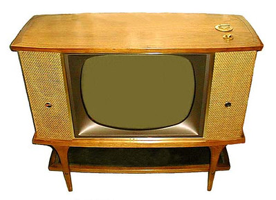
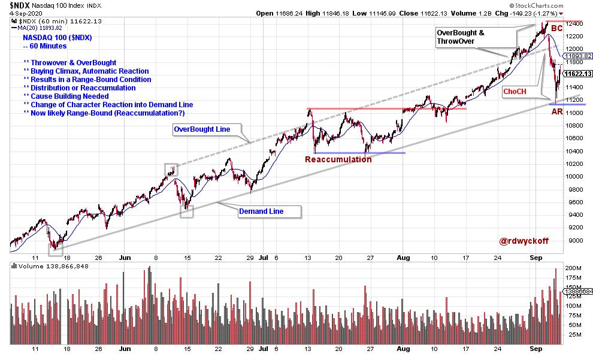
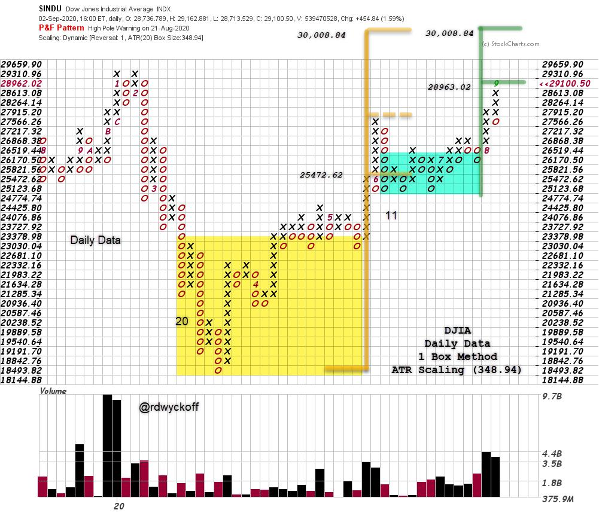

# Power Charting TV: A Study of the Current Market

URL: https://articles.stockcharts.com/article/articles-wyckoff-2020-09-power-charting-tv-a-study-of-t-923/
Date: September 06, 2020 at 06:27 PM
Author: Bruce Fraser

This weeks Power Charting episode sparked interest as it covered current market conditions and also the long term stock market cycle. Roman Bogomazov and I also discussed these topics in our weekly ‘Wyckoff Market Discussion' episode, which can now be viewed on-demand. Roman and I invite you to join us for this discussion of the current state of the stock market advance. A special offer is available through Wednesday for new subscribers to our ‘WMD' webinars.

Below is a 60-minute chart of the NASDAQ 100 index ($NDX). Trendline analysis since May illustrates a classic Wyckoff stride or advance for the $NDX. In July, a Throwover of the uptrending channel produced an Overbought condition and a subsequent Reaccumulation trading range into August. Thereafter, the $NDX continued the prior uptrend and accelerated into a larger Overbought condition into September. Now a reaction back into the channel has produced a ‘Change-of-Character' drop to the Demand Line. This is a larger correction than any that preceded it during the Uptrend. This indicates the $NDX is likely range-bound for some period of time.

click on chart for active version

The Dow Jones Industrial Average ($INDU) one box reversal Point & Figure chart (PnF) generates an Accumulation count (yellow shading) and a Reaccumulation count (green shading). These counts confirm each other. The PnF count in green is often referred to as a ‘Stepping-Stone Confirming Count'. These counts are in the process of being fulfilled with a peak index price of 29,199. Higher prices are still possible in the objective range. This and other PnF charts are discussed in the most recent WMD and Power Charting episodes (see links below).

Roman Bogomazov and I host the ‘Wyckoff Market Discussion' (WMD). Each week (Wednesday at 3pm PT, recording available) we review market conditions from a Wyckoff perspective. A special offer is available through Wednesday to attend these in-depth Wyckoff Market studies. Watch the latest Episode Special below. Click here for the Special Offer. Roman's Fall Wyckoff course cycle (Trading Course 1 & 2) is just starting. The first lesson is free to view on-demand.Click hereto watch and to learn more.

Wyckoff Market Discussion (September 2, 2020)

To view the current episode of Power Charting please click on the link provided below.

Power Charting Episode (September 4, 2020): A Study of the Current Market. Wyckoff Life Cycle Model Workshop.

All the Best,

Bruce

@rdwyckoff

Announcement: Technical Securities Analysts Association of San Francisco (TSAASF.org) 50th Anniversary Fall Conference on Saturday, September 12. Title: Old School is New School. This is a virtual online event. An All-Star list of Technical Analysis speakers will enrich your day (recording available). TSAASF.org members attend for Free! Become a member today. Click here to see speakers, their bios and topics. And to Register.
