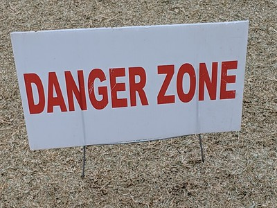
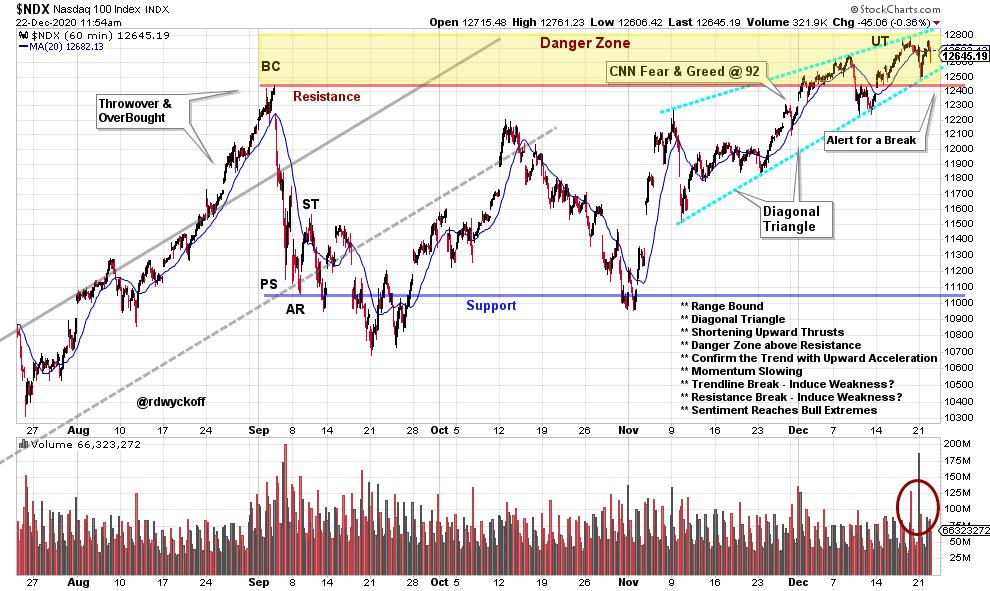

# Danger Zone

URL: https://articles.stockcharts.com/article/articles-wyckoff-2020-12-danger-zone-307/
Date: December 22, 2020 at 02:09 PM
Author: Bruce Fraser

In these holiday shortened weeks volatility could be the central story of the stock market indexes. Empty trading desks and light volume make it easier for markets to get pushed around. The emergence of a potential new strain of COVID-19 in England has kicked off this weeks market excitement. The present position of the indexes has inspired the Wyckoffian imagination for possible catalysts to suddenly move the market.

The NASDAQ 100 Index ($NDX) has been range-bound since an epic Buying Climax (BC) in September. A sharp reaction of the index back to the lower end of the rising trend channel was an Automatic Reaction (AR). This set the outer bounds of the trading range, which is still influencing price action to this day. Two Upthrusting (UT) actions in December have the $NDX hovering above the Resistance level. We give the prevailing uptrend all due respect and expect higher prices ahead. But this area just above Resistance is the Danger Zone. And two converging trendlines on the hourly chart have the appearance of a nearly complete Diagonal Triangle formation. Note the expanding volume off this most recent peak. A price break just below this level would crack the Resistance line and the lower Diagonal trendline. Rapid reactions are often the result of a broken Diagonal Triangle. Thus, the reason for considering this the Danger Zone.

Some past Diagonal Triangle structures have resolved by price accelerating upward and that could happen here. Another consideration could be that early Monday's weakness is a Backup to prior Resistance which sets up a new uptrend. We will likely know soon.

Happy Holidays and a Prosperous 2021 to you and yours.

Bruce

@rdwyckoff

Announcements:

You are invited to our next (and Free) live Wyckoff Market Discussion webinar on January 6th (click here to register). This, first webinar of the year will be devoted to a discussion of the outlook for 2021.

Roman begins a new cycle of his Wyckoff Trading Courses in January. Click on the link below to read more and to attend the first class FREE!

Register below to attend the first class FREE:

Wyckoff Trading Course, Part 1: Analysis (click here to register)

Wyckoff Trading Course, Part 2: Execution (click here to register)

To learn more go to: www.wyckoffanalytics.com

Disclaimer: This blog is for educational purposes only and should not be construed as financial advice. The ideas and strategies should never be used without first assessing your own personal and financial situation, or without consulting a financial professional.
