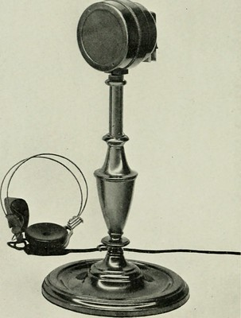
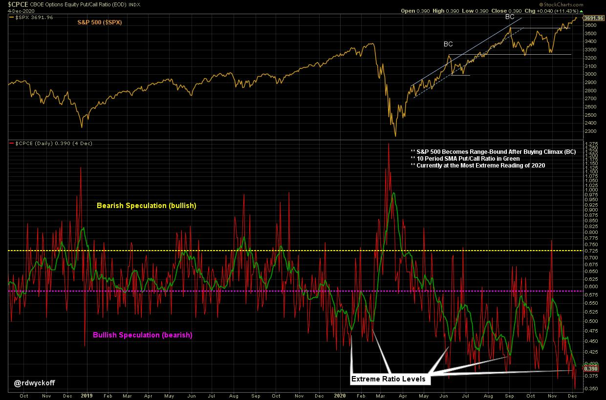

# Sentiment Speaks

URL: https://articles.stockcharts.com/article/articles-wyckoff-2020-12-sentiment-speaks-806/
Date: December 08, 2020 at 09:00 AM
Author: Bruce Fraser

Sentiment measures are environmental to the stock market. They speak to the general state of speculation in stocks, but are difficult to use for precise timing. Sentiment is considered in a contrary way for speculative markets. In the example of the Equity Put to Call ratio (plotted below), when an extreme volume of Puts is trading in relation to Calls it is considered generally bullish for the future direction of stocks. An excess of Call buying is seen as bearish for stocks. I find the CBOE Equity Put / Call Ratio to be helpful in measuring and understanding the state of speculative sentiment toward overall stock prices. The green line in the lower panel is a ten-day simple moving average of the daily data. It takes about ten days of cumulative data to illustrate an extreme of speculation as measured by option trading. Below are some observations about this indicator (in no particular order).

click on chart for active version

1. The 10 day SMA of the $CPCE went to extreme readings in January and February of 2020. A sharp and fast selloff followed which reversed the indicator dramatically.
2. Stock index price lows tend to be acute ‘V-bottom' affairs which coincide with abrupt extremes in the $CPCE. Tops tend to take more time, as can be seen in early 2020.
3. This year the $CPCE (10 day SMA) seems to be operating in a new bracket of bullishness. There is a step-up in call volume activity. Does this represent a new permanent level of bullishness or an extreme for speculative activity, as measured by option trading?
4. In June the $CPCE ratio reached an extreme as the $SPX had a Buying Climax and went into ‘Range-Bound' state (for about a month). The next rally produced a Buying Climax in early September accompanied by a $CPCE call trading spike.
5. The current $SPX rally has marginally upthrusted the September peak at the same time that the $CPCE (10 day SMA) is producing the most extreme reading of the year. Overall stock price momentum appears to be slowing.

Generally bullish speculation is expensive when the $CPCE reflects high Call buying. Traders are willing to pay high premium prices for Call options at these times. Also, it appears that price momentum tends to slowdown for the overall market when there is high Call trading activity.

Another sentiment indicator that can be compared to the $CPCE is the ‘CNN Fear & Greed' index. It ranges from 0 to 100. Readings above 90 (high bullish market activity) or below 10 (high bearish market activity) are rare and typically are seen at stock market extremes. Go to the CNN Fear & Greed webpage to see a recent history for this indicator. As the markets trend upward into year end this indicator has climbed above a 90 reading. This indicator also tends to be environmental and measures the backdrop of speculative activity. Currently it is confirming the very extreme reading in the 10 day SMA of $CPCE.

There is no telling the when or how of a market reaction to extreme sentiment readings. Stock market indexes can respond by mildly pausing, or conversely have sudden stiff price reactions as was experienced early this year. From these indicators we do know that bullish speculation is high, and that it is a crowded trade. It is harder to profit when the crowd has grown large and many are doing the same speculative activities.

All the Best,

Bruce

@rdwyckoff

Announcement:

Three FREE Wyckoff webinars have just been announced. Roman Bogomazov and I conduct a weekly 'Wyckoff Market Discussion' (WMD) each Wednesday. You are invited to attend the first episode of 2021 when we discuss the outlook for the year ahead. Click here to register for this WMD session.

Roman begins a new cycle of his Wyckoff Trading Courses in January. Click on the link below to read more and to attend the first class FREE!

Register below to attend the first class FREE:

Wyckoff Trading Course, Part 1: Analysis (click here to register)

Wyckoff Trading Course, Part 2: Execution (click here to register)

To learn more go to: www.wyckoffanalytics.com
