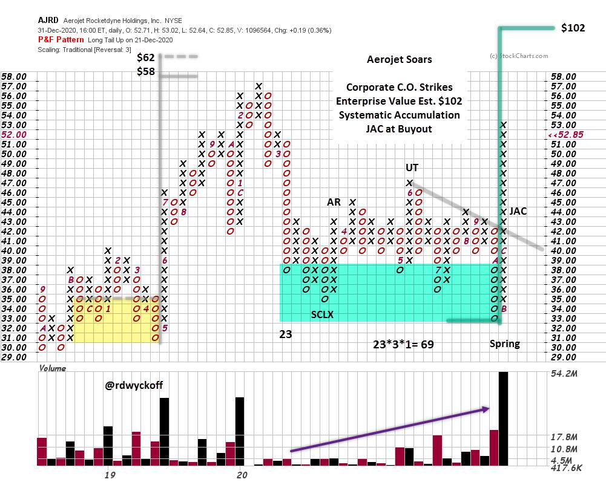

# Aerojet Soars

URL: https://articles.stockcharts.com/article/articles-wyckoff-2021-01-aerojet-soars-21/
Date: January 04, 2021 at 12:12 PM
Author: Bruce Fraser

Lockheed Martin (LMT) announced in December the acquisition of Aerojet Rocketdyne Holdings (AJRD) for $56 per share. From a Wyckoff perspective this appears to be a great deal for LMT. The Point and Figure chart indicates that Lockheed management knew they were purchasing an undervalued company. We typically think of the ‘Composite Operator' as a stock market participant (institution, hedge fund, mutual fund etc.). While corporations can be among the most astute accumulators of the stock of companies they would like to acquire outright, or have some ownership interest. AJRD is an example of deft Accumulation of shares prior to the takeover of this company. We don't know who the purchasers of AJRD shares were prior to the announcement, but the classical footprint of C.O. Accumulation appear on the chart. If LMT ends up paying the full $56 for all the shares of Aerojet they seem to be securing a great asset for their shareholders. Let's see why.

In 2020 AJRD was being systematically accumulated. Note the rising volume during down columns. This was the C.O. absorbing shares on a declining scale within the PnF count structure. The highest volume was on the decline into the Spring. A classic ‘catapult wall' propels AJRD out of the Accumulation in what is often referred to as a ‘Jump Across the Creek' (JAC). If AJRD had not been acquired, the PnF count would have argued for a $102 price objective. LMT management got a terrific deal for shareholders and announced the buyout at a classic Wyckoff chart moment.

All the Best,

Bruce

@rdwyckoff

Announcements:

Wyckoff Market Discussion (WMD) free Webinar: The Outlook for 2021

You are invited to our next (and Free) live Wyckoff Market Discussion webinar on January 6th, 2021 (click here to register). This first webinar of the year will be devoted to a discussion of The Outlook for 2021.

Wyckoff Trading Course

Roman begins a new cycle of his Wyckoff Trading Courses in January. Click on the link below to read more and to attend the first class FREE!

Register below to attend the first class FREE:

Wyckoff Trading Course (January 4th, 2021), Part 1: Analysis (click here to register)

Wyckoff Trading Course (January 5th, 2021), Part 2: Execution (click here to register)

To learn more go to: www.wyckoffanalytics.com

Disclaimer: This blog is for educational purposes only and should not be construed as financial advice. The ideas and strategies should never be used without first assessing your own personal and financial situation, or without consulting a financial professional.
