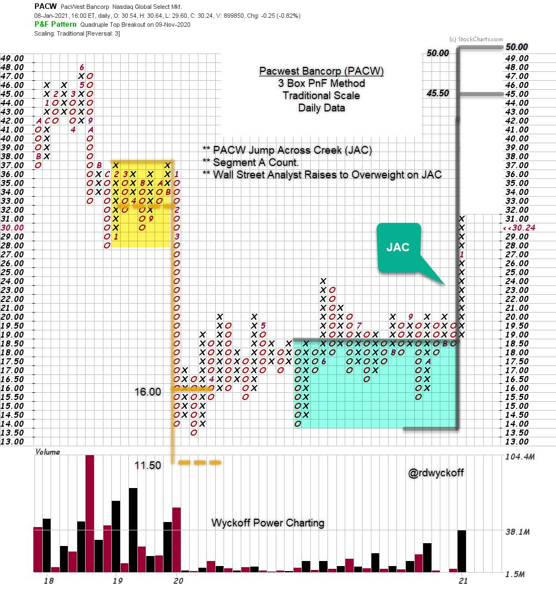
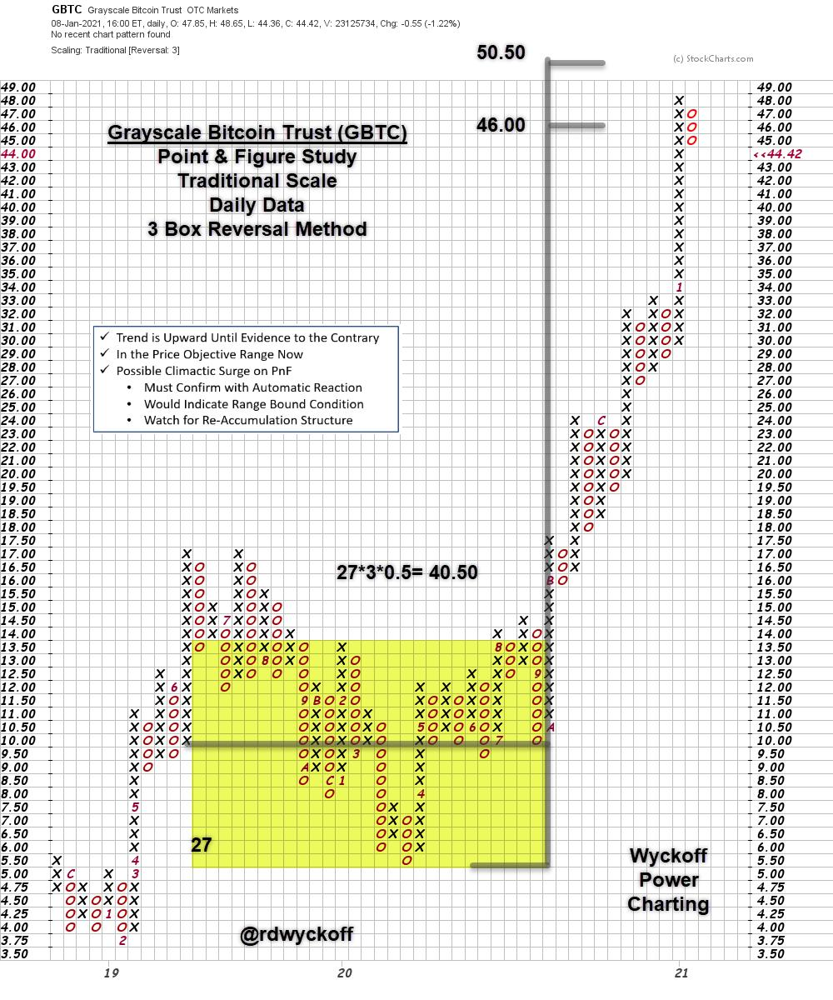

# Power Charting TV: Big Investment Themes for 2021

URL: https://articles.stockcharts.com/article/articles-wyckoff-2021-01-power-charting-tv-big-investme-361/
Date: January 12, 2021 at 06:16 PM
Author: Bruce Fraser

On January 4th BOK Financial (BOKF), PacWest Bancorp (PACW) and super regional bank SVB Financial (SIVB) all received analyst upgrades. BOKF and PACW were increased to ‘Overweight' status. The Financial sector (XLF) and bank industry groups are in constructive uptrends. Using Wyckoff Methodology technique can we confirm the timeliness of these upgrades? Here is a Point and Figure chart of PACW. Does the present position of PACW support the potential for an imminent rally?

PacWest Bancorp (PACW)

PacWest Bancorp jumped out of an apparent Accumulation structure shortly before the upgrade to Overweight status. An uptrend has begun. The analyst upgrade has the appearance of razor sharp timing. The PnF Segment 'A' price objective estimate reaches $45.50 / $50.00. Segment 'B' can be considered once this more conservative objective is reached. That count extension is to the Selling Climax low in March of 2020. As homework construct a PnF of BOKF and determine if there is a bullish count potential (hint: think re-accumulation structure).

Grayscale Bitcoin Trust (GBTC)

On January 8th I constructed this PnF count of Grayscale Bitcoin Trust (GBTC) to estimate the upward potential of this Bitcoin proxy. Note the climactic type surge that reached $48 and the midpoint of the $46 / $50.50 PnF objective. The chart notes indicate that Climactic exhaustion would be confirmed by a sudden and sharp Automatic Reaction (AR) and this appears to have occurred in yesterday's trading with a 19% decline, intraday.

Power Charting Video

The first Power Charting video of 2021 is devoted to ‘Big Investment Themes of 2021'. Stock, inflation and interest rate trends for 2021 are explored. Watch ‘Power Charting' on StockChartsTV. Here is a link to the recording:

Power Charting. Big Investment Themes of 2021

Wyckoff Market Discussion Video

Roman Bogomazov and I discussed the Outlook for 2021 in the first ‘Wyckoff Market Discussion' of the year. This first WMD episode is, per tradition, open for all to attend (special offer mentioned in the video ends on January 13th). Watch the recording here:

Wyckoff Market Discussion. Outlook for 2021

All the Best,

Bruce

@rdwyckoff

Disclaimer: This blog is for educational purposes only and should not be construed as financial advice. The ideas and strategies should never be used without first assessing your own personal and financial situation, or without consulting a financial professional.
