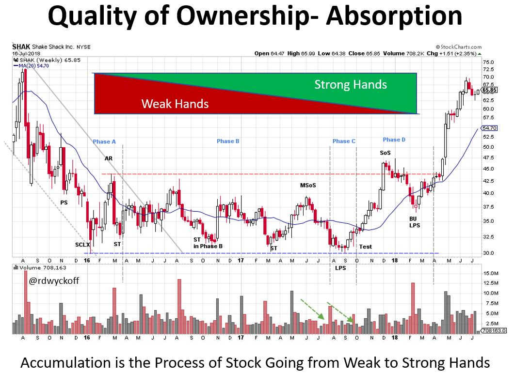
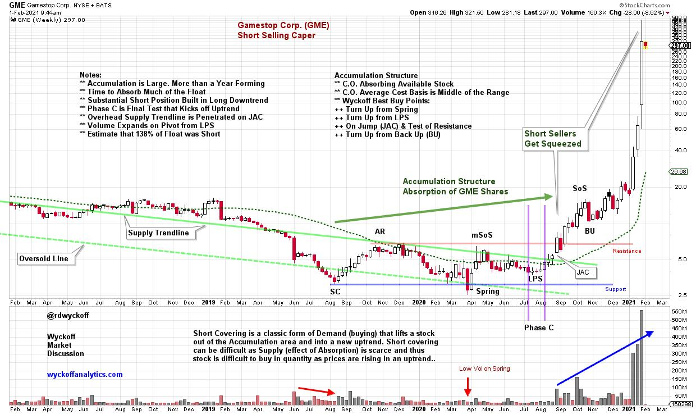

# Reddit or Not, Short Sellers Get Squeezed

URL: https://articles.stockcharts.com/article/articles-wyckoff-2021-01-reddit-or-not-short-sellers-ge-315/
Date: January 31, 2021 at 08:13 PM
Author: Bruce Fraser

Richard D. Wyckoff was on a mission to discover the ‘Real Rules of the Game' for success on Wall Street. He understood that public investors and traders were not profitable in their speculative activities and, in fact, were being preyed upon by large stock market operators. Mr. Wyckoff devoted his entire career to uncovering the methods of stock market professionals and to convey those lessons to the investing public through magazines (The Ticker, Magazine of Wall Street), books and finally an investment course.

GameStop Corp. (GME) has been on an upward tear recently largely propelled by immense ‘Short Covering'. The stock has climbed from the teens to as high as $483 in a few weeks. Short Covering in GME and other stocks has destabilized the stock market. Institutional investors that short stock are being rocked by the speed of the rise in these stocks. Some firms may be at existential risk of failure. The stock market indexes have been weakening with the theory being that good stocks are being sold to raise cash to meet margin calls induced by their skyrocketing short portfolios (recall that a short sale is a speculation that a stock's price will fall).

The financial press has been blaming this short covering advance on small public speculators who have been communicating via social media platforms such as reddit.com. Wall Street is horrified that individuals can come together, virtually, share ideas and profit from their strength in numbers. Now that large institutional investors have been wounded from the ‘squeezing of the shorts' there is talk of reforms to diminish the power of these social media crowds. I believe Mr. Wyckoff would always champion the individual investor, but he would also counsel that a deeper truth is at work here that is driving the dynamics of recent price moves. We must understand what is the true cause of stock price movements that generate profits cycle after cycle. There is no amount of legislation and reform that is going to change the essential forces that drive prices up and down. These are the Real Rules so let's review them.

> We must understand what is the true cause of stock price movements that generate profits cycle after cycle. There is no amount of legislation and reform that is going to change the essential forces that drive prices up and down. These are the Real Rules so let's review them.

Accumulation is a rational process or preparation phase that precedes a Markup (long term uptrend of the stock price). Accumulation traditionally occurs after a significant bear market downtrend. A Selling Climax stops the decline and there are ‘Phases' of Accumulation where prices are bounded between Support and Resistance. Note the diminishing volatility (Schematic above) as prices progress through the Phases. Large, informed (typically institutional) interests are systematically absorbing shares of stock. It takes time to buy a meaningful position in the stock. There are a number of these large interests competing with each other to Accumulate shares at bargain prices. We call this collection of investors the ‘Composite Operator'. This is a characterization of these very skillful and shrewd Accumulators. They work independently of each other but have the same objectives of buying good stocks at great prices. An important note: not all stocks complete a Selling Climax and enter Accumulation, there are many cases where stocks are not valued and bought by the Composite Operator. To read additional Wyckoff Power Charting blog posts on this topic click here and here and here and here.

Why do stocks enter into extended Markup and Markdown periods? The answer is the quality of the ownership. Weak hands will carry a stock through a Markdown. In the case study above Accumulation can be detected in the price and volume characteristics during each Phase. The narrative here is volatility is diminishing as stock is being absorbed into strong hands. The C.O. has the goal of buying shares within the price bounds of the Accumulation range without driving the stock upward before they have bought all the stock they want to own. Chart reading in the Wyckoff World is about detecting the actions of the C.O. as they conduct their operations and to follow in their footsteps. At the moment in the chart when the Supply vs. Demand balance shifts (meaning the Supply of stock has largely been absorbed) the uptrend begins. Wyckoffians have the goal of getting on-board at that time and participating in the new advance of prices.

Short sellers are an important consideration in this narrative. Large short positions often build during the Markdown preceding the Selling Climax and start of the Accumulation. Some portion of these shorts do not get covered or closed out and are carried throughout the Accumulation period. Other short sellers will actively trade (during the Accumulation) by shorting near the Resistance area and covering (closing out) around Support. These short sellers are often surprised by the bullish advance of prices during Phase D & E. Short seller buying is an important source of panicky buying during Phases D & E. Short sellers help to forcefully kick-off the new bull trend in the stock. Short covering is an important source of Demand as the Markup begins.

GameStop (GME) was under Distribution from 2013 until 2015 when it began a Markdown that concluded in 2019 (with a price decline from 57.74 to 3.15). During the secular bull market this was one of the rare successes for institutional short sellers. When a large operator is campaigning a major position (long or short) they must close that position when they can, and not when they want to. The best tactical place and time to cover a long term and successful short position is on the slide into a Selling Climax (SC). This is the juncture when price accelerates downward on massive volume. The goal of some short sellers is to find and short stocks that will go to zero and thus they never need to cover the position. As we all know, that is not how this story ends.

A classic Accumulation developed in GME at the conclusion of the SC. The C.O. community was beginning to absorb shares of GME which took a year to complete. We can't know for sure but the C.O. may have identified the large short interest in GME and planned to squeeze these shorts to help accelerate GME into an uptrend. The sharp rally in March 2020 is a minor Sign of Strength (mSoS) that demonstrates good demand for GME. The following reaction into July is shallow and flat, producing a higher low. These two events are classic Wyckoffian tape reading clues about the advanced state of Accumulation and a major warning to short sellers to cover and reduce risk. Accumulation is the Cause that generates the subsequent Effect of a major Markup. It is now being reported that short interest exceeded the actual number of shares of float and explains why the stock price climbed so far, so fast.

Retail traders who recently bought GME as the squeeze developed did not create this disaster. They do not deserve any of the blame or credit for this train wreck. This is now a battle between trading titans. It might be best for public traders to step aside and let these forces fight it out. In the meantime, study these amazing lessons by Mr. Wyckoff on the ‘Real Rules of the Game' and then operate in harmony with the large Composite Operators.

All the Best,

Bruce

@rdwyckoff

Disclaimer: This blog is for educational purposes only and should not be construed as financial advice. The ideas and strategies should never be used without first assessing your own personal and financial situation, or without consulting a financial professional.

More Resources:

Wyckoffanalytics.com for great free Wyckoff content. Also check out Roman Bogomazov's Wyckoff Trading Courses.

This Week's Power Charting Episode

Power Charting Video. Market Discussions with Roman

Roman and I discuss the current stock market drama around heavily shorted stocks. Also we review current market conditions from a Wyckoff perspective.
