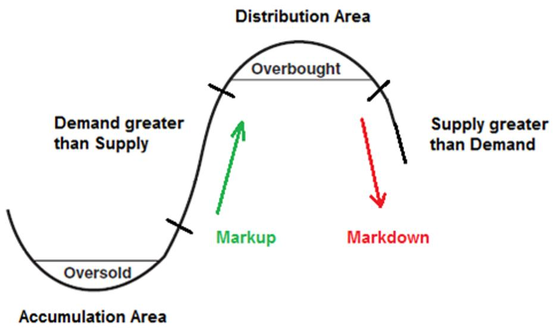
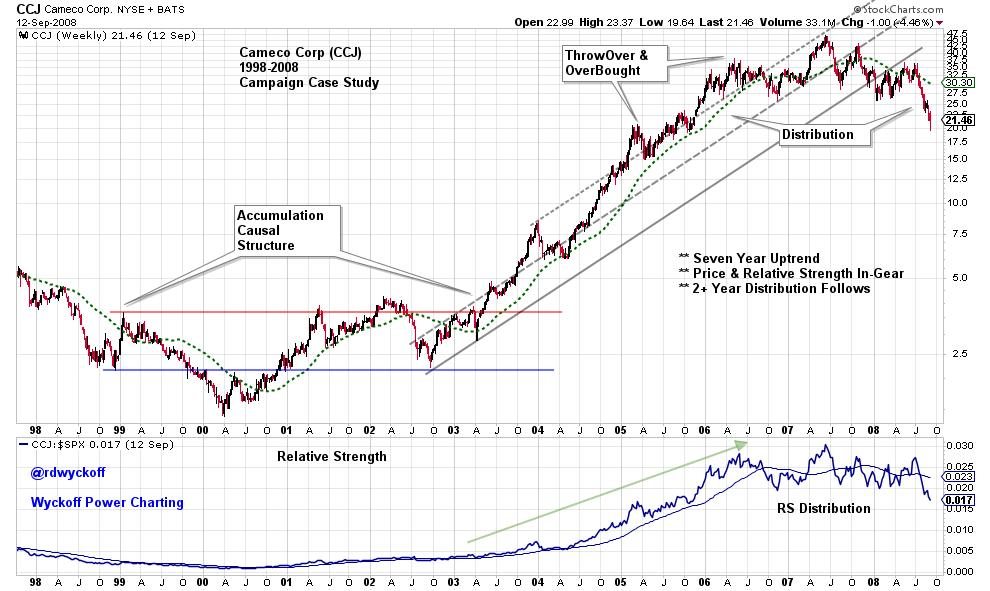
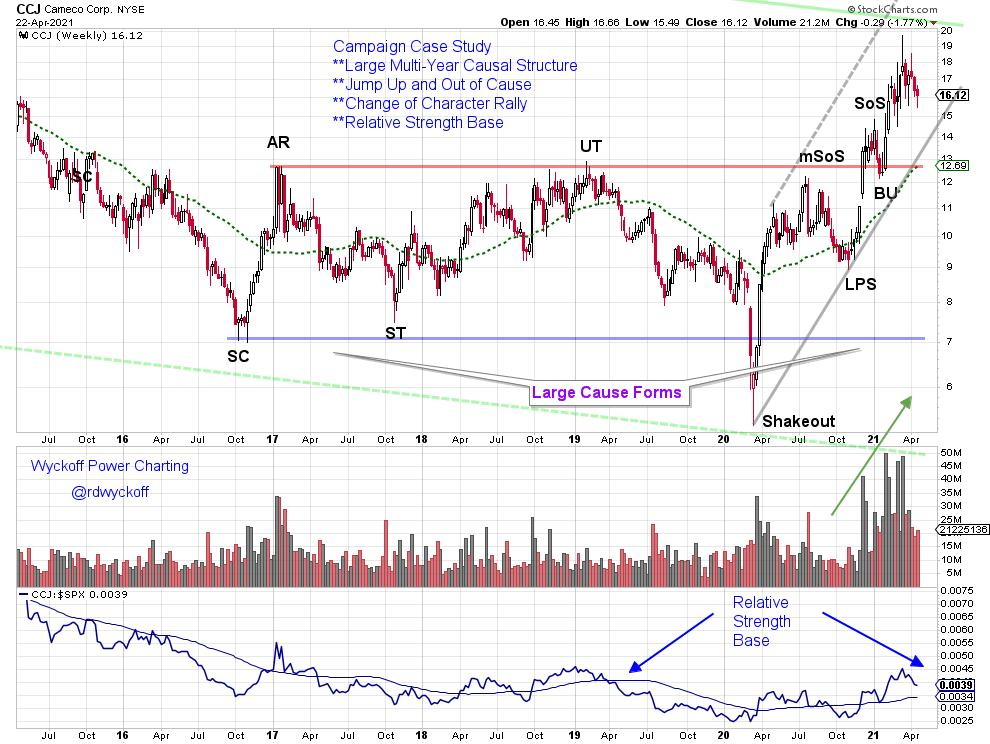
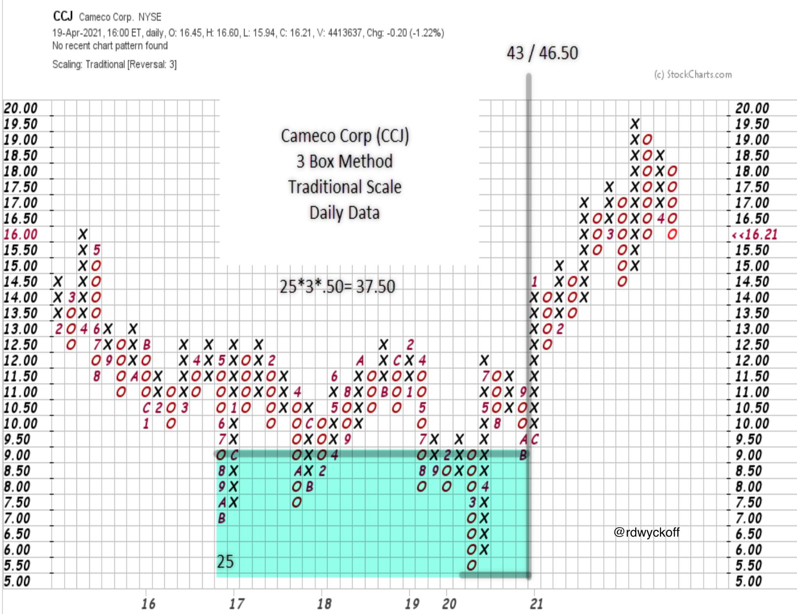

# Identify Campaign Setups with the Wyckoff Method

URL: https://articles.stockcharts.com/article/articles-wyckoff-2021-04-identify-campaign-setups-with-727/
Date: April 23, 2021 at 12:56 PM
Author: Bruce Fraser

Campaign Investing is a specialized process. The tools of the Wyckoff Method are very adaptable to the practice of Campaigning. Wyckoff is fractal, working effectively in multiple timeframes. In the case of Campaigning the longer time periods are evaluated. The goal is to identify the pre-conditions to the emergence of upward trends that can potentially last months to multiple years. During my current ‘Your Daily Five' (YD5) episode (link below), stocks are profiled that have Campaign setups. Not every Campaign setup results in a long term uptrend. With the Wyckoff Toolkit, the Campaign trader is working to codify rules that will raise the probabilities of finding, positioning and holding the best Campaign Candidates.

In this blog post, and the recent YD5 episode, we will become familiar with the Campaigning process. In later posts more detail and nuance will be added. For Wyckoffians with a shorter time horizon please consider the possibilities for how this method could enhance your preferred trading timeframe.

click on chart for active version

This Cameco Corporation (CCJ) historic case study illustrates a multi-year campaign uptrend. A Causal structure (Accumulation area) from 1998 to 2003 was large. The uptrend emerged in 2000 but did not clear the Resistance area (red horizontal line) permanently until mid-year 2003. The upward stride was defined by the trend-channel while price and relative strength stayed above the long term moving average for more than 3 years as the dynamic uptrend unfolded. At the conclusion a two year Distribution formed, stopping the advance and preparing for a subsequent bear market markdown. The stock price cleared Accumulation in the mid-$4 price area and ultimately reached a final high above $46 in about a four year timeframe. A campaign worthy advance.

click on chart for active version

From 2016 to the present a new Causal structure appears to have formed for CCJ. A Shakeout was the final test of the Accumulation area (during the Covid-19 decline of March ‘20) followed by a sharp change of character advance that propelled the stock price up and above the resistance zone at year-end 2020. Now the conditions of price and relative strength are in-gear up. With a large four year Causal structure, CCJ has the appearance of being a Campaign Candidate once again.

The Horizontal Wyckoff Point & Figure (PnF) counting method is integral to Wyckoff analysis. This is certainly true in the Campaign trading timeframe. Point & Figure can be modified (by changing reversal method or scaling, or both) to capture and count very large Accumulation (and Distribution) price structures. The Wyckoffian is then able to estimate the potential Cause generated in very large horizontal price congestion areas. In our CCJ case study a seeming textbook Cause is generated from 2016 to 2021. From the Countline of $9 there is $37.50 of appreciation potential that counts to $43 to $46.50. That is 4.78 times the countline in possible appreciation. A campaign worthy potential. How long an objective of that size could take to be achieved (years likely) is unknown. Just imagine the power of this analysis! To read more on constructing and counting large horizontal modified Point & Figure structures; click here.

There is much more to cover in this Campaign approach. Topics such as trend following technique, stop placement, modified PnF count methods and much more are to be considered. Also, the psychology of staying on big trends and when to exit must be addressed. In my most recent ‘Your Daily Five' episode five Campaign case studies are considered. Click the link below to view more on Campaigning.

Five Campaign Candidates | Bruce Fraser | Your Daily Five (04.19.21)

All the Best,

Bruce

@rdwyckoff

Disclaimer: This blog is for educational purposes only and should not be construed as financial advice. The ideas and strategies should never be used without first assessing your own personal and financial situation, or without consulting a financial professional.

Other Recent Videos:

Wyckoff Market Discussion - 20% OFF SPECIAL Now thru 4/28/21 at WyckoffAnalytics.com

Bruce Fraser, Professor Wyckoff | David Keller, CMT | Behind the Charts (04.19.21)
