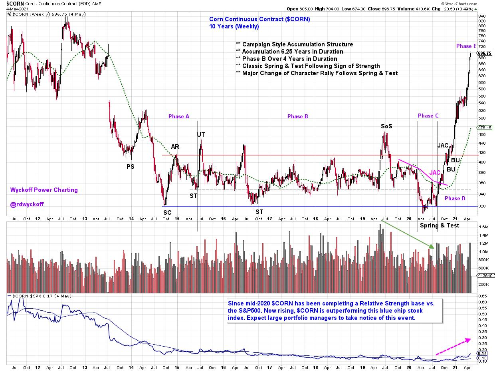
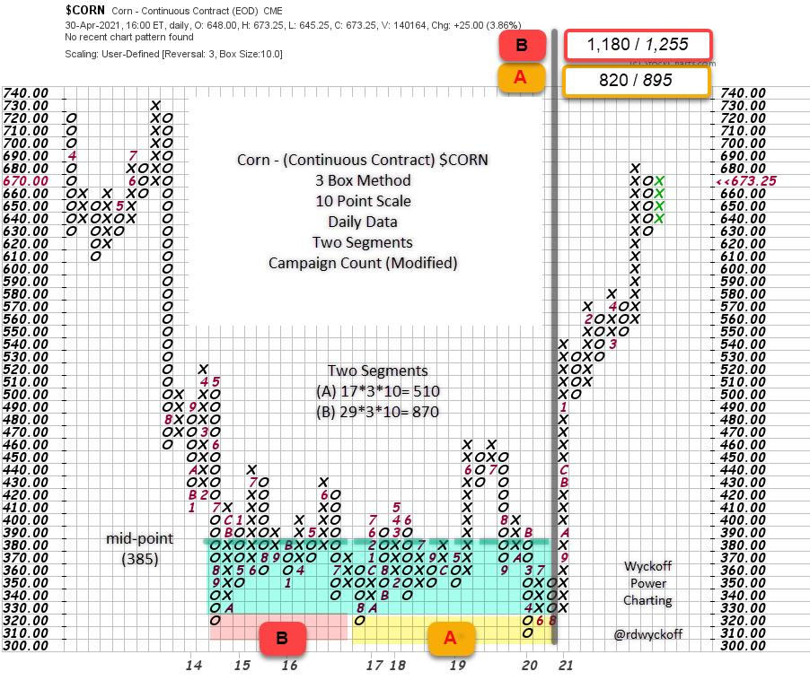
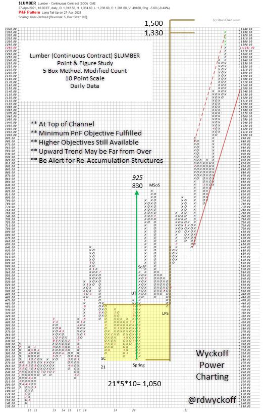

# Power Charting TV: Inflation Nation

URL: https://articles.stockcharts.com/article/articles-wyckoff-2021-05-power-charting-tv-inflation-na-133/
Date: May 05, 2021 at 12:38 PM
Author: Bruce Fraser

Materials prices are screaming higher and higher and this is emphasizing to investors that inflation is surging. Eventually raw and intermediate materials price increases work their way into the Consumer Price Index (C.P.I.) trend. The Federal Reserve acknowledged as much last week, using the term ‘frothy' to describe surging commodity prices. Financial market observers have been well aware of these pressures for some time now.

In the most recent episode of Power Charting (on StockChartsTV), we study inflation trends with an eye toward whether these trends are temporary (as the Fed believes) or these pressures are becoming ingrained in the economy and investor consciousness. Wyckoffians study the ‘Tape' for clues about the evolution of trends; their beginning, middle and conclusion. In upcoming Wyckoff Power Charting posts, we will showcase some of the more interesting trends emerging from this inflation surge. In the most recent episode; Lumber, CRB Index, and Crude Oil are among the markets studied. Here we evaluate the Corn Futures market ($CORN). Note: Futures trading is highly volatile and can involve a high degree of risk. We study these markets, but don't recommend trading them. Please consult your investment professional before making any trade or investment.

Multi-year Accumulation began with a Selling Climax in 2014. A textbook Spring & Test was followed by a magnificent, and nearly vertical ‘Change of Character' rally. This annotated chart documents the very large Accumulation structure, with Phase analysis. Phase B is 4.75 years of trendless price action and illustrates the need for patience to allow final testing to transform a range bound market into a sizzling advance. Once in Phase D, Point & Figure counts can be estimated for the upward potential generated by the Accumulation structure.

Campaign PnF counts often require a ‘Modified' chart construction to capture the entire Accumulation. Here a 3 Box Method with a 10 point scale accomplishes this. Two Segments are identified and counted. There is no classic ‘count line' on this chart so we estimate the mid-level of the Accumulation which is 385. Segment A has an objective range of 820 / 895. The 2012 high was 849 thus the PnF objective range is in the zone of the resistance as defined by this prior high. The Segment B count objective of 1,180 / 1,255 is derived from extending the count across the entire PnF structure and could take years to achieve, if at all. Conclusion; there is still a higher price potential for Corn as defined by the PnF of this large Accumulation structure.

For additional discussion and Wyckoffian views of inflation trends watch the most recent episode of Power Charting on StockChartsTV (below). Lumber (chart above), CRB, XLE and the Fed Funds Interest Rate are among the markets discussed.

Power Charting: Inflation Nation

All the Best,

Bruce

@rdwyckoff

Disclaimer: This blog is for educational purposes only and should not be construed as financial advice. The ideas and strategies should never be used without first assessing your own personal and financial situation, or without consulting a financial professional.
