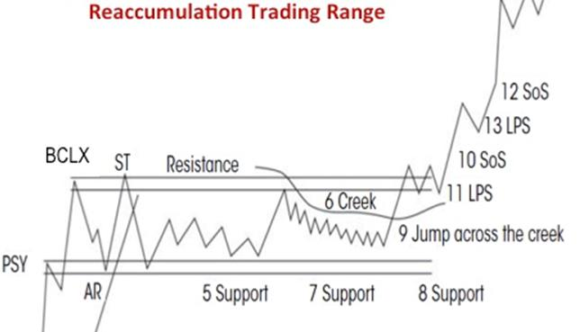
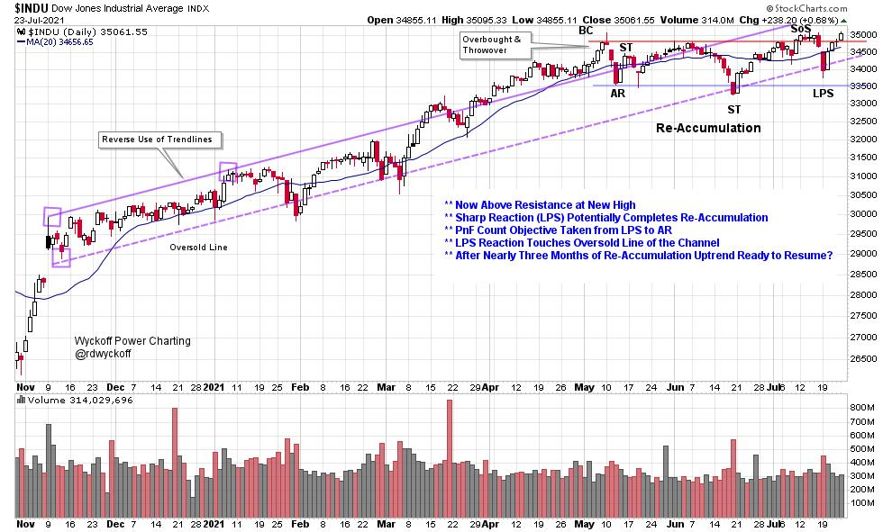
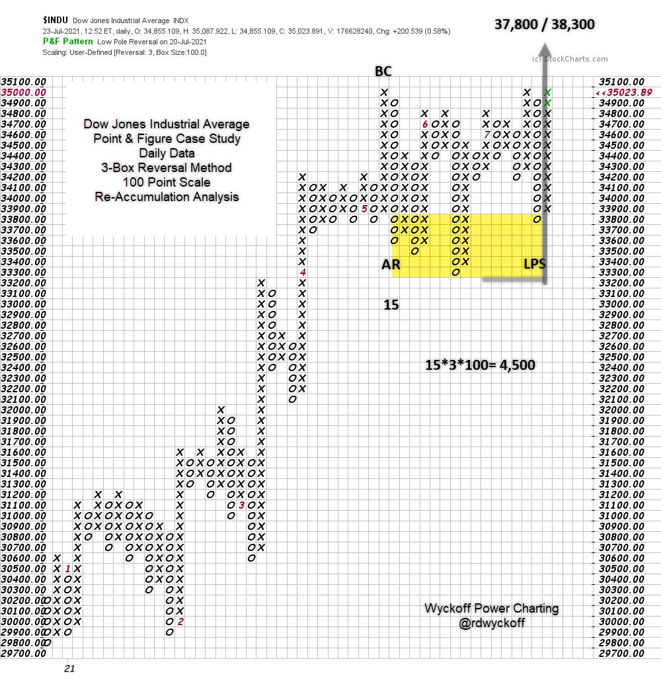

# Is the DJIA Completing a Wyckoff Reaccumulation?

URL: https://articles.stockcharts.com/article/articles-wyckoff-2021-07-is-the-djia-completing-a-wycko-712/
Date: July 24, 2021 at 02:22 PM
Author: Bruce Fraser

On the most recent episode of Power Charting on Stock Charts TV (link below) an analysis of the Dow Jones Industrial Average was considered. A sudden and sharp reaction occurred earlier this week. The index returned to the Oversold Trendline and found good support. Is the DJIA completing a Reaccumulation that reaches back to April? If so, a Point & Figure horizontal count study should provide price estimates for the advance. The DJIA has the potential to go from a trendless range bound state to a fresh new uptrend. This is a very interesting juncture for the index. Let's have a look.

Dow Jones Industrial Average (daily) with Wyckoff Labeling

The upward stride of the Dow Jones Industrial Average ($INDU) is in a well defined upsloping channel. In April and May an overbought condition started with a Buying Climax and continued with a range bound Reaccumulation. The Sign-of-Strength into Resistance produced a sharp reaction that could not reach Support, a bullish occurrence. In Wyckoff terms this is a Phase |C| event or final test of the Reaccumulation. A quick rally has been the response, further confirmation of the LPS label. A jump up and out would be evidence of overhead supply being absorbed. We will watch closely for this possible next step.

Dow Jones Industrial Average Point & Figure Horizontal Count Case Study

In Wyckoff Point & Figure horizontal count analysis, we apply the labels from the vertical chart (above) to the PnF chart. In this case take the count from the Last Point of Support (LPS) to the Automatic Reaction (AR). This is 15 columns multiplied by the reversal method (3-Box) then multiplied by the scaling (100 points). This generates 4,500 DJIA points of potential. Which is added to the low and the countline (LPS). The objective range is 37,800 to 38,300. A meaningful appreciation potential from the current index value.

Tactics

The resistance as defined by the Buying Climax (BC) which is 35,000, should be exceeded with momentum. This may happen imminently or after a brief pause. Any reaction here should be shallow and brief which demonstrates that absorption is nearly complete and DJIA stocks are in strong hands following the Reaccumulation. A jump through Resistance is often followed by a Backup to that line, which should hold.

A larger PnF count is possible either because of more weakness back into the trading range or on the Backup to the Resistance line after a Jump up and out. The DJIA is in the Danger Zone at the Resistance line. A rally above this level would be a very meaningful clue regarding the start of a fresh new uptrend.

All the Best,

Bruce

@rdwyckoff

Disclaimer: This blog is for educational purposes only and should not be construed as financial advice. The ideas and strategies should never be used without first assessing your own personal and financial situation, or without consulting a financial professional.

Power Charting TV

Watch the most recent Power Charting episode on-demand by clicking on the link below. A presentation of other important indexes and their PnF count objectives are shown and discussed.

Power Charting Episode -Wyckoff Chartfest- July 16, 2021

Additional Wyckoff Resources:

Rev Up with Reaccumulation Trading Ranges -Wyckoff Power Charting Blog (click here for link)

Reaccumulation Roundup -Wyckoff Power Charting Blog (click here for link)

Reaccumulation Review -Wyckoff Power Charting Blog (click here for link)
