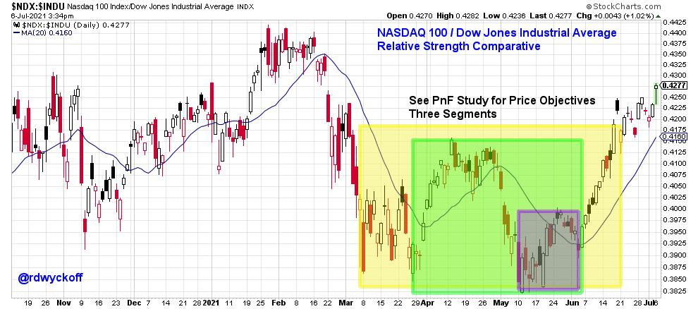
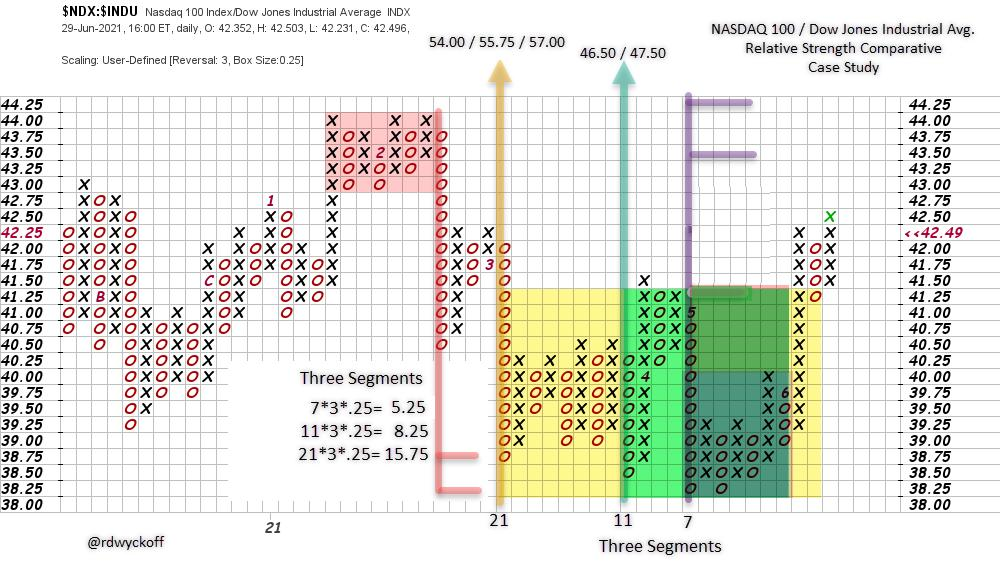

# Power Charting TV: Crypto Currency and the Wyckoff Method

URL: https://articles.stockcharts.com/article/articles-wyckoff-2021-07-power-charting-tv-crypto-curre-284/
Date: July 06, 2021 at 04:04 PM
Author: Bruce Fraser

Join special guest Alessio Rutigliano for a discussion of Crypto Currencies and the Wyckoff Method. Alessio has become a foremost expert on trading Crypto. He has very effectively combined vertical bar chart analysis and horizontal Point & Figure (PnF) studies (link to the Power Charting episode is below). Alessio and I will be conducting a workshop on the use of this PnF technique in the crypto markets. PnF is a powerful tool for estimating price objectives for stocks, commodities and indexes. This is also the case for Cryptos, with some modifications. Alessio has produced a tremendous body of work on using PnF for calculating price targets. Join us on Power Charting as Alessio reveals some of the work he has done adapting PnF for the fast moving Crypto markets.

Cryptos and the Wyckoff Method. Special Guest: Alessio Rutigliano

In the video, the Relative Strength comparative study of the NASDAQ 100 ($NDX) to the Dow Jones Industrial Average ($INDU) is an intraday analysis. Here is a daily data chart not included in the video, which shows a larger Accumulation structure (yellow shaded box) reaching back to March.

NASDAQ 100 / Dow Jones Industrial Average. Relative Strength Comparative Study

The early-March Selling Climax of the $NDX in relation to the $INDU stopped the decline and began a range-bound condition. Final tests in May and June were followed by a liftoff of the $NDX in comparison to the $INDU and apparent new leadership for the Growth Index. See the video for further discussion of this event.

Relative strength analysis employing classic Wyckoffian Horizontal Counting technique could yield valuable information about competing asset classes as they rotate in and out of favor.

NASDAQ 100 / Dow Jones Industrial Average. Relative Strength PnF Case Study

Here is a Point & Figure estimation (daily data) of how high the Relative Strength trend could climb. Three segments are counted and all of them have higher objectives from current levels. This indicates that growth stock performance leadership is in the early stages of reemerging. The relative strength uptrend that began in June follows an Accumulation type structure (yellow shaded area). The initial PnF objective targets the 44.00 zone where the prior peak formed (red shaded box). A classic place for resistance. Two higher targets are estimated and flagged on the chart.

All the Best,

Bruce

@rdwyckoff

Disclaimer: This blog is for educational purposes only and should not be construed as financial advice. The ideas and strategies should never be used without first assessing your own personal and financial situation, or without consulting a financial professional.

Announcement

Special Event: POINT-AND-FIGURE FROM STOCKS TO CRYPTOS

Join Alessio and Me for this live 2-part workshop on July 8th & July 15th from 3pm to 5:30pm PT (recording available). In this new series we will illustrate how to apply this time-tested technique to stocks and cryptocurrencies. Click here to read more about this event.
