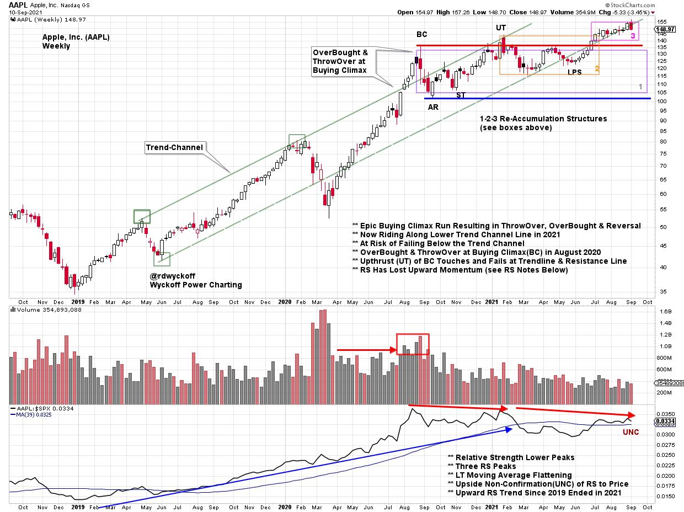
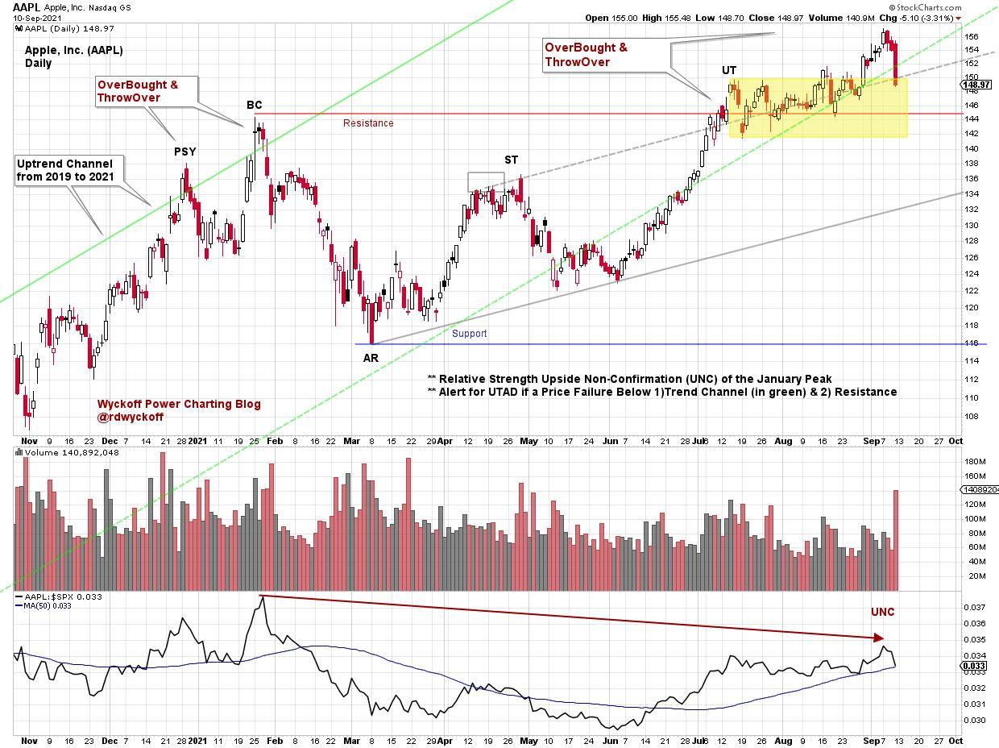
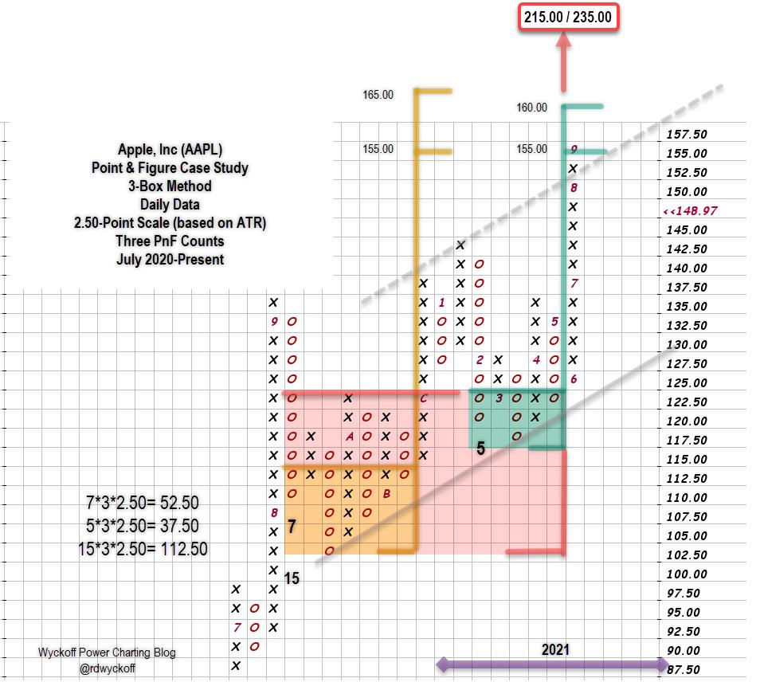

# AAPL on the Hinge

URL: https://articles.stockcharts.com/article/articles-wyckoff-2021-09-aapl-on-the-hinge-226/
Date: September 12, 2021 at 05:21 PM
Author: Bruce Fraser

Apple, Inc. (AAPL) has been one of the most analyzed stocks in the Wyckoff Power Charting pages. It is the largest company by market capitalization and has a huge influence on the major stock indexes. On March 19th of 2015 it was added to the (pre) historic Dow Jones Industrial Average becoming a ‘Bellwether' stock in all regards. Beginning in 2019 it embarked on a rising trend that culminated with an upward acceleration into a Buying Climax (BC) in 2020 (see weekly chart below). AAPL is at a most interesting juncture here and it is time to do some Wyckoffian analysis on this stock.

Apple, Inc. Weekly with Three Re-Accumulations

As the opening bell rang for the start of trading in 2019, AAPL was emerging into a price and relative strength uptrend. From the March 2020 low the trend accelerated into a Buying Climax in late August, about one year ago. The Buying Climax threw over the rising trend channel creating a classic OverBought condition. Wyckoffians expect a Buying Climax and Automatic Reaction(AR) to signal a range-bound condition for price for the foreseeable future. A Re-Accumulation structure is often the result of such a trading range. It prepares the way for the next important advance in the stock (or index). Paradoxically Distribution and Re-Accumulation begin in a like manner. So far AAPL has had the character of Re-Accumulation with diminishing volatility, higher lows and an upward bias to the trading range structure. In June AAPL rallied up through the resistance, as defined by the Buying Climax peak, and has been working higher since. As a ‘Bellweather' AAPL has been doing the job of leading the market indexes to higher prices since June.

Relative strength topped at the Buying Climax peak and has been making subtly lower highs since, not uncommon during periods of Re-Accumulation. The upward stride of RS since the 2019 low demonstrated AAPL's market performing leadership. Now a year into Re-Accumulation, institutional investors are keenly aware of the mildly underperforming status of AAPL during the prior year, as defined by a year of lower highs in Relative Strength.

Study the upward striding trend channel for AAPL and the recent flirtation with the lower channel trendline. Two important technical levels on the weekly chart are; 1) the prior resistance line (Buying Climax Level) and 2) the lower trend channel line (where price now rests). We will watch closely for a possible break of both of these levels as a technical price failure, with the expectation that the trend for this stock is still upward, but in peril.

Apple, Inc. Daily

Zooming into the daily view, a Preliminary Supply peak forms at year end 2020 and then a Buying Climax (BC) in late January of this year. A Resistance line is extended from the BC and a Support line from the low of the Automatic Reaction (AR). Higher lows from the AR onward suggests a potential Re-Accumulation structure. The Backup (BU) and rally are making new price highs, but so far are not making new RS highs. An attempt to rally away from the Resistance line in July has been lackluster. The most recent daily price bar is a sharp reversal downward on significant volume. Price should hold around the area of the Resistance line and not drop back into the Re-Accumulation range.

Three Re-Accumulations have formed (see numbered boxes on the weekly chart), and all have had breakouts (the third is profiled in the yellow shaded box on the daily chart). A drop below the $137 price level will reverse all three of those structures.

Apple, Inc. Point & Figure Case Study. 3-Box Method. 3 PnF Counts.

A Re-Accumulation with an upward stride has developed since last September. Three Point & Figure horizontal counts are considered. Two internal counts (yellow and green shaded boxes) are ‘Stepping Stone' confirming counts to a range of $155 to $165. The minimum objective of $155 has recently been reached. Fulfilling these two confirming counts could represent a form of resistance for AAPL. A larger count (red shading) stretches across the entire structure and reaches $215 / $235.

A summary of the present position of Apple, Inc.

- AAPL is on the cusp of important thresholds
- AAPL has rallied above the year long Re-Accumulation (weekly chart & PnF)
- AAPL has rallied above the 2021 Re-Accumulation (daily chart)
- AAPL has rallied above a minor Re-Accumulation from July to September
- Relative Strength has been negatively diverging from price since August 2020
- RS is still above a rising long term moving average (weekly chart)
- Important Support levels and trendlines are directly below current price levels ($144 to $137)
- The upward trend is our friend, while definable risk levels are just below the current price
- New product announcements could generate emerging demand
- If Re-Accumulation is complete a new phase of markup should accelerate price and RS higher

Any failure of price through nearby Resistance lines, Support lines and trendlines on expanding volatility and volume could signal an Upthrust After Distribution (UTAD)

As a leadership stock AAPL could inspire a stock market rally with a fresh new uptrend. Re-Accumulation structures are periods when stocks pause and refresh for continuation of a prior advance. As is often the case, stocks get into precarious positions at the existential moment when the trend could pivot in either direction. AAPL appears to be at this interesting juncture.

All the Best,

Bruce

@rdwyckoff

Disclaimer: This blog is for educational purposes only and should not be construed as financial advice. The ideas and strategies should never be used without first assessing your own personal and financial situation, or without consulting a financial professional.

Announcement:

TSAA-SF Annual Fall Conference. September 18th

The Technical Securities Analysts Association of San Francisco (TSAA-SF) will host its annual fall conference on Saturday, September 18th. An All-Star list of great traders and technical analysts will present at this year's event. Members of the TSAA-SF can attend with no additional charge and have access to all recordings. If members cannot attend any part of the live conference they can view it, any time on-demand. So become a member of this great community of technicians and traders today and enjoy the excellent presentations and content all year long!

Learn more, become a member and register for the event here:

tsaasf.org

List of this year's presenters:

- Chris Kimble - founder and CEO of Kimble Charting Solutions
- Craig Johnson, CFA, CMT - Managing Director and Senior Technical Research Analyst at Piper Sandler Companies
- Irusha Peiris, CMT - portfolio manager at O'Neil Global Advisors
- Alessio Rutigliano - Wyckoff Method educator focused on crypto markets
- Brett Steenbarger, Ph.D. - Professor of Psychiatry and Behavioral Sciences at SUNY Upstate Medical University in Syracuse, NY
- Ari H. Wald, CFA, CMT - Managing Director and head of Technical Analysis at Oppenheimer
