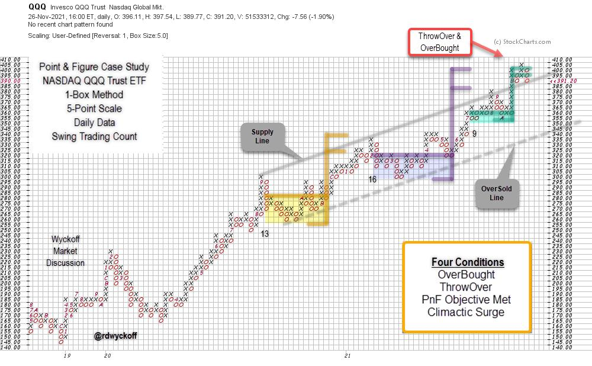

# QQQ Teetering + Point & Figure Workshop TV Special

URL: https://articles.stockcharts.com/article/articles-wyckoff-2021-11-qqq-teetering-point-figure-wor-739/
Date: November 28, 2021 at 06:18 PM
Author: Bruce Fraser

The Point and Figure charting engine at StockCharts.com is an outstanding tool. It provides incredible flexibility to draw many varied types of PnF charts. Navigating the PnF chart controls is easy once they are understood.

Wyckoffians use these charts to estimate price objectives using a horizontal counting method. There are many additional analytical techniques that Technicians employ with great effect. To read more about the many varied uses of PnF charts please read the excellent ‘Point & Figure Charting' article in ChartSchool (Click Here).

For readers who are new to PnF charting, and those who would like a refresher on PnF Chart construction. I have recorded a two part Point & Figure Workshop video series (see video links below).

The Invesco QQQ Trust (QQQ) chart above, is plotted using the 1-Box reversal method and 5-Point scaling, both are user defined choices. It captures an upward trend that reaches back to 2018. Three horizontal trading ranges are identified from late 2020 to the present. Each horizontal range generates a price objective estimate. The most recent two counts are ‘Stepping-Stone Confirming Counts' with upper estimates of $400 for the QQQ. This PnF chart analysis is a demonstration of how Wyckoffians use these charts.

Chart Summary

1. Three Swing Trading structures identified and counted since 2020.
2. Upward Trend Channel contains the advance of the trend.
3. Most recent two PnF structures are ‘Stepping-Stone' Reconfirming Counts with similar objective ranges near $400.
4. ThrowOver of the Channel produced an OverBought condition and simultaneously reached and exceeded, the uppermost ‘Stepping-Stone' count objective. The recent upward surge into an OverBought condition has the character of a Buying Climax (BC). Any sharp and sudden reaction back toward the $355 area reverses the BC and the likely start of a new Reaccumulation structure, or possibly Distribution. Only time will tell.
5. Friday's weakness has placed the ETF back at the ‘Supply Line' from above and thus further weakness threatens to return QQQ back into the trend channel. Lower support appears to be near $355 and $340 (at the Over-Sold Line).
6. Reversal back into the trend channel from an OverBought and ThrowOver condition often results in near term volatility and weakness. Finding and holding support near the Supply Line could prove critical to the continuation of the uptrend in force.

Roman Bogomazov and I will be conducting a ‘Wyckoff Market Discussion' Open-Door Session on Wednesday December 1, and you are invited. We will evaluate these markets from a Wyckoffian perspective and consider strategies and tactics. If there is ever a WMD event to attend, this is the one, as we consider the market action following Friday's sharp reversal. To learn more about WMD (CLICK HERE). To register for free access to this event (CLICK HERE).

All the Best,

Bruce

@rdwyckoff

Disclaimer: This blog is for educational purposes only and should not be construed as financial advice. The ideas and strategies should never be used without first assessing your own personal and financial situation, or without consulting a financial professional.

Power Charting TV. Point & Figure Construction Workshop Parts 1 & 2

Point & Figure Construction Workshop Special, Part 1

Point & Figure Construction Workshop Special, Part 2
