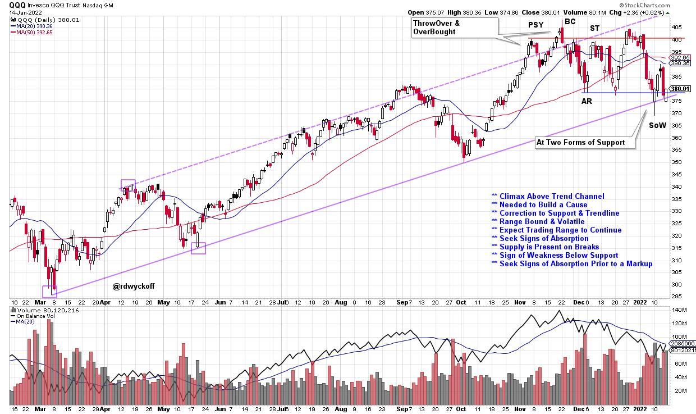

# Power Charting TV: Scanning for Springs and Upthrusts

URL: https://articles.stockcharts.com/article/articles-wyckoff-2022-01-power-charting-tv-scanning-for-954/
Date: January 16, 2022 at 01:40 PM
Author: Bruce Fraser

Join Johni Scan and me on our quest to develop a library of Wyckoff Scans during 2022. Context is a term often used with chart analysis employing the Wyckoff Method. Understanding the chart attributes during the various phases of Accumulation, Distribution and Trend Analysis is a cornerstone of the Methodology. Scanning for Wyckoff conditions has been difficult and elusive largely because of the contextual changes in price behavior as these Phases evolve to their conclusion.

Two scans that we recently profiled were focused on Springs and Upthrusts. Watch these two ‘Your Daily Five' videos to see the scan language, a description of the nature of the price setups, and five examples of the scan output. Below is a link to these two videos.

Range-Bound QQQ Trust ETF

Those of you who have been following Power Charting blogs and videos have been tracking the upward trajectory of the QQQ NASDAQ Trust ETF. Classic Wyckoff trend channel studies and Point and Figure horizontal counts have been spot-on as a ThrowOver and Overbought condition, with a Buying Climax (BC) surge, stopped the advance in November. A range-bound condition now follows with well defined support and resistance on the daily chart. There has just been a breach of the support and the Demand trendline. Labeled here as a Sign of Weakness (SoW), it could be a Spring. In the possible context of this Spring condition, it would be logical for a Wyckoffian to run a Spring Scan to identify possible Spring candidates and setups. This is a timely example of the concept of ‘Context' applied to Wyckoff Scanning.

Wyckoff Scanning Project

In this week's Power Charting episode (Wyckoff 2022 Outlook, part 2) on StockChartsTV, Johni and I discuss the ‘Wyckoff Scanning Project' and the ‘Dream Scan Project'. While it is a work in progress, we showcase five interesting stocks that were generated from the current iteration of the Dream scan. When we feel it is ready for ‘Primetime' we will reveal the scan language and essential attributes of the updated version.

All the Best,

Bruce

@rdwyckoff

Disclaimer: This blog is for educational purposes only and should not be construed as financial advice. The ideas and strategies should never be used without first assessing your own personal and financial situation, or without consulting a financial professional.

Video Links

Fishing For Springs Using The Scan Engine

Scan For Upthrust Distribution In The Wyckoff World

Wyckoffian 2022 Outlook, parts 1 & 2

A Wyckoffian 2022 Outlook

Wyckoff 2022 Outlook, Part 2. Stock Selection with Johni Scan
