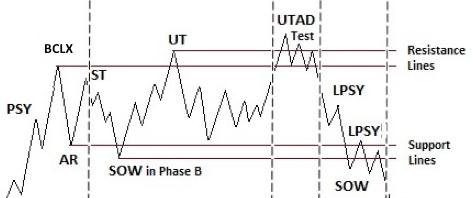
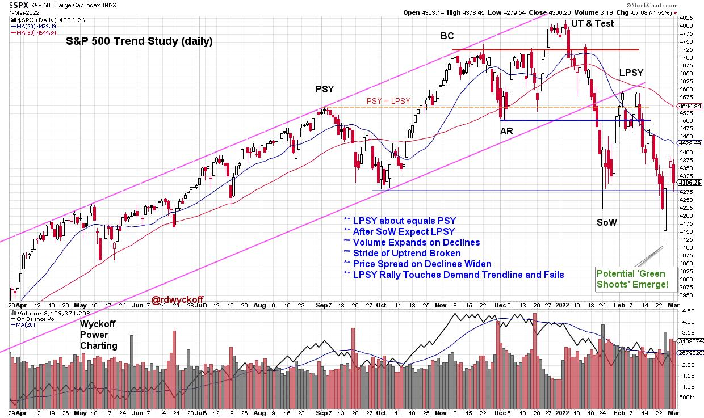

# Distribution or Re-Accumulation?

URL: https://articles.stockcharts.com/article/articles-wyckoff-2022-03-distribution-or-reaccumulation-699/
Date: March 01, 2022 at 06:36 PM
Author: Bruce Fraser

Join Johni Scan and me for Monday's (2/28/2022) "Your Daily Five" where we focus on Distribution and Re-Accumulation characteristics. Both begin in nearly the same manner but conclude very differently. A Re-accumulation is a range-bound condition that forms after an uptrend. It is a pause or preparation phase for a fresh new leg of a larger uptrend.

A Distribution is a range-bound price structure that precedes a markdown (downtrend) after completion of the prior uptrend. Re-accumulations often scare traders and investors into believing that a Distribution is forming which can cause them to exit their positions. Re-accumulations form repeatedly in a major uptrend. Distributions, on the other hand, result in a reversal of trend into what Wyckoffians call a Markdown Phase.

Any rally that follows last week's extreme low will then need to be judged for how well it can reach and exceed overhead resistance, among other characteristics, to determine the possible emergence of Re-accumulation or the descent into a Markdown and completion of Distribution. Also discussed in Monday's episode are the internal positive divergences in breadth studies, extreme bearish sentiment that has emerged, and Point & Figure count objectives and their status.

S&P 500 ($SPX) with Wyckoff Interpretation

S&P 500 Chart Notes:

- Following the Upthrust (UT & Test) volatility increases, and volume expands.
- Not Unusual to have multiple Sign-of-Weakness (SoW) and Last Point of Supply (LPSY) chart events.
- If Re-Accumulation, the price low often appears at about the 1/3 to ½ point of the completed structure.
- If Re-Accumulation, look for the next rally phase to be stronger than the January rally, as a constructive sign of confirmation.
- If Distribution, then demand will be poor on the rally with diminishing price and volume characteristics, and a (likely) lower high into a second LPSY.
- Re-Accumulations can take months to form and are evidence of stock absorption by strong hands (see suggested reading list below).

All the Best,

Bruce

@rdwyckoff

Disclaimer: This blog is for educational purposes only and should not be construed as financial advice. The ideas and strategies should never be used without first assessing your own personal and financial situation, or without consulting a financial professional.

Video Link

Your Daily Five for Monday February 28, 2022

Additional Reading:

Rev Up with Reaccumulation Trading Ranges | Wyckoff Power Charting

Reaccumulation Roundup | Wyckoff Power Charting

Distribution Definitions | Wyckoff Power Charting
