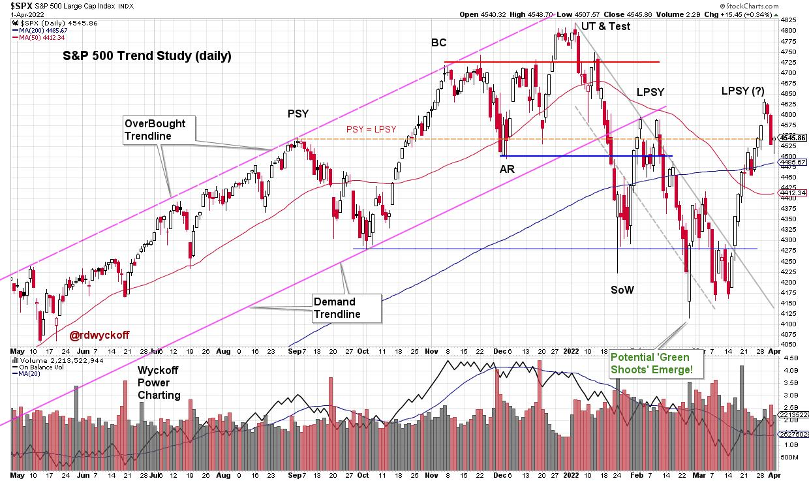
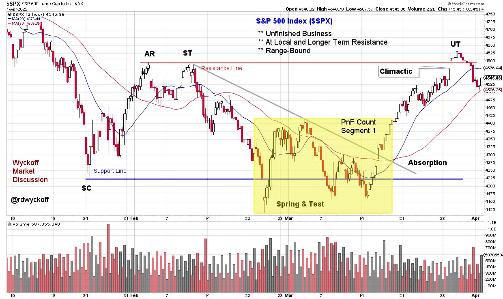
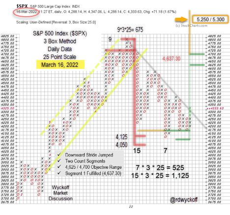

# Wyckoff Principles within Principles

URL: https://articles.stockcharts.com/article/articles-wyckoff-2022-04-wyckoff-principles-within-prin-656/
Date: April 03, 2022 at 04:17 PM
Author: Bruce Fraser

Trouble for the S&P 500 Index became apparent last September when an outsized decline arrived. Downward volatility with volume expansion (presence of Supply) characterized the decline into October, touching the demand trendline. Bulls were relieved by the near vertical rise into November which included a new high in the index. Two attributes of that rally had clues and warnings regarding exhaustion of the larger advance in force since the March 2020 lows. There was the sharp and persistent advance of the index which could be viewed as a Buying Climax (BC). Second was the acceleration of that rally as it culminated on high volume. Once a Climax (BC or SC) and Automatic Reaction (AR) occur, a range-bound condition is expected, and that is what came next. Roman Bogomazov and I evaluated this structure as it was unfolding in our weekly ‘Wyckoff Market Discussion' (see below for a complimentary invitation to attend the upcoming WMD on April 6th).

S&P 500 Index Daily Chart

Dr. Hank Pruden often discussed the concept of ‘Principles within Principles' in our Wyckoff Method classes. This concept is at work throughout the recent stock market structure. Let's profile one of those here. Green Shoots emerged in February / March during the test of the ‘Sign of Weakness'. This could be seen in internal breadth characteristics, sentiment studies and the throw under of the downward trend channel (as an oversold condition). Also Point and Figure (PnF) count objectives were being fulfilled (more on this below).

S&P 500 2-Hour Intraday Chart Study

A significant principle in Wyckoff analysis is the concept of building a cause. Here an Accumulation structure is identified on the Intraday (2-hour) vertical chart above. The Selling Climax (SC) in late January stopped the decline, followed by an Automatic Rally (AR), and this established a range-bound condition going forward. Range-bound conditions (trading ranges) are where Causes are built. Within the larger structure reaching back to January is a smaller trading range (yellow shaded box). Each of the lows within tested the January Selling Climax (SC) successfully. The subsequent March rally has been the best swing trading advance of the year. This rally returned to the Resistance area, as defined by the Automatic Rally (AR). A Point and Figure count of this smaller structure has been fulfilled (PnF chart below). The final phase of this rally had acceleration and a gap upon the throw over of the AR (labeled an Upthrust), which suggests a local Buying Climax (BC) of the March advance. We would then expect volatility back into the trading range, which appears to be unfolding now.

Capacity of the index to remain in the vicinity of the resistance area of this trading range would suggest that Accumulation is unfolding and that it is nearing completion. A return to the SC area would mean more work is needed in this potential Accumulation structure, or worse that Re-Distribution is forming for another bear leg downward.

S&P 500 Index Point & Figure Case Study

Point and Figure Notes (chart originally profiled during weekly WMD webinar):

- Distribution count formed after BC surge (red line)
- Minimum downward count objective was touched at 4,125
- A 7-column Swing trading count began forming at that point
- Each decline thereafter had less force demonstrating local absorption
- Both counts were taken when the downtrend line was exceeded (gray line)
- The subsequent rally (not shown on this PnF chart) was partially fulfilled at 4,625
- The larger count (15 columns) is still active and has potential objectives at new price highs
- This very large trading range structure reaches back to August 2021 and could be Distribution

An excellent low risk trading juncture was presented on the three tests of the Selling Climax lows. In the cluster of those tests ‘Green Shoots' emerged along with a local PnF swing trading count. Now fulfilled, we will tighten our risk management and study the action of the stock indexes around this resistance area and any emerging weakness back into the trading range.

All the Best,

Bruce

@rdwyckoff

Disclaimer: This blog is for educational purposes only and should not be construed as financial advice. The ideas and strategies should never be used without first assessing your own personal and financial situation, or without consulting a financial professional.

Announcement:

Join Roman Bogomazov and me for a complimentary ‘Wyckoff Market Discussion' this coming Wednesday, April 6th at 3pm PT. Each week we cover the important financial markets with a Wyckoffian orientation while also reviewing other relevant indicators effecting the present position and likely future trends of these markets. See you there!

Registration Link (completely free and we never share your registration info): Click Here to Register

To learn more about WMD click here.

Video Links

Trading Survival and Success Strategies | Bruce Fraser & Andrew Cardwell | Power Charting (04.01.22)

Wyckoff Power Charting Blog Links of Interest

Distribution or Re-Accumulation? | March 01, 2022 at 06:36 PM
