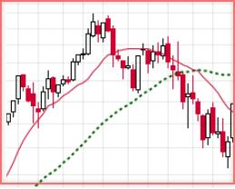
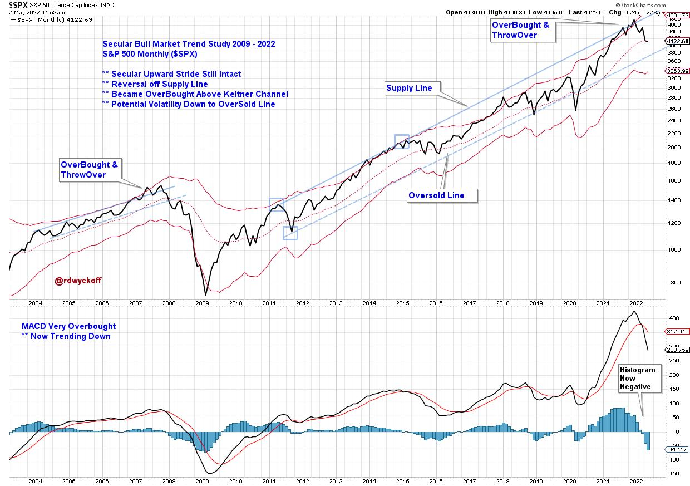
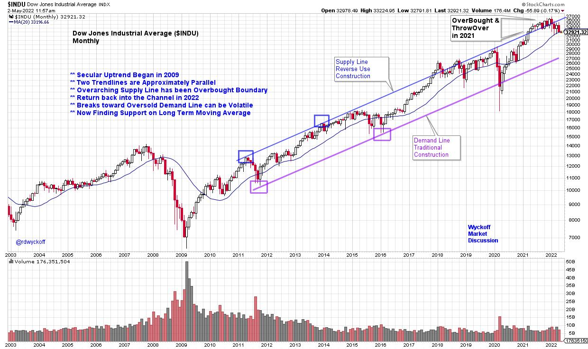
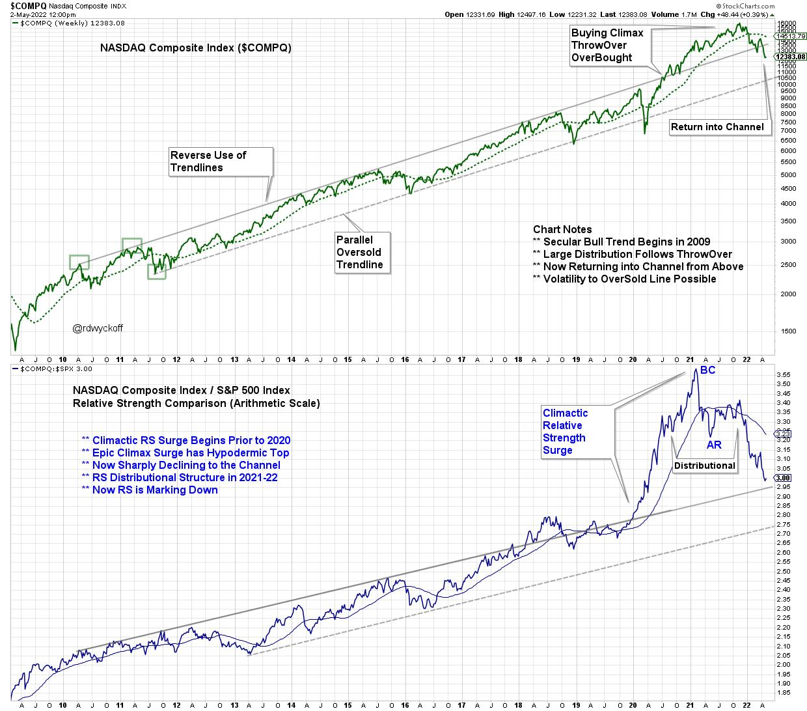
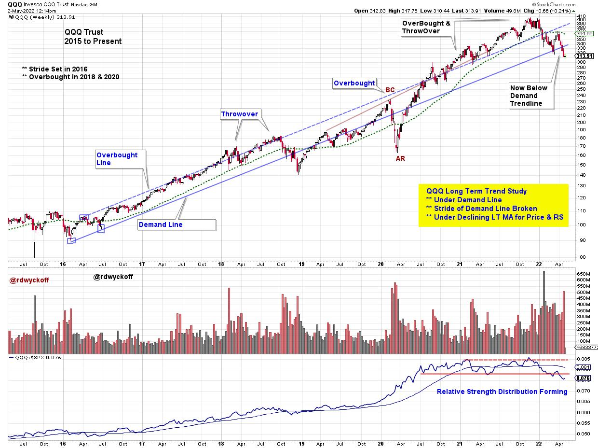
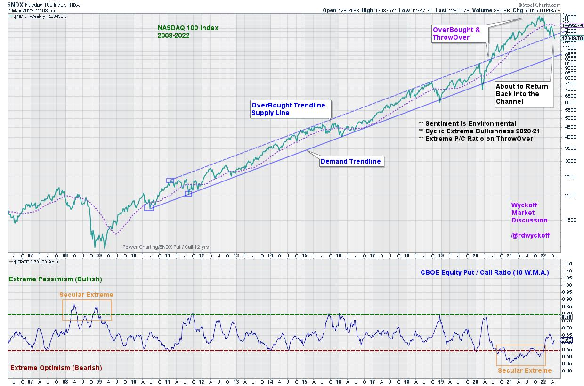

# Is the Trend About to Bend?

URL: https://articles.stockcharts.com/article/articles-wyckoff-2022-05-is-the-trend-about-to-bend-736/
Date: May 02, 2022 at 12:50 PM
Author: Bruce Fraser

When studying the markets chartists can tend to become myopic and close in on smaller and smaller timeframes (certainly that is the case for this Wyckoffian). Meanwhile, the tsunami of monster trends can engulf portfolios with unexpected reversals. A powerful antidote to this vulnerability is awareness of the major price trends. When a large trend takes hold, it can persist for very long periods of time. The trend is not only a chartist's friend, it is what makes technical analysis work! Richard D. Wyckoff taught a method of trend analysis that is unique, effective, and original. This technique has been studied extensively in this blog (links to some of these posts are below).

Here are some notable trend studies of the epic and decade long trends that have been unfolding and continue to be mostly in-force. Does this very long trend in financial assets still have life? What conclusions can we draw from the present position of the indexes within their trends? Can these trend studies inform our current trading and investing tactics?

S&P 500 (2003-2022)

Two trends (2004-08 and 2009 to the present) are illustrated with trendline studies and a Keltner Channel. Price plots are monthly. The current upward trend stride is remarkably long in duration. An overbought condition can be defined by a throwover of either the Supply Line or the Keltner Channel. This occurred in 2015 and 2021. An Overbought status can persist in long term uptrends and we see, in both cases, the index ‘rides' along the upper trendline and channel for a number of months. The MACD Histogram flips negative almost simultaneously with the downward turn of the index below the ‘Supply Trendline' and into an index price decline. The scale of the upward trend and the width of the trend channel is large and meaningful. Price declines to the lower trend channel line often takes months, even when the primary trend remains upward and intact. How would you manage your portfolio risk in an environment defined by this overbought condition during an ongoing uptrend? Each investor and trader would have a unique answer to this question. On to some additional examples.

Dow Jones Industrial Average ($INDU) Trend Study and Chart Notes:

- Stride set by ‘Reverse Use Trendline' in 2011-12.
- Demand Line follows the same upward stride.
- 2021-22 Index becomes overbought above the channel. Rides top trendline for 10 months.
- Back into the channel in 2022. Vulnerable to downward volatility once it falls back into channel.
- Demand Line is strong support during 2020 decline.

NASDAQ Composite with Relative Strength (2009-2022)

NASDAQ Composite ($COMPQ) Trendline Study with Relative Strength

Chart Notes:

- Stride set in 2010-11 with Reverse Use Trendline. Very well defined channel for 10 years.
- At the 2020 price lows Relative Strength is already breaking above the channel and $COMPQ establishes strong leadership.
- Distribution appears to be forming in price and Relative Strength during 2021-22.
- Buying Climax (BC) and Automatic Reaction (AR) is pronounced on the Relative Strength study in 1st Qtr of 2021. This event signals the conclusion of the decade long leadership of NASDAQ stocks.
- Price has recently returned into the channel from above.

Invesco QQQ Trust (QQQ) with Relative Strength (2015-2022)

QQQ Trust ETF (QQQ) Notes:

- Stride set in 2016 on this weekly chart.
- Relative Strength has slowed ahead of price and has formed an Upthrust in late '21.
- Relative Strength became range-bound in 2020 in advance of price which peaked in late '21 with diminishing upward thrusts.
- Now below the RS neckline while price is resting on the lower channel trendline.
- A rally here is needed to defend this long term upward trend.
- The seven year trend is on the verge of failing.

NASDAQ 100 Index ($NDX) with C.B.O.E. Equity Put / Call Volume (2006-2022)

NASDAQ 100 Trend Study (2006 to Present)

Chart Notes:

- Anchor Points of Demand Trendline in 2010 & 2011 set the stride of the Bull Market Secular Trend.
- OverBought parallel trendline is exceeded in 2020. Is this a Climactic 18-month surge?
- Now reversing back towards upper channel line. Will it act as Support?
- Secular extreme Put volume (high pessimism) in 2008 is notable and coincides with the ‘Great Recession' Bear Market.
- Extreme Call Volume (high optimism) activity in 2021 coincides with the Climactic run up and out of the channel. A possible psychological conclusion of the 13 year bull market advance.

The Wyckoffian method for trendline and trend channel construction is unique and illuminating. Trend technique is fractal and works in all timeframes. Mastery of Wyckoffian trend identification is a powerful trading tool. Stockcharts.com is a superior platform for annotating, analyzing, and saving your trend studies. The examples highlighted above are notable and illustrative while there are many more not covered here.

When analyzing a trend step out to the next larger timeframe to determine if a larger trend is at work. This larger trend could overwhelm and engulf the instrument you are evaluating, and possibly trading. The ebb and flow of the instrument being studied often has a rhythm within the channel as the larger trend is unfolding. Being aware of this trend heartbeat can improve patience in waiting for the best setup for a new surge in the direction of the primary trend being studied.

All the Best,

Bruce

@rdwyckoff

Additional Reading on Trend Analysis

Click (Here & Here & Here)

Announcement:

Dr. Gary Dayton, Psy.D., Wyckoff trader and Peak Performance Trading Coach will present a 3-Part live workshop on May 3, May 10 & May 17. This is a must attend workshop for all Wyckoff Traders.

Workshop Title:

TRADE MINDFULLY

ACHIEVE OPTIMAL TRADING PERFORMANCE WITH

MINDFULNESS & CUTTING-EDGE PSYCHOLOGY

To Learn More and Register: (Click Here)
