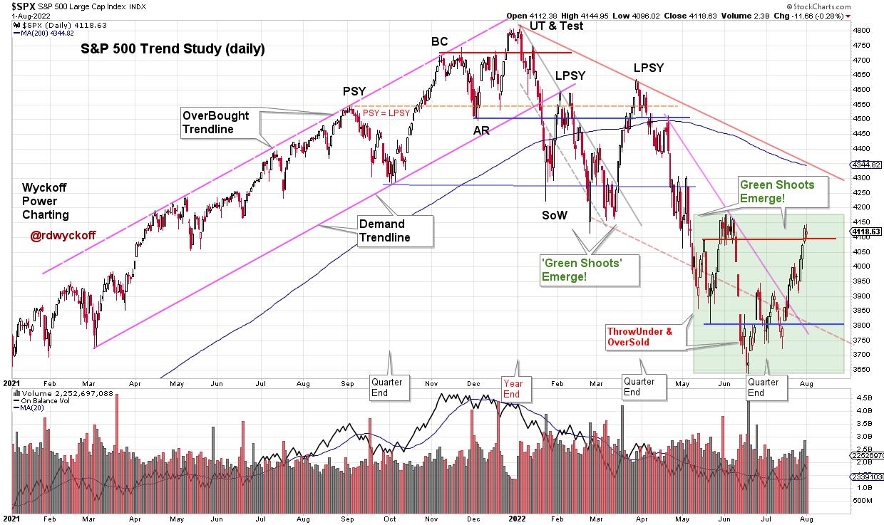
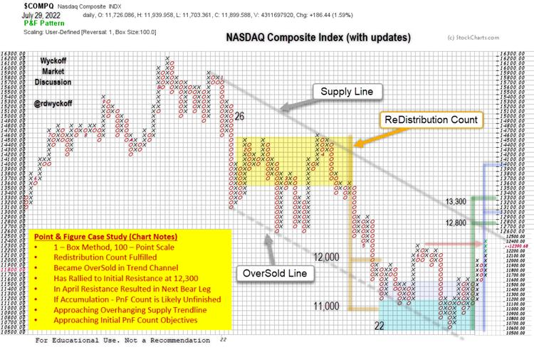

# A Wyckoff Cause is Forming. What's Next?

URL: https://articles.stockcharts.com/article/articles-wyckoff-2022-08-a-wyckoff-cause-is-forming-wha-60/
Date: August 01, 2022 at 06:57 PM
Author: Bruce Fraser

In May and June oversold conditions in the major stock indexes developed. Internal breadth and sentiment measures reached notable extremes. Keeping in mind the quarter-end effect, Wyckoffians were on the lookout for an acceleration of the downtrend into a ‘Selling Climax', which arrived in mid-June (quarter-end). Following a series of selling panics (in May and June) a period of ‘Testing' and ‘Cause' building would be expected. A successful test followed in July with two declines of narrowing spread and diminished volume. After becoming oversold below the downtrend channel (green shaded area on the chart below), the S&P 500 worked its way back into the channel (above the oversold trendline). A quality rally followed and now the index is at initial resistance.

In Power Charting episodes on StockChartsTV we discussed ‘Green Shoots' during the recent Selling Climax and subsequent tests (green shaded area). This was evidence of internal exhaustion of selling (likely window dressing) as the quarter was coming to a close. This echoed the January to March period of ‘Green Shoots' that preceded the significant April advance (which completed a ReDistribution structure).

S&P 500 Index - For Educational Use. Not a Recommendation

Chart Notes:

- As the Distribution unfolded, beginning in the fall of '21, I have been using this $SPX chart as a real-time Wyckoff case study of emerging Distribution and Markdown.
- Currently range-bound, a possible Cause is forming for a more important rally. Most likely in the context of a long-term bear market. Price holding above resistance is needed to confirm.
- The downtrending ‘Supply Trendline' and the declining 200dma are at approximately the same level and could be a price objective for this rally.
- The Cause building process is not complete and will likely grow larger. We must keep this in mind when estimating PnF objectives.
- Bear Market rallies can be very convincing, resulting in many market pundits declaring the Bear vanquished. Wyckoffians follow the action of the ‘Tape' allowing the market to lead the way.
- Initial overhead resistance is now being approached and may lead to ‘Backups'. Shallow and narrow reactions are preferred. A deeper reaction could signal either ReDistribution or continuation of a range-bound structure. We will study price and volume characteristics for essential clues.

NASDAQ Composite Index ($compq)

Another stock index perspective is the NASDAQ Composite through the lens of a Point & Figure case study. Using the 1 – Box Reversal technique (and 100 point scaling) the January to April ReDistribution horizontal count was taken. The objective range was fulfilled between 12,000 and 11,000 with the May decline. The climactic decline stopped at the brief ThrowUnder of the OverSold trendline. This was the start of a ‘Range-Bound' condition. In June there was another attempt to reach the OverSold Line which produced a Selling Climax.

The current range-bound price structure appears unfinished (if Accumulation) and would likely need a shallow and brief reaction to be complete. A sharp decline to the area of prior (June) support is not out of the question either. If this is ReDistribution, the prior March to April rally high could be a suitable analog.

All the Best,

Bruce

@rdwyckoff

Disclaimer: This blog is for educational purposes only and should not be construed as financial advice. The ideas and strategies should never be used without first assessing your own personal and financial situation, or without consulting a financial professional.

An archive of Power Charting episodes discussed in this article is available (click here)

Announcement:

Each week Roman Bogomazov and I discuss the current state of the financial markets from a Wyckoffian perspective. To learn more about this dynamic weekly session (click here)
