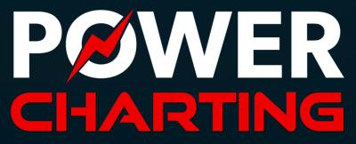
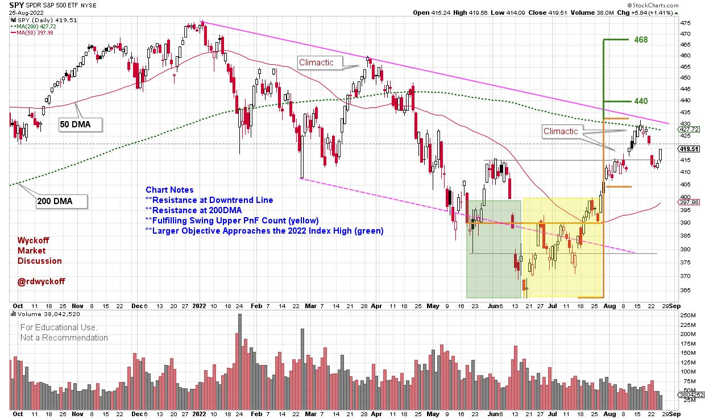
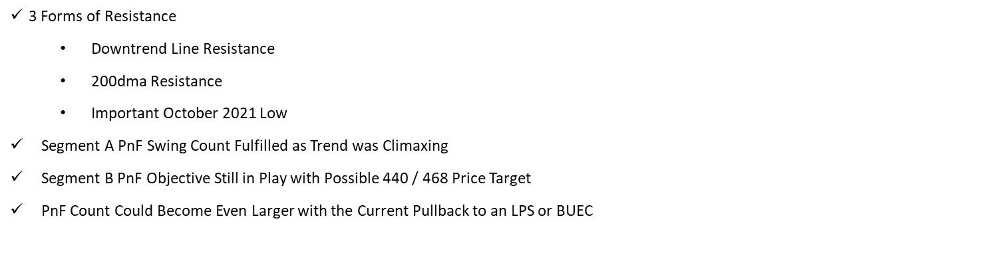
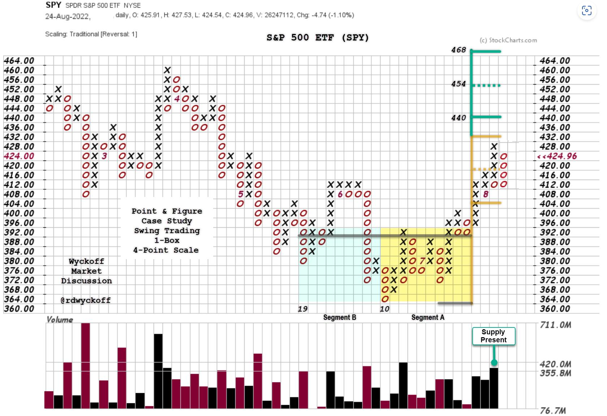

# Stocks at a Crossroad

URL: https://articles.stockcharts.com/article/articles-wyckoff-2022-08-stocks-at-a-crossroad-891/
Date: August 25, 2022 at 06:47 PM
Author: Bruce Fraser

Determining the stride of an uptrend or downtrend is an essential Wyckoff technique. The stride of a trend is often set early in that trend and then prices can adhere to that pace of advance or decline for the majority of the bull or bear run. Trend determination techniques have been covered often in this blog and you are encouraged to review these materials and case studies. Below is an interpretation of the downtrend in force in 2022.

S&P 500 SPDR ETF (SPY)

Chart Notes:

Two Bullish and One Bearish Scenario:

Backup to the Edge of the Creek (BUEC). First decline from a climactic surge will typically be sharp and swift. If this is a BUEC the SPY should stabilize in the area of local support (where it is now). A small range-bound sideways structure would follow. Volume would dry up, and daily price spreads would diminish.

Last Point of Support (LPS). The sharp and sudden decline that has begun will continue into the middle of the range-bound structure forming since May of this year. A return to the area of the lower channel trendline is very possible. Typically, the shallower the reaction the more bullish for the uptrend.

Downtrend resumes. The April decline showed persistent selling with wide daily price spreads and increasing volume. Note the volatile break in early June. The SPY is very close to entering that price zone now. There was very little to nonexistent price support in the price zone from 410 to 365. A return into that price zone could recreate a similar volatility profile during a price decline.

S&P 500 SPDR ETF (SPY) Point & Figure Case Study

Chart Notes:

- Segment A (yellow shading): Fulfilled during the rally to resistance. The current reaction has taken back the climactic rally run. The start point of a climactic rally is often the support point when a subsequent pullback occurs (SPY 410-412 in this case).
- Segment B (green shading): Reaches to the resistance of the January price high. The ability to consolidate here and resume the uptrend would put these higher price objectives into play.

The recent rally has been the best of the year for the stock indexes and many stocks. The rally peak is reminiscent of the March advance, only stronger. The indexes are on the cusp here. Wyckoffians have scenarios mapped out and tactics established. The market risk profile is heightened from the June and July levels when many stocks were preparing for swing trading advances. For those trading this market risk exposure needs to be reassessed and tightened.

All the Best,

Bruce

@rdwyckoff

Disclaimer: This blog is for educational purposes only and should not be construed as financial advice. The ideas and strategies should never be used without first assessing your own personal and financial situation, or without consulting a financial professional.

---

Announcements:

Technical Securities Analysts Association Fall Conference. September 17, 2022

Hybrid Conference Format. In-person AND virtual!

The 2022 Conference will include a great lineup of technical analysis and trading experts as guest speakers. This year, TSAA-SF is hosting a hybrid event, in-person at GGU and online via Zoom. In-person attendees will have access to exclusive pre-event coffee chats, lunch and a post event happy hour!

Virtual Attendance is Included with Your TSAA-SF Membership. To Learn More and Sign-up (click here)

To View the Speaker Bios (click here)

---

Wyckoff Analytics Fall Course Announcement.

Wyckoff Trading Course, Part 1. Analysis (first session is free)

Wyckoff Trading Course, Part 2. Execution (first session is free)

To Learn More and Sign-up for the Free Sessions (click here)
