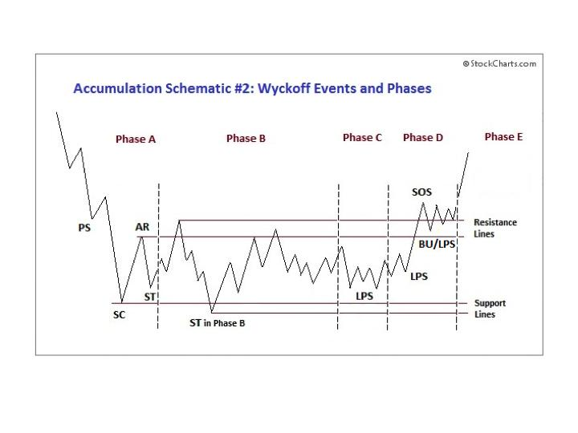
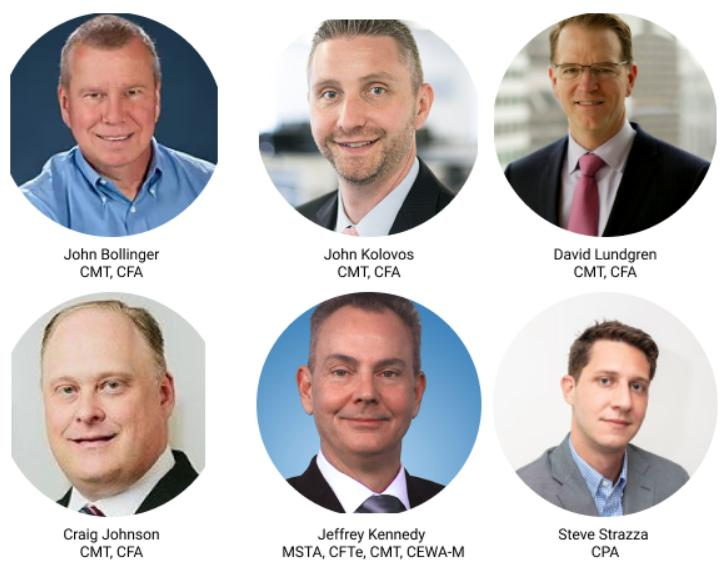

# Power Charting TV: Accumulation in the Master's Own Words

URL: https://articles.stockcharts.com/article/articles-wyckoff-2022-09-power-charting-tv-accumulation-670/
Date: September 11, 2022 at 05:01 PM
Author: Bruce Fraser

Richard D. Wyckoff, the Master, in his own words; and his quest to understand what propelled stock prices.

He observed large interests conducting campaigns of a magnitude that resulted in trends lasting for months and years. As a young man he studied these Composite Operators (C.O.) and how they would stealthily conduct campaigns. He developed a methodology for detecting the footprints of C.O. interests on the charts (which he called Tape Reading). He created an entire approach called the ‘Wyckoff Method' for identifying the campaigns of large Accumulation and Distribution and how they emerge into the trends where sizeable returns are made.

In this Power Charting TV episode, we study the very words of the Master as he recounts his discovery of the Accumulation process as performed by legendary operator E.H. Harriman (of Union Pacific Railroad fame) as he conducted a major campaign. In our Power Charting case study, we apply Mr. Wyckoff's words to a campaign transpiring a full 100 years later. The essential conclusion is the principles of successful speculation have not changed much, if at all since Mr. Wyckoff's Wall Street tenure.

Mastery Lessons from Richard D. Wyckoff

Johni Scan (John Colucci) then illustrates a one-line scan that ranks the leading industry groups. Then how to search those groups for the best leading stock ideas and how to use those scans for identifying emerging Accumulation.

Source: Wyckoff Power Charting. Let's Review | July 01, 2015

Announcement:

Technical Securities Analysts Association (TSAASF.org) Fall (Hybrid) Conference

This iconic conference is a Fall Tradition. Learn what the large institutional interests are thinking and doing from these leading technical analysts. There is no better time in the markets than now to learn the perspective of this group of industry leaders as the all-important fourth quarter approaches. There are two ways to attend this conference; live or virtual. Virtual attendance is included with your TSAASF.org membership (easy to join). Live attendance includes lunch, post conference reception, and additional off-line content (yours truly will be conducting a pre-conference ‘Coffee with Wyckoff' session on swing trading) and StockCharts.com's own David Keller will present during the lunch hour. Join us for what will certainly be a memorable day. To learn more, join the TSAA-SF and attend (click here).

See You There,

Bruce

@rdwyckoff

Disclaimer: This blog is for educational purposes only and should not be construed as financial advice. The ideas and strategies should never be used without first assessing your own personal and financial situation, or without consulting a financial professional.
