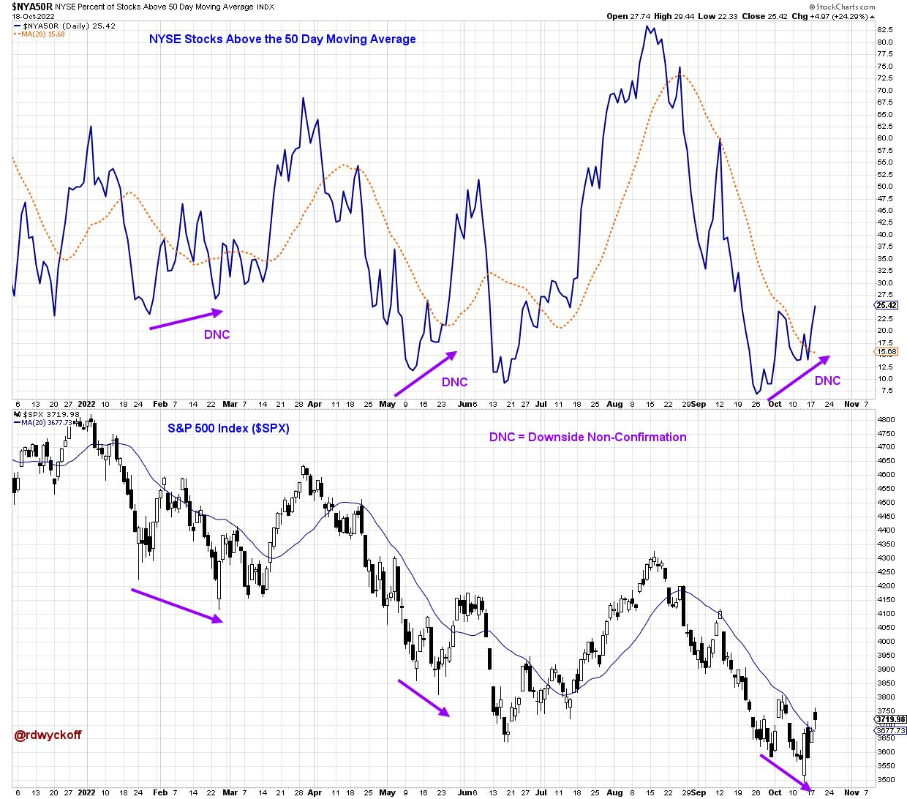

# Power Charting TV: Stocks on the Edge

URL: https://articles.stockcharts.com/article/articles-wyckoff-2022-10-power-charting-tv-stocks-on-th-935/
Date: October 18, 2022 at 09:20 PM
Author: Bruce Fraser

On rare occasions stock indexes become delicately balanced between two profoundly differing scenarios. This currently seems to be one of those junctures. The most recent Power Charting TV episode explores this existential moment.

Stock indexes have been in a mega-bullish upward stride since 2009. The pace of this advance has been illustrated by a classic Wyckoff trend channel construction in the S&P 500 Index ($SPX) and the NASDAQ 100 Mega-Cap Index ($NDX). Now both of these indexes are teetering just below their trend channels. Further declines in these indexes will clearly spell the end of decade long (secular) uptrends.

A rally needs to start soon to keep the very long secular trend intact. And there is a ray of hope that such an outcome is possible. Regular Power Charting viewers are aware that we are always on the search for potential ‘Green Shoots' that manifest prior to the emergence of a new rally phase in stock indexes. In September and October early evidence of Green Shoots developed. This suggests that individual stocks are beginning to resist the downward trend pressure. Two intraday breadth indicators are profiled in this episode. We can observe the classic downside non-confirmation (DNC) of the breadth indicators to the falling stock indexes as the internals improve.

NYSE Stocks Above the 50 Day Moving Average and S&P 500

Here is another illustration of the non-confirmation phenomena using the percent of stocks above the 50 Day Simple Moving Average (daily data). The message of this indicator is that some leadership stocks turn upward prior to the low in the stock index. This Breadth non-confirmation principle was part of the ‘Tree of Indicators' concept used for timing Swing, Intermediate and Cyclic turns in the stock market and was taught in the Technical Analysis classes at Golden Gate University (GGU).

Also, presented in this ‘Stocks on the Edge' episode is an introduction to the ‘Power Charting Trend Model'. Future episodes will profile how to interpret this trend model and the methods for finding industry groups and stocks that are emerging into uptrends.

Watch ‘Stocks on the Edge' here:

Stocks on the Edge. Power Charting. October 14, 2022

All the Best,

Bruce

@rdwyckoff

Disclaimer: This blog is for educational purposes only and should not be construed as financial advice. The ideas and strategies should never be used without first assessing your own personal and financial situation, or without consulting a financial professional.

Announcement:

The Wyckoff Market Discussion weekly series will have an open session on Wednesday October 19th at 3pm PT. Roman and I discuss markets from a Wyckoffian perspective each week. You are invited to join us for this special edition. Invite your friends, bring the popcorn, and prepare to be immersed in financial markets through the lens of Wyckoff. (click here to register).

To Learn More about the Wyckoff Market Discussion series: https://www.wyckoffanalytics.com/wyckoff-market-discussion/
