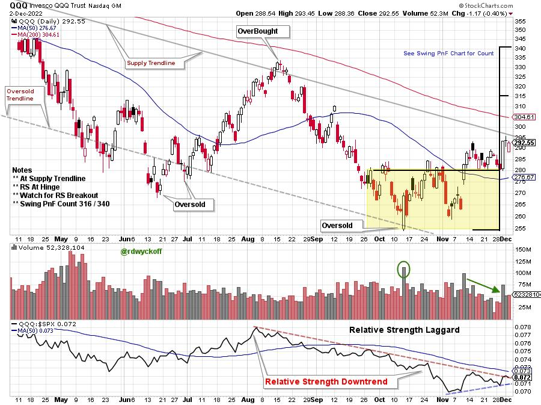
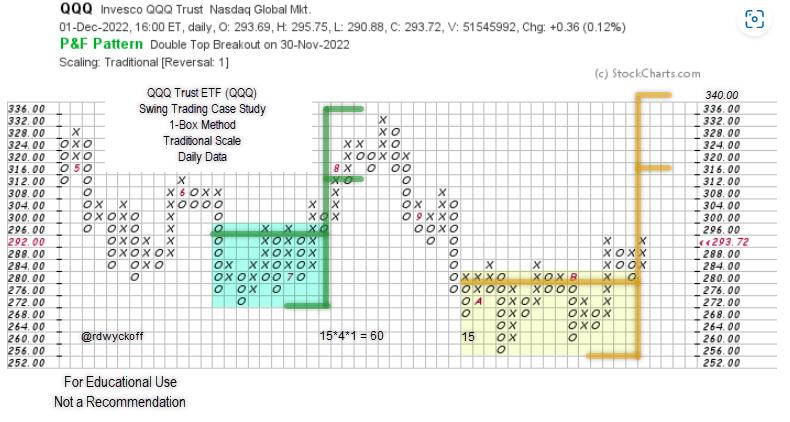

# Will the QQQ Swing into Gear?

URL: https://articles.stockcharts.com/article/articles-wyckoff-2022-12-will-the-qqq-swing-into-gear-223/
Date: December 02, 2022 at 05:37 PM
Author: Bruce Fraser

Mega-Cap Growth stocks have led the stock market weakness on the way down in 2022. They have also lagged during the 4th quarter rally. This weakness has been a drag on major stock indexes such as the S&P 500 and the NASDAQ Composite. With the recent rally phase well underway could the Mega-Cap Growth stocks be preparing to play catchup with a bout of outperformance? The Mega-Cap Stocks have immense capitalization weighting in the major stock indexes. If they shake off their underperforming ways, even temporarily, it could put stock indexes into hyperdrive. We turn to a Swing Trading PnF case study of the QQQ ETF to determine if a ‘Cause' has formed for a rally and the upward potential of that advance.

Chart Notes:

- A potential Swing Trading Accumulation Structure back to September for QQQ.
- QQQ Mega-Cap stocks have been a performance drag on major stock indexes during 2022.
- Relative Strength downtrend for the current quarter and the year illustrates the weakness.
- Relative Strength downtrend since August is attempting to reverse upward.
- QQQ is now in a Backup position with low volatility and diminished volume.
- The Overhead Supply trendline is immediately above and is important resistance.

Point & Figure Chart Notes:

- Swing PnF count (yellow shading) has price objectives near the August highs.
- A rise to this level would exceed the overhead Supply Line and the 200 d.m.a.

Better participation from these all-important mega-cap stocks would be a boost to the stock indexes, at least temporarily. A Swing PnF accumulation count appears nearly complete. This is a very important juncture on the charts, and we should monitor developments closely.

All the Best,

Bruce

@rdwyckoff

Disclaimer: This blog is for educational purposes only and should not be construed as financial advice. The ideas and strategies should never be used without first assessing your own personal and financial situation, or without consulting a financial professional.

## Announcement:

Best of Wyckoff Workshop. December 15, 2022, 9am to 12:30pm ET

This complimentary event is generously sponsored by the International Federation of Technical Analysts

To learn more and to register (click here)

Presenters and Topics:

- Alessio Rutigiano, Navigating the Crypto Market
- Fantz Herr, Improve Your Trading Results with Post-Trade Analysis
- John ‘Johniscan' Colucci, Scanning for Wyckoff Setups
- William Reardon & Roman Bogomazov, Live Trading Session (Wyckoff Tape Reading)
- Roman Bogomazov & Bruce Fraser, Wyckoff Market Discussion. A Wyckoff review of current markets

To learn more and to register (click here)
