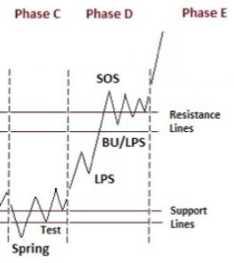
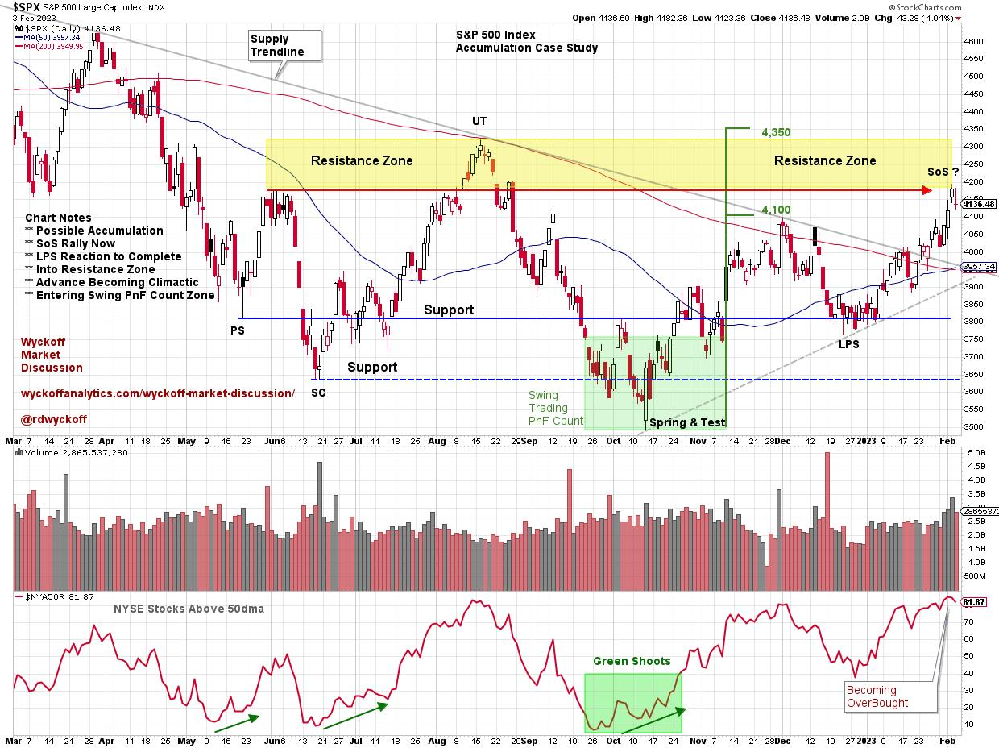
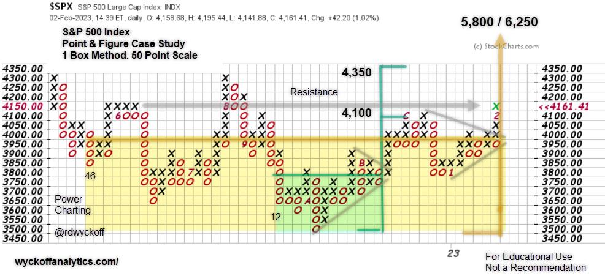

# Is the S&P 500 In Late Stage Accumulation?

URL: https://articles.stockcharts.com/article/articles-wyckoff-2023-02-is-the-sp-500-in-late-stage-ac-67/
Date: February 04, 2023 at 05:44 PM
Author: Bruce Fraser

Are the major stock indexes under Accumulation? If so, we Wyckoffians would expect an important Markup (uptrend) to follow. Accumulation is the process of large interests (known as Composite Operators) stealthily Absorbing shares of stocks they expect to appreciate during the subsequent Markup Phase. Accumulation can take an indeterminant period of time to form. The C.O. will systematically Accumulate their ‘Line of Stock' during this trendless price structure. Eventually a greater number of Institutional type investors will begin competing for the remaining supply of stock, which indicates that Absorption (and therefore Accumulation) is nearly complete. The Law of Supply and Demand is at work here. Demand is increasing and Supply has been largely Absorbed. This unbalanced condition will eventually throw stocks and the market into a new uptrend.

The S&P 500 Index has been range-bound since May 2022. Now the Index is approaching the late-May peak, which we define as Resistance. The May Support and Resistance have largely contained trading as price has been unable to meaningfully escape this zone to initiate a new trend. Now the $SPX has rallied to the May '22 Resistance level. Is Absorption nearly complete, which would allow the markup to proceed from here? Below is a chart study of $SPX:

S&P 500 Index ($SPX) Accumulation Study

Chart Notes:

- Preliminary Support (PS) and Selling Climax (SC) stop the decline in May and June.
- Spring & Test in October arrives at the end of the 3rd quarter.
- Two stage rally carries to the Resistance Zone & fulfilled the swing trading PnF Objective.
- The Supply TrendLine has defined the 2022 Bear trend stride and has finally been exceeded in January.
- Positive breadth divergence or Green Shoots appear as Spring & Test develop.

S&P 500 Index Point & Figure Case Study

PnF Chart Notes:

- Range Bound since May. Is Accumulation forming?
- Swing PnF Count generated at 3rd Quarter Spring & Test.
- Minimum Swing Count objective has been met as the $SPX enters Resistance Zone.
- A Minor Sign of Strength (mSOS) developed as $SPX exceeded the December peak.
- The index accelerated into the mSoS, Resistance Zone and minimum PnF count simultaneously.
- Watch for a potential reaction with expanding volume to signal exhaustion of the rally.
- Price momentum could accelerate into the 4,350 PnF upper target zone. This would be a positive.
- Watch for a Major Sign of Strength (MSoS) above the August high (4,300).
- After a MSoS, a Last Point of Support (LPS) or Back Up (BU) would be expected next.
- Once a LPS or BU is identified, Accumulation can turn into a Markup.

Caution is warranted at the Resistance area of a trading range. Traders must respect the possibility of continuation of the downtrend in an ongoing bear market. The FED is on a campaign to raise interest rates which is a normal bear market backdrop. We have enjoyed a strong rally with expanding breadth from the 3rd quarter lows. PnF horizontal count technique has nicely targeted the price objective recently fulfilled.

Wyckoffians are ‘tape readers'. Therefore, we will watch for the diminished spread and volume characteristics that accompany a reaction into a LPS or BU. These events would affirm late stage Accumulation and would be a juncture for positioning stocks for a more important Markup phase.

All the Best,

Bruce

@rdwyckoff

Disclaimer: This blog is for educational purposes only and should not be construed as financial advice. The ideas and strategies should never be used without first assessing your own personal and financial situation, or without consulting a financial professional.

## Power Charting Video

The most recent Power Charting video focuses on finding Industry Group leadership. In this case study the Semiconductor Group is profiled. A simple scan is used to identify stocks that are leading.

Finding Leadership in Semiconductors

For More on Wyckoff Accumulation

(click here) and (click here)

## Announcement

In the weekly Wyckoff Market Discussion (WMD) Roman Bogomazov and I profile important markets from a Wyckoff perspective. To learn more and to join our Wyckoff Community go to (click here).
