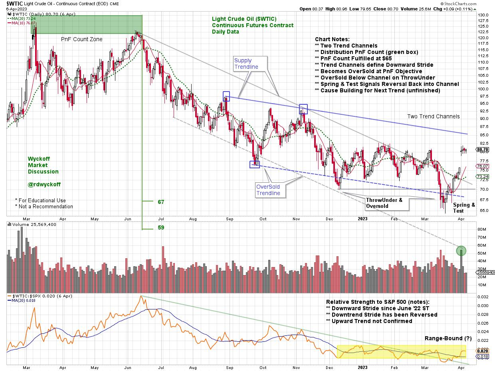

# Crude Oil Reaches an Interesting Juncture

URL: https://articles.stockcharts.com/article/articles-wyckoff-2023-04-crude-oil-reaches-an-interesti-761/
Date: April 10, 2023 at 01:19 PM
Author: Bruce Fraser

Wyckoff analysis of this essential commodity is currently revealing. The trend of Crude Oil has a major influence on not only most sectors of the stock market, but it is also a key cost input for the production of almost all goods, services, and other commodities. Since March of 2022, the general trend of Crude Oil has been downward, which has diminished inflationary pressure on the economy and consumers. Therefore, any change in trend has implications for overall economic activity. In the weekly Wyckoff Market Discussion (WMD) sessions Roman Bogomazov and I consider the present position and likely future direction of Crude. At the bottom of this blog post there is a link to the ‘Open Door Session' we conducted last week. In it we evaluate stocks, interest rates, crypto and commodities.

Tune into Power Charting this Friday for a case study analysis of Crude Oil on StockChartsTV. This chart is a preview of Friday's Power Charting workshop.

In March of 2022 Crude accelerated into a Buying Climax and was immediately reversed. At that time in WMD (and Power Charting) we called for a stopping of the upward trend with a range-bound market to follow. That is what happened. Crude failed to continue the upward trend with a Secondary Test in June 2022 and a downtrend followed. At the conclusion of the June Secondary Test (ST) a Point & Figure count was taken flagging a downward price objective of $67 to $59 (the green shaded box defines the area of the PnF count).

Chart Notes:

- Two Trend Channels
- Distribution PnF Count (green box)
- PnF Count Fulfilled at $65
- Trend Channels define Downward Stride
- Becomes OverSold at PnF Objective
- OverSold Below Channel on ThrowUnder
- Spring & Test Signals Reversal Back into Channel
- Cause Building for Next Trend (unfinished)

Tune in to Power Charting this Friday for the complete Wyckoff case study analysis for crude oil. Current and historical PnF and vertical charts will be reviewed with a Wyckoffian perspective.

In the meantime, tune into the Wyckoff Market Discussion from last week. In addition to Wyckoff Method studies, some stunning historical analogs (crypto and gold to S&P 500) are presented by Roman. Check it out here (and note the special WMD offer which expires on 4/12/2023):

Wyckoff Market Discussion for April 5, 2023

To Learn More about the Wyckoff Market Discussion (Click Here)

See You Friday,

Bruce

@rdwyckoff

Disclaimer: This blog is for educational purposes only and should not be construed as financial advice. The ideas and strategies should never be used without first assessing your own personal and financial situation, or without consulting a financial professional.
