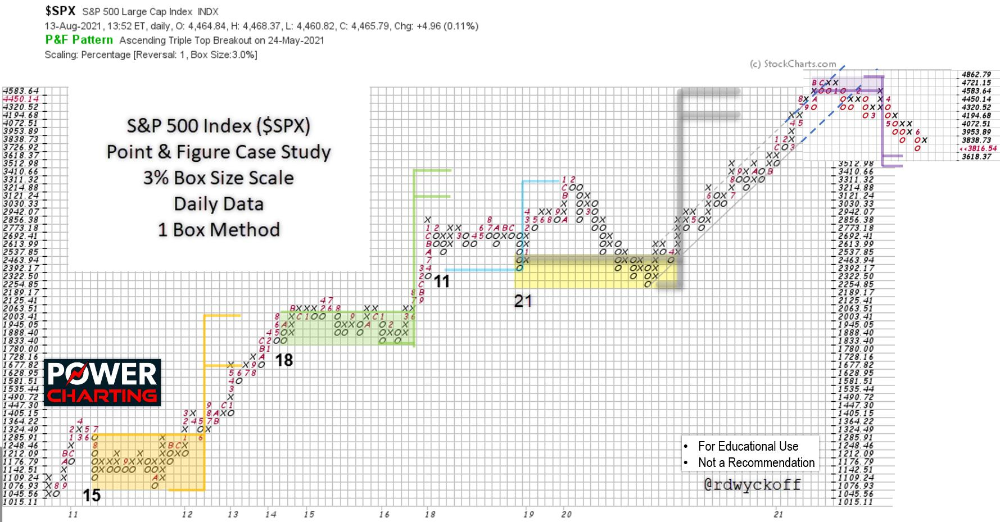
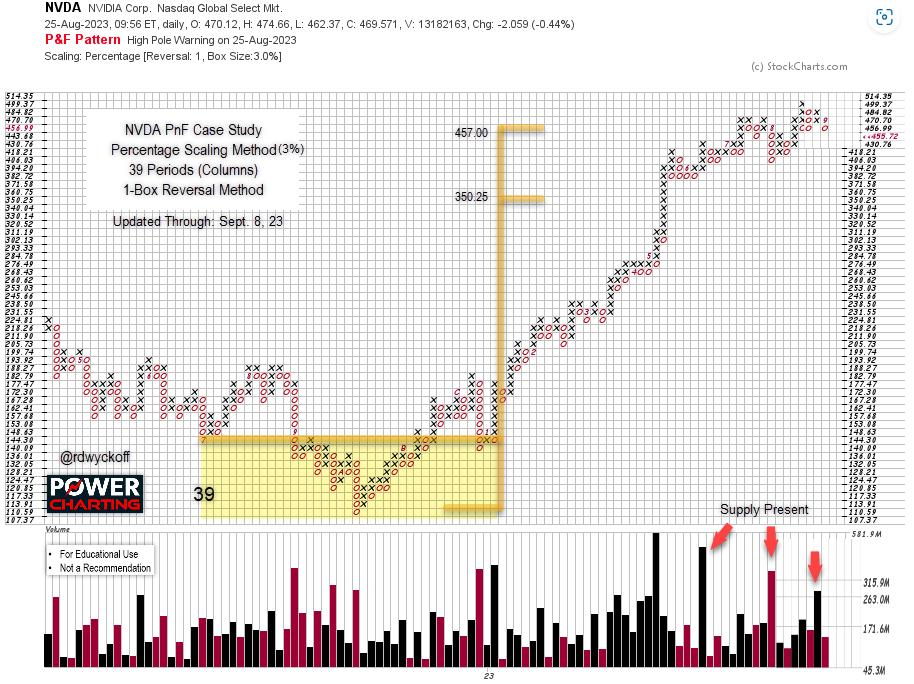

# Percent Scale PnF Technique. Nvidia Case Study.

URL: https://articles.stockcharts.com/article/articles-wyckoff-2023-09-percent-scale-pnf-technique-nv-456/
Date: September 10, 2023 at 03:09 PM
Author: Bruce Fraser

A project that I have been working on in recent years is Horizontal PnF Counting using Percent Scaling. The method has generated promising results. Here we look at two case studies that illustrate the techniques value. Using the ‘Percentage Chart Scaling' Method in StockCharts.com Point & Figure charting platform produces a Log Scale PnF chart. The percent scale defaults to 1% but can be adjusted manually. The case study charts in this blog are 3% scale PnF Charts. It takes a 3% change in price to move to the next vertical grid column.

This method is useful for estimating the price objective potential of a dynamically growing financial instrument. The traditional rules for counting horizontal (range-bound) structures also applies to the log-scale method.

The first case study is the bull market run in the S&P 500 Index from 2010 to the Bull Market peak in 2021. Each of the Re-Accumulation pauses are counted and flagged for their price projection estimates. These Re-Accumulations can take a year or more to unfold and build a Cause for the next upward ascent. The counts are remarkably accurate and useful. Please take time to study each of them.

This charting method has been made possible by the introduction of computerization. This technique is a compounding function rather than a simple horizontal counting method used in traditional fixed scale PnF charting methodology. Therefore, each horizontal column in the range-bound structure represents a compounding event. An example of a 10 column wide range-bound price structure represents 10 periods of say 3% growth in the subsequent upward trend. Thus 10 periods of growth at 3% results in a compounded appreciation of 33.1% which would be the price target for the advance.

The benefit of this PnF method is the capability of estimating the compounded growth of a dynamically advancing investment. As is the case with traditional PnF Method the time duration of the move remains an unknown. It is best to employ log-scale for dramatically rising and volatile instruments. For smaller ‘Swing Trading' structures arithmetic scaling is most effective. Fellow Wyckoffian Alessio Rutigliano has used log scaling PnF very effectively in the analysis of the Crypto Markets. Alessio's analytical work on Crypto Markets can be seen and studied at WyckoffAnalytics.com.

S&P 500 Index ($SPX) Point & Figure Case Study. 3% Scaling, 1-Box Reversal Method.

This log-scale horizontal PnF study of the S&P 500 Index spans more than a decade. The bull run from 2010 to 2021 had four well defined ‘Re-Accumulation' periods. Each of these structures identified price targets that were eventually achieved. The final upward leg of the Bull Market was dramatic in its persistency and was preceded by a long and volatile trading range. The horizontal PnF count was exceeded by only one box and was the conclusion of the bull market. The log scale of this chart study was in 3% increments, which is very aggressive scaling, and illustrates what a virile bull market this decade long period was. Consider that each upward chart entry (entered as an ‘X' on the chart) was a 3% increase.

The final upward surge into the Bull Market peak was capped by an acceleration of the index into a Buying Climax. A throwover of the trend channel combined with a fulfillment of the PnF count objective sealed the fate of this aging, historic Bull Market run.

NVIDIA Corp. (NVDA) Point & Figure Case Study. 3% Scaling, 1-Box Reversal Method.

NVIDIA Corp. (NVDA) has become one of the "Magnificent 7'. The rally in 2022 and '23 was preceded by a period of Accumulation. Across the Accumulation 39 columns were counted. One-Box reversal method is used. Thus 39 periods of 3% appreciation are estimated. From the low of the count area and from the count line two price objectives are generated and flagged. The price objectives are 350.25 to 457.00. Recently NVDA surged past the higher target zone. In a final upward run (usually considered climactic) the upper objective can be exceeded. If, in short order, the stock price reverses and falls below the higher objective back into the target zone we will consider the PnF count to be active and still valid. NVDA has shortening upward thrusts in the area of the $457.00 price objective. As of Friday, September 8th NVDA was back below the upper price objective, closing the week at $455.72. Sudden weakness to a support area would be further evidence that, at best, a new range-bound price structure is beginning. Which could become a fresh new Re-Accumulation or Distribution. Only time will tell, and we will watch closely.

Notes on Log Scale PnF Method

1. Initially default to 1% Scaling. Then try 2% Scaling.

2. Count Accumulation and Re-Accumulation structures as you would with arithmetic scale charts.

3. Default to 1-box reversal charts. Avoid counting 3-box charts.

4. Primarily use log-scale method for dynamically growing financial assets. Use arithmetic scale otherwise.

5. Count very conservatively. Big counts will generate very big price objectives using log-scale.

6. Use a financial calculator or Excel to calculate compounded growth for the price objectives.

7. For Distribution and Re-Distribution default to arithmetic scale PnF charts to estimate price targets. Log scale will typically result in over-counting of downside objectives.

8. Lots of practice will help you discern when arithmetic scale or log-scale is the best method.

All the Best,

Bruce

@rdwyckoff

Disclaimer: This blog is for educational purposes only and should not be construed as financial advice. The ideas and strategies should never be used without first assessing your own personal and financial situation, or without consulting a financial professional.

#### Announcement:

TSAA-SF Annual Conference

In-person in San Francisco. Livestreaming for dues paying members.

The TSAA-SF will be hosting our 2023 annual conference, in partnership with AAPTA, at Golden Gate University on Sep 16, 2023.

Speakers include:

Linda Raschke - Auction Theory versus the Theory of Reflexivity

Brett Villaume - Understanding Relative Strength

Bruce Fraser - Swing Trading Technique Using the Wyckoff Method

Ali Merchant - Power of trend lines and market outlook using major indices

Bob Schott - Technical Analysis for the Buy Side

Eoin Treacy - Waiting for Godot

Damon Pavlatos - Anticipating Market Action using Market Profile, Volume Analytics Strategies along with traditional charting analysis.

Cost: TSAA-SF members in-person: $150 (breakfast and lunch included), non-members: $400. Free livestreaming for TSAA-SF members. Join the TSAA-SF now for only $75/year.

For more information on the speakers and their topics and to register (Click Here):

https://www.tsaasf.org/event-5391152

#### Power Charting TV:

Wyckoff Case Study: A Period of Distribution Featuring Nvidia! First of Three Parts. Special Guest: Roman Bogomazov

Description:

Master Wyckoffian Roman Bogomazov joins Bruce Fraser for an in-depth historical chart case study of Nvidia common stock. This is the first installment of a three-part Power Charting series devoted to analyzing Nvidia common stock. Each of the three episodes is evaluated using the Wyckoff Chart Reading Method in chronological order. This episode evaluates a period of Distribution. In conducting these case studies, the objective is to illustrate and develop in the viewer an appreciation of the nuance the Wyckoff Method offers in the understanding of the present position and likely future direction of a stock or index, using chart analysis, for the intention of more effectively campaigning that instrument at the best possible time.
