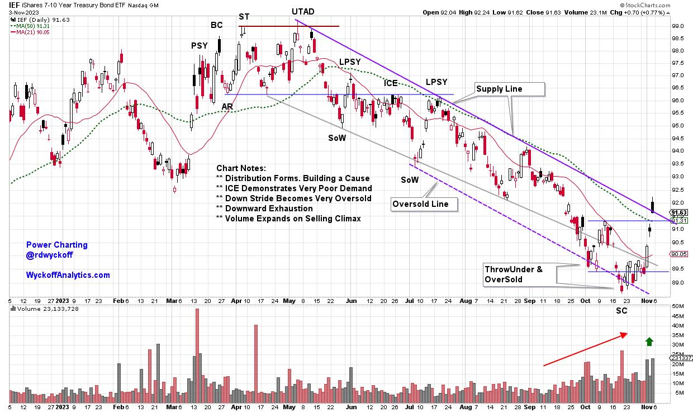
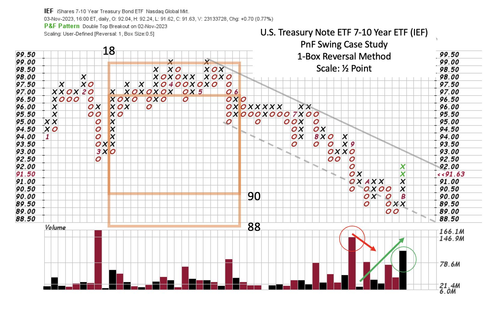

# Bonds Got Clipped. Now What?

URL: https://articles.stockcharts.com/article/articles-wyckoff-2023-11-bonds-got-clipped-now-what-323/
Date: November 05, 2023 at 06:04 PM
Author: Bruce Fraser

Last week's sharp upward reversal in the bond market followed the FOMC Interest Rate decision. A decision to not change the Fed Funds Interest Rate target. Unlike the prior meeting ‘non-action', this decision inspired robust bond and stock buying by the investment community. The downward stride of bond prices this year has been punishing to bond portfolio valuations. The regional bank crisis in the spring of this year dramatically illustrated the problem. Bond prices calmed into the beginning of summer, but trouble heated up again with the start of a new downward leg of the bond bear market. Was there a warning that a new downtrend was starting, and how far down could bond prices fall?

For this trend study we turn to the iShares U.S. Treasury Bond 7-10 Year ETF (IEF). Treasuries rallied following the trouble in the banking sector in March. Essentially in the 2nd Quarter of '23 a new wave of Distribution formed preparing the way for a future downward trend for bond prices. In the month of June Distribution was nearly complete as demonstrated by a very flat price structure below key Support, with no ability for price to lift. Wyckoffians call this ICE when it develops following Distribution. The Supply Trendline established the likely pace of the emerging downward stride. Once a downtrend kicks off it must be respected for the force of nature it is.

iShares U.S. Treasury Bond 7-10 Year ETF (IEF)

#### Chart Notes:

- Following the Regional Banking trouble bonds try to rally. Re-Distribution Follows
- UTAD & SoW decline is a warning of the presence of large supply
- LPSY & ICE indicate very weak demand, a sign of the downward stride
- PnF studies can now estimate the extent of the price potential
- Exhaustion of the trend is signaled by ThrowUnder with accompanied Climactic volume
- Confirmation of the Selling Climax is the high volume jump out of the downward channel

iShares U.S. Treasury Bond 7-10 Year ETF (IEF)

#### PnF Chart Notes:

- Distribution has well defined symmetry. Two tests of $99. PSY = LPSY at $97
- ICE has formed at $96 under prior Support
- Decline following UTAD pierces support on expanding volume. ICE follows
- Attempt to rally fails at new resistance. PSY=LPSY here. Take PnF count from here
- Distribution target zone is estimated as $88 / $90
- Confirmation of this target is ThrowUnder on massive spike of Volume
- Climactic volume on widening price spread stops the decline
- Watch for evidence of either an emerging Accumulation or Re-Distribution

At this time a range-bound condition is likely underway. The sharp sudden rally has good demand and short covering characteristics. Stock investors were bullishly inspired by the ripping reversal. The deep pessimism into recent lows for stocks and bonds is indicative of investors being positioned with high cash levels and short exposure. Fuel for a rally that appears to have kicked-off this past week.

All the Best,

Bruce

@rdwyckoff

Reference to Wyckoff Distribution definitions: CLICK HERE

Disclaimer: This blog is for educational purposes only and should not be construed as financial advice. The ideas and strategies should never be used without first assessing your own personal and financial situation, or without consulting a financial professional.

Announcement

Join Roman Bogomazov and me each week on the Wyckoff Market Discussions where we take a deep dive into key markets from a Wyckoffian perspective. Stocks, bonds, commodities and cryptos are among the financial markets profiled. CLICK HERE to watch a recent episode and learn more.

#### Power Charting TV:

Power Charting Episode for November 3, 2023: Is the Correction Over for Stocks?
