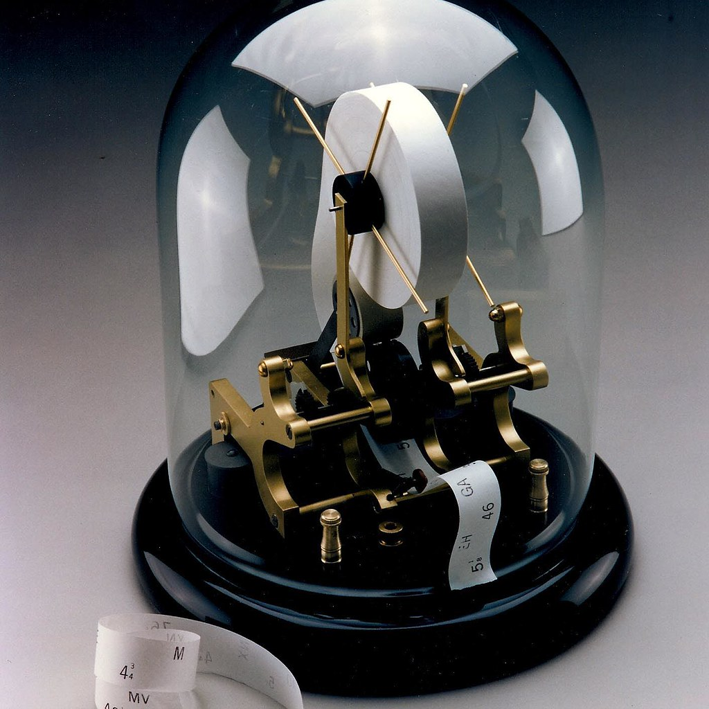
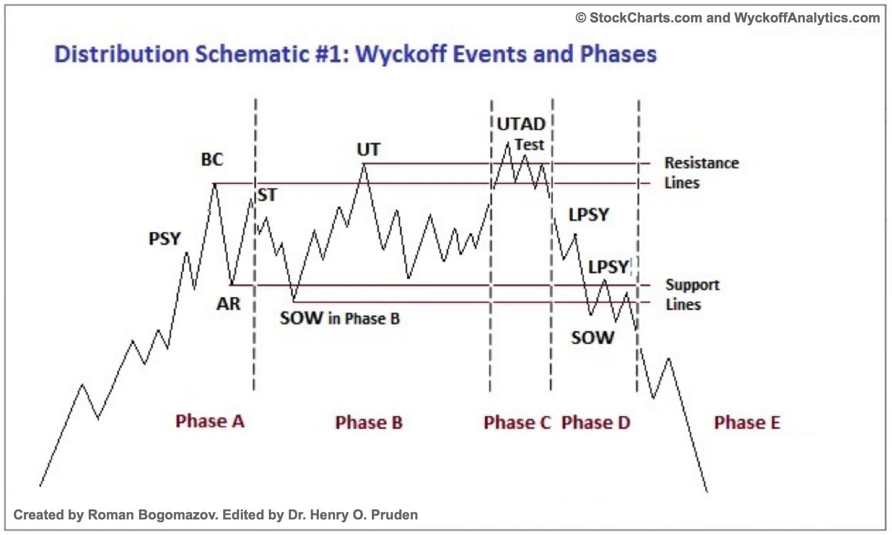

# Tape Reading for Distribution

URL: https://articles.stockcharts.com/article/articles-wyckoff-2024-02-tape-reading-for-distribution-617/
Date: February 06, 2024 at 01:32 PM
Author: Bruce Fraser

Recent Power Charting episodes have been devoted to the classic technique of chart reading innovated by Richard D. Wyckoff. He referred to the method as ‘Tape Reading' while it is actually the technique of reading charts, bar by bar to assess the likely future direction of an index, stock, bond or futures contract. This price and volume chart reading method is as powerful and relevant as it was a century ago when Mr. Wyckoff was successfully employing it. Using the Case Study approach we utilized at Golden Gate University (GGU), the recent episodes of Power Charting have largely focused on this type of analysis.

The current Power Charting (link below) has a Distribution case study of United Parcel Service (UPS). Mr. Wyckoff integrated Vertical Bar Chart analysis with Point and Figure studies therefore we do the same in this case.

The Wyckoff Community have enthusiastically embraced these studies and have asked for more of them. I am all for it. Chart reading is about the most fun a Wyckoffian can have! This bar by bar analysis of price and volume is a meticulous process that once understood can reap huge rewards. It is a mastery skill. Wyckoffians will study and markup thousands upon thousands of charts, finding their mastery path continuing to ever higher levels. My mission, in these cases, is to support you on your personal market mastery journey.

All the Best,

Bruce

@rdwyckoff

Disclaimer: This blog is for educational purposes only and should not be construed as financial advice. The ideas and strategies should never be used without first assessing your own personal and financial situation, or without consulting a financial professional.

Power Charting Video: Tape Reading for Distribution

Video Index

00:00Intro

02:03New StockCharts Index Members Page

10:43Pruden Model - Distribution Definitions

11:30Wyckoff Rules

11:43Long Term Weekly Chart (UPS)

14:00Point & Figure Big Picture (UPS)

15:18Tape Reading Action (UPS)

21:54Point & Figure (UPS)

Reference to Wyckoff Distribution definitions: CLICK HERE
