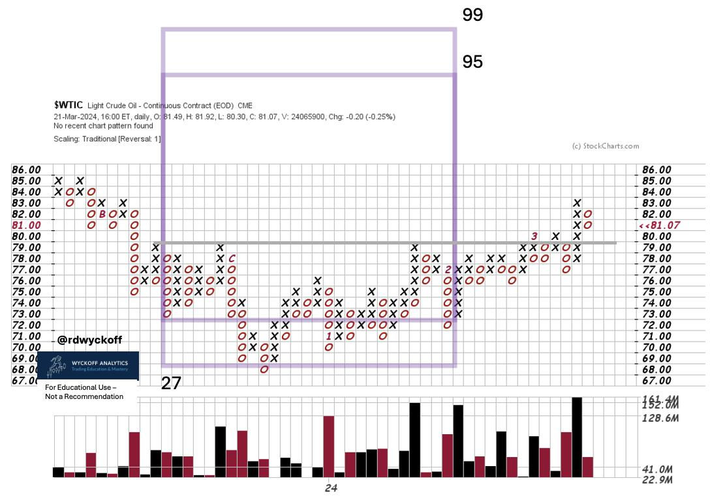
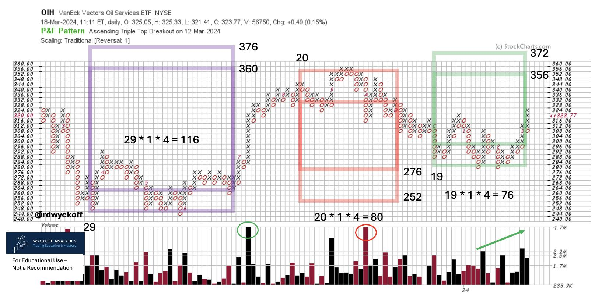
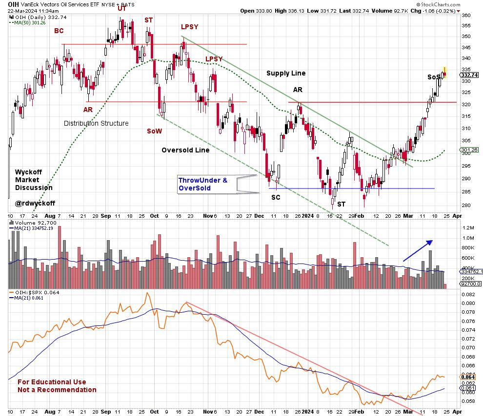

# Energy Heats Up

URL: https://articles.stockcharts.com/article/articles-wyckoff-2024-03-energy-heats-up-900/
Date: March 22, 2024 at 02:57 PM
Author: Bruce Fraser

Crude Oil struck an intraday low on December 13th of 2023, the same day as Fed Chair Powell's notable press conference. This concluded a decline from approximately $95 (at the end of the 3rd quarter) to under $68 (near the end of the 4th quarter). After that Fed meeting and press conference the market priced in as many as five ¼ point Fed Funds interest rate cuts in 2024-25. This optimism has waned as crude oil began building a range-bound structure that appears to be an Accumulation base. Now this Accumulation appears nearly complete.

Crude Oil, Continuous Contract. PnF Swing Trade Case Study. 1 - Box Method

Wall Street's enthusiasm for future interest rate cuts is deteriorating with recent higher oil prices. Rising energy prices are a leading cause for inflation as measured by CPI, PPI, PCE and others.

Producer Prices (PPI) have recently been reported and were surprisingly double the forecast of economist's projections. Inflation is heating up again. The FOMC has headwinds that will temper their ability to dramatically reduce interest rates this year.

A swing trading Point and Figure study of the Accumulation provides an estimate of the upside potential for crude oil. This is a conservative PnF count which could be extended. If the objectives are fulfilled larger counts can be considered.

VanEck Oil Services Group ETF (OIH). Three PnF Swing Counts

There have been several swing trading opportunities in the oil services industry group. Here are three PnF counts. Two of them came within one box of fulfilling the minimum projections. The most recent count is still unfinished. Is it possible a larger ‘Campaign Count' using 3-box reversal method is developing?

Chart Notes:

- Range-Bound since December.
- Local Climax from $315 to $335 which is just above the Resistance zone.
- Volatility remains elevated in the trading range. Less volatility on pullbacks would suggest absorption.
- Relative Strength basing after downtrend. Attributes of leadership emerging.
- Accumulation range could grow larger.

The vertical chart has the recent Distribution and Accumulation structures. They have classic Wyckoff attributes. The Sign of Strength (SoS) advance above the resistance line of the Accumulation may have the character of a local Buying Climax. This would be a place for OIH to pause before continuing higher. A correction back into the Accumulation trading range is very possible. The less correction of price the better. Any pullback would make the PnF count larger. The Relative Strength peaked in September of last year and has been in a well-defined downtrend since. This trend has been reversed upward and bodes well for price strength in the future.

Take time to evaluate the other industry groups in the Energy Sector as they have a family resemblance to the Oil Services Group.

#### Power Charting Final Episode

The 228th and final episode of Power Charting TV has been posted. To the many of you who have watched these videos, asked great questions and made suggestions... a huge Thank You! I have always visualized us being in the classroom setting together discussing all-things Wyckoff. The thrust and goal of these sessions has been to convey the concepts, techniques and nuances of the Wyckoff Method. As you all know, but please allow me to repeat, Wyckoff is a complete Method for trading markets. The goal of all Wyckoffians is to be on the Path to Trading Mastery. So many of you have shared your work and your progress is impressive. My plan is to post these written blogs on a more frequent basis, so stay tuned. Please sign up for email notification if you have not done so already.

There are excellent resources to support you on your mastery path. Join Roman and me for the weekly Wyckoff Market Discussion (Wednesday's at 3pm PT). Below is a link for a discount to WMD for my readers. Check out additional resources at Wyckoff Analytics (click this link to learn more). Consider taking Roman's ‘Wyckoff Trading Courses'.

All the Best,

Bruce

@rdwyckoff

Disclaimer: This blog is for educational purposes only and should not be construed as financial advice. The ideas and strategies should never be used without first assessing your own personal and financial situation, or without consulting a financial professional.

Join Roman Bogomazov and Me for the Weekly Wyckoff Market Discussions.

Special WMD Discount Coupon for Power Charting watchers. Be sure to add the coupon code (powercharting) at checkout:

https://www.wyckoffanalytics.com/wyckoff-market-discussion/

Power Charting Video

Power Charting Video: Gold Shines (March 8, 2024)
