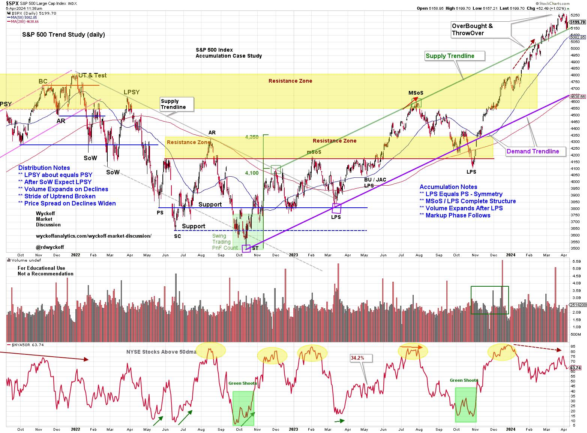
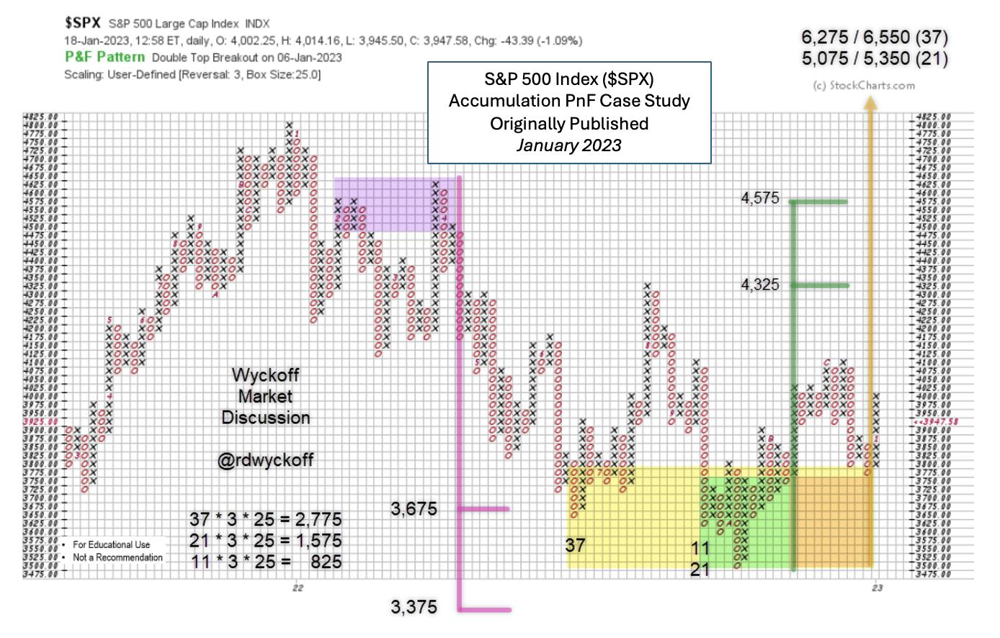
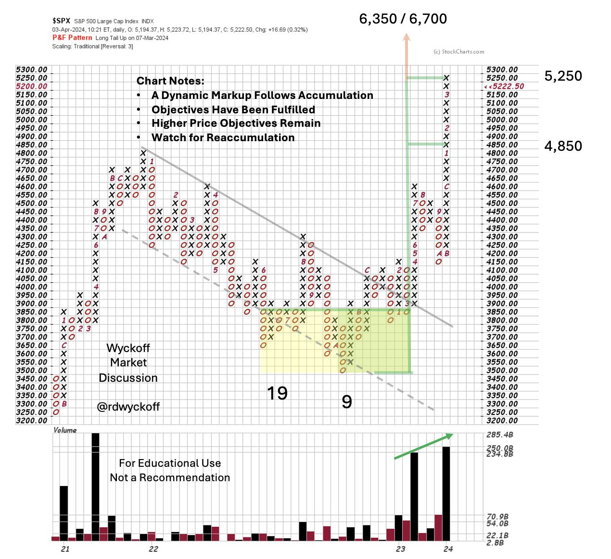

# Trifecta of Trouble

URL: https://articles.stockcharts.com/article/articles-wyckoff-2024-04-trifecta-of-trouble-402/
Date: April 05, 2024 at 11:49 AM
Author: Bruce Fraser

The Markup Phase of a Bull Market is glorious to behold and participate in. But they do ebb and flow. The bullish run in the major stock indexes has been persistent in 2024. We often discuss the quarter-end effect for stock index trends and the upward trend has persisted into the end of the first quarter with diminishing momentum. Let's turn our attention to some classic and powerful Wyckoff chart studies to determine the present position and possible future direction of the indexes as the second quarter begins.

S&P 500 Index with Wyckoff Markups. 2021-2024

This daily chart of the S&P 500 should be familiar to regular readers. It is our Wyckoffian record of market structure going back to the bull market peak of 2021. It is a real-time journal of our Wyckoff Analysis through the Distribution Structure, the Markdown, the Accumulation Phase of 2022-23 and now the Markup. The Markup finally exceeded the rangebound condition of the Accumulation with the advance that began in October of '23. We had been making the case for the unfolding Accumulation here and in the Wyckoff Market Discussions (every Wednesday with Roman Bogomazov) throughout the Accumulation period.

Recently the S&P 500 climbed above the well defined Markup channel into a Throwover and OverBought condition. This OverBought / ThrowOver has arrived as the First Quarter was coming to a conclusion. Thus suggesting ‘Window Dressing' shenanigans by institutional types. Often strong trends in the indexes (both upwards and downwards) can follow through and persist for a few weeks into the new quarter. We will watch for a change of character in the behavior of the indexes in the Second Quarter. An example of this would be a reversal of the S&P 500 back into the upward striding Trend Channel. A sudden and sharp break back into the channel would be labeled an Automatic Reaction (AR) and would represent an important confirmation of the upward trend exhaustion. Until such an event the upward trend must be respected.

We expect the upward stride of a Markup phase to be broad and strong and such is the case here. Recall that Accumulation is a zone of deepening pessimism where the public and institutions become progressively more cautious. Such caution manifests as portfolio defensiveness (higher levels of cash, lower beta stocks and more bond type assets). Meanwhile the ‘Composite Operator' types are absorbing stocks with good growth and value features for the next bull market. This puts stocks in very strong hands. This Supply to Demand imbalance can result in stock indexes launching higher following the preparation phase of Accumulation. As Accumulation concludes broad pessimism is observed in the extreme pessimism readings of various sentiment gauges (which were profiled in Power Charting and on WMD at the time).

Point and Figure Price Objectives

S&P 500 Point & Figure Study. January 2023

This PnF legacy chart was first profiled in January of 2023. It estimated the downside potential of the bear market, which was fulfilled with a Selling Climax and a Secondary Test. The Climax initiated Accumulation (detailed in the vertical chart above) that continued throughout the second half of 2022. In January of '23 the upside of the nearly completed Accumulation was estimated in three segments. The first two segments have now been fulfilled. Note the Count Line was 3,775 and the $SPX was at 4,000 when this projection was made and published. Pessimism at the time was such that this study was met with much disbelief, a very good sign for the higher prices yet to come as the indexes began climbing the ‘Wall of Worry'.

Below is a PnF update with the Markup phase. Second phase price objectives are now being fulfilled. New price highs above the 2021 bull market peak have markedly swelled bullish sentiment. Analyst types are now rushing to make projections for the $SPX above 6,000 and even 7,000. This bulge of optimism is a warning sign that caution is warranted.

S&P 500 Point & Figure Study, 50 Point Scale. April 2024

The current interpretation of the 2022-23 Accumulation shows the robust Markup following the Accumulation (50 point scaling slightly changes the price objectives). Once the downward trend channel was broken and tested from above the upward stride was dramatic. Index prices have now Upthrusted the bull peak of 2021 where a Backup to old resistance is likely.

#### Trifecta of Trouble (a summary)

1) The S&P 500 is now above the upward stride of its trend channel. This OverBought condition could lead to a correction and would be confirmed by return into the channel. Old resistance from the 2021 bull peak would be a price level to expect support to develop.

2) Point & Figure Price Objectives generated in early 2023 are now being fulfilled. Watch for classic signs of stopping action such as an Automatic Reaction and range-bound sideways trading. This would generate PnF count potential for either ReAccumulation or Distribution. Higher price objectives remain and there is good seasonality in the second half of this election year. We will watch the tape for further indications.

3) Sentiment has flipped from bearish to bullish. High readings from the NAAIM, AAII, CNN Fear & Greed and other important gauges are frothy. This is normal and typical in a Bull Market as the upward stride of the trend ebbs & flows. Corrections of the uptrend bring back caution and even pessimism which builds cash for higher prices in the future.

A dynamic Markup is very exciting, important, and not to be missed. Corrections along the way are inevitable. They often represent rotation of leadership as the economy matures and changes character and that appears to be the case here (subject for future WPC blog posts).

All the Best,

Bruce

@rdwyckoff

Disclaimer: This blog is for educational purposes only and should not be construed as financial advice. The ideas and strategies should never be used without first assessing your own personal and financial situation, or without consulting a financial professional.

#### Announcement

Wyckoff Market Discussion – Free Open Door Session. Wednesday April 10, 2023, 3pm PT

Join Roman Bogomazov and me for a FREE session of the Wyckoff Market Discussion. From a Wyckoffian perspective we discuss the current state of key financial markets.

Register to attend this free session (CLICK HERE)

To Learn more about the WMD series (click here)
