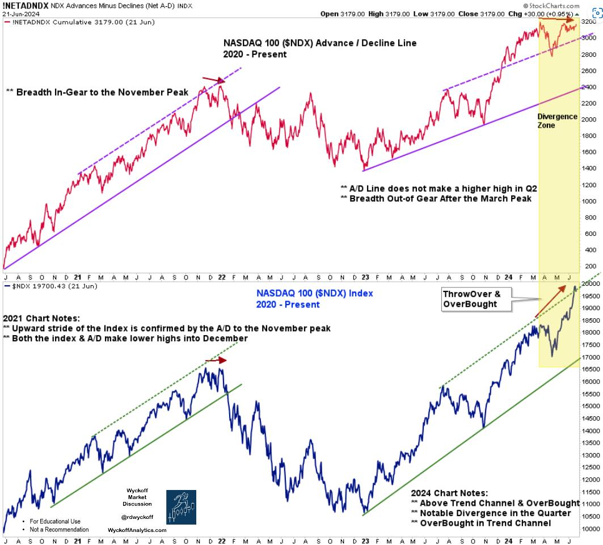
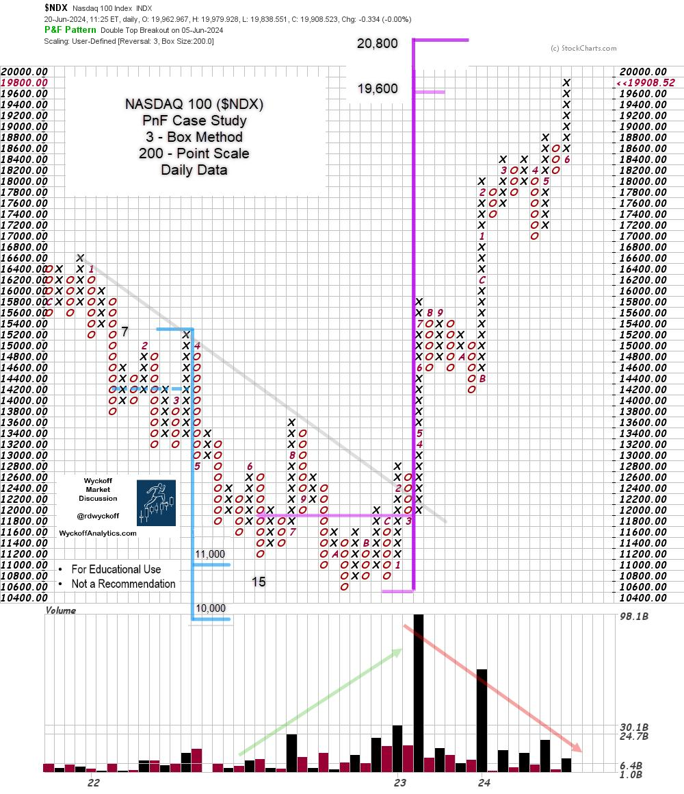

# End of Quarter NASDAQ 100 Pile-On

URL: https://articles.stockcharts.com/article/articles-wyckoff-2024-06-end-of-quarter-nasdaq-100-pile-956/
Date: June 24, 2024 at 02:32 PM
Author: Bruce Fraser

The NASDAQ 100 ($NDX) has been surging higher since October 2023 with the pace of advance accelerating in the second quarter of 2024. These 100 components are among the largest market capitalization NASDAQ Composite ($COMPQ) stocks. All of the ‘Magnificent-7' mega-caps are represented in this index. Now the second quarter is concluding and the $NDX has been leaping upward in what Wyckoffians would describe as a climactic pace. End-of-Quarter window dressing is suspected. Institutional types are deploying available cash into hot-hot Mag-7 stocks prior to Quarter-End. NVDA alone has added about 1 trillion dollars of market cap to its valuation in about a month.... Stunning. Only institutions, en masse, have the buying power to propel valuations higher in such a brief period of time. And this stampede of buying has been rushed into the end of a three-quarter uptrend. Such Buying Climaxes are often reversed suddenly and sharply in what Wyckoff terms an Automatic Reaction (AR). We will watch for the possibility of such a reversal in the third quarter. If institutions are accelerating their buying into the current calendar quarter, then demand should dry up as the month and quarter rolls over.

The chart study below illustrates early signs of exhaustion among the elite growth stocks of the NASDAQ 100. The study is of the $NDX advance / decline line as a representation of the breadth of participation of these 100 stocks. Note that with the late March price high in the index (first quarter window dressing) the A/D line peaked. It has not exceeded this level in the three months since. With the torrid rise of the $NDX in the second quarter, a clear and dramatic divergence has developed. Breadth divergences often warn of an impending ‘Change of Behavior' in the stock market indexes.

NASDAQ 100 Index with Advance / Decline Line 2020-2024

Chart Notes:

- During 2021 the $NDX and the A/D line climbed lockstep to the Bull Market peak in November.
- In March 2024 the NASDAQ 100 A/D Line peaked and, so far, has not matched that peak in the second quarter. The $NDX has soared to new heights since then, creating a dramatic divergence.
- During the second quarter NVDA climbed above the 3-Trillion dollar mark becoming the largest market capitalization company exceeding both AAPL and MSFT. During the year NVDA has added nearly $2T to its market capitalization (through June 19th). Much of the strength of the $NDX in the quarter is attributable solely to NVDA.
- The NASDAQ 100 index is composed of the premier growth stocks of this bull market. The A/D Line of the index indicates the majority of these elite growth names have paused in their respective uptrends. This A/D Line divergence confirms the narrowing of money flows into fewer elite growth stocks.

NASDAQ 100 Index Point & Figure Case Study

While the NASDAQ 100 A/D Line was making an internal momentum peak at the end of the first quarter the Point & Figure price targets estimated by the 2022-23 Accumulation still had higher to go. On this PnF chart March concluded with an entry at 18,000. The estimated price target of the Accumulation in this study is 19,600 / 20,800. NVDA and other stocks in the $NDX accommodated and continued climbing in the second quarter to the PnF price targets, reaching 19,800 in late June.

Chart Notes:

- A sudden and sharp reaction would suggest the start of a range-bound condition. This has not happened yet. The uptrend may have further to climb. A period of Cause Building would be expected to follow. Only then could it be determined if Re-Accumulation or Distribution is underway.
- Note the diminishing volume with each upward thrust of the trend. Demand is waning. Another warning that fewer stocks are propelling the index to new heights.
- Study how the Re-Distribution count of early 2022 flagged the Selling Climax low and the cause building process of Accumulation that resulted.

The PnF study above pointed to higher price objectives as the momentum peaked in March and a few Mega-Cap stocks accommodated during the next quarter. Now the $NDX is in the process of fulfilling those higher price objectives. Wyckoffians have a checklist of what to watch for when determining the intentions of the large Composite Operators as the last half of the year approaches.

All the Best,

Bruce

@rdwyckoff

Disclaimer: This blog is for educational purposes only and should not be construed as financial advice. The ideas and strategies should never be used without first assessing your own personal and financial situation, or without consulting a financial professional.

Helpful WPC Blog Links:

Trifecta of Trouble (Click Here)

Distribution Definitions (Click Here)

Wyckoff Power Charting. Let's Review (Click Here)

Wyckoff Resources:

Additional Wyckoff Resources (Click Here)

Wyckoff Market Discussion (Click Here)
