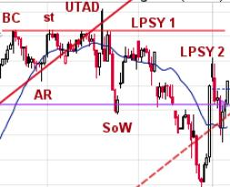
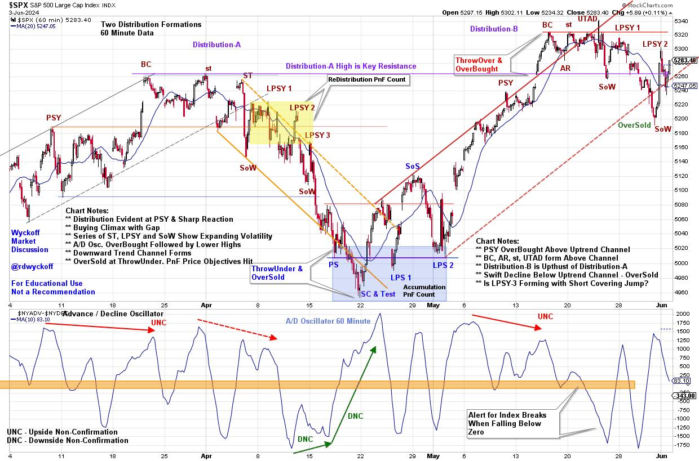
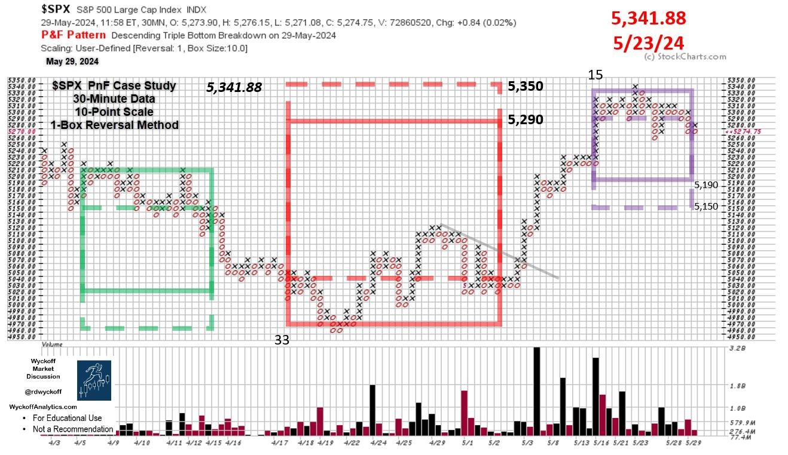

# Wyckoff at Work in the Intraday Timeframe

URL: https://articles.stockcharts.com/article/articles-wyckoff-2024-06-wyckoff-at-work-in-the-intrada-2/
Date: June 03, 2024 at 05:28 PM
Author: Bruce Fraser

It is well known that stock market indexes are fractal. Demonstrating repeatable price structures in all timeframes. In the intraday timeframe these price structures repeat frequently. The Wyckoff characteristics of Accumulation, Markup, Distribution and Markdown are constantly at work in smaller periods of time. Wyckoff students will study such structures to sharpen analytical and trading skills. In the example below of the S&P 500 Index the 60-minute timeframe reveals an unfolding Distribution and Markdown through March and April. Followed by a period of swing trading Accumulation. In May, once again Distribution appears to be forming. In the most recent weekly Wyckoff Market Discussion, we evaluated these unfolding structures. Let's review this intraday study.

Distribution-A Notes:

- Preliminary Supply (PSY) warns of accelerating selling in uptrend. Watch for continuation of the uptrend.
- ReAccumulation, after the PSY, carries the index into a Gap and Buying Climax (BC). We draw a Resistance Line.
- Secondary Tests (ST) are rejected at BC Resistance. Reactions result in Lower Lows referred to as Signs of Weakness (SoW).
- Volatility and Gaps are manifesting on declines with expanding volume. Supply is overwhelming the index and increasing.
- Three Last Point of Supply rallies fail each at lower highs. Downtrend channel becomes evident while Distribution is still forming. This sets the stride of the impending decline.
- Markdown engulfs the $SPX Index. Volatility expands as prices fall.
- See the PnF study for estimates of downside price objectives for this intraday structure.
- ThrowUnder and OverSold below the bottom of the Trend Channel just as PnF count objectives are being fulfilled. Note the Selling Climax into the lower PnF objective. A Trifecta of Bullish conditions!

Swing Accumulation Notes:

- Advance Decline Oscillator generates a higher low or Downside Non-Confirmation (DNC) prior to the SC. The A/D Oscillator also rallies sharply prior to the SC low. Positive internals bode well for a rally in the $SPX.
- Accumulation forms and generates a PnF count (blue shaded box). A rally follows.

Distribution-B Notes

- A gap kicks off the final rally into the BC. The AR is the sharpest reaction since Accumulation. BC is seen as future resistance level. A ST and Upthrust After Distribution (UTAD) are rejected at BC resistance level. UTAD often results in aggressive reaction to support. This is a sign of weakness.
- LPSY-1 is a brief rally of poor quality and is unable to return to BC resistance. SOW reaction follows with expanding and aggressive supply character and breaks the upward trend channel.
- LPSY-2 has the character of a ‘short covering rally' which is brief and sharply rising. They normally fail suddenly and weakness resumes.
- PnF count objective is taken and could become larger.

S&P 500 Point & Figure Case Study (30-Minute Data)

PnF Chart Notes (PnF data through May 29th):

- Intraday PnF Useful for Early I.D. of Price Swings
- Redistribution PnF (green box) counts to the low where....
- Accumulation forms (red box) and is fulfilled ($SPX - 5,341.88)
- Latest Structure has Distribution Character
- Current PnF Count is Likely not Complete

Conclusion

Distribution-A and Distribution-B are adjacent to each other. They are evidence on the smaller intraday timeframe of the Composite Operator (C.O.) actively distributing stock at the top of a trading range. The fractal nature of markets demand that we zoom out to the daily and weekly timeframes to see if there is an emerging Distribution character forming. An impending clue to this will be any attempt to decline to the April low. Also, the speed and volatility of that decline. The intraday timeframe can help develop a nuanced view of the intentions of the indexes and sharpen tactics in all timeframes.

All the Best,

Bruce

@rdwyckoff

Disclaimer: This blog is for educational purposes only and should not be construed as financial advice. The ideas and strategies should never be used without first assessing your own personal and financial situation, or without consulting a financial professional.

Helpful WPC Blog Links:

Trifecta of Trouble (Click Here)

Distribution Definitions (Click Here)

Wyckoff Power Charting. Let's Review (Click Here)

Wyckoff Resources:

Additional Wyckoff Resources (Click Here)

Wyckoff Market Discussion (Click Here)
