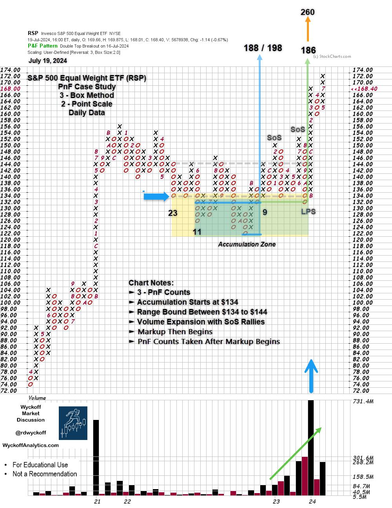
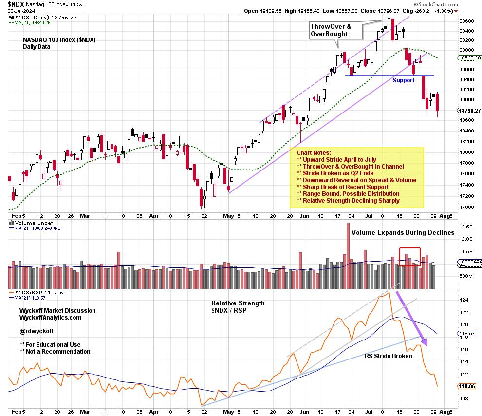

# S&P 500 Equal Weight ETF Gains Strength

URL: https://articles.stockcharts.com/article/articles-wyckoff-2024-07-sp-500-equal-weight-etf-gains-547/
Date: July 30, 2024 at 04:16 PM
Author: Bruce Fraser

The S&P 500 index ($SPX) is a capitalization-weighted stock index. Many lesser capitalization blue-chip stocks that compose these 500 companies have been performance laggards. Though smaller companies in the index, these corporations are among the bluest of the blue-chip stocks. These prestigious corporations have been overshadowed by the immense mega-capitalization companies that have received attention from institutional and individual investors. For the most part, these other and forgotten stocks have better valuations and dividend yields as they have been somewhat neglected by Wall Street.

The Invesco S&P 500 Equal Weight ETF (RSP) provides a perspective highlighting these smaller blue-chip stocks in the index. Does this equal-weighted index reveal a market story obscured by the mega-cap dominated S&P 500 index?

S&P 500 Equal Weight ETF (RSP), Point & Figure Chart Study

S&P 500 Equal Weighted ETF (RSP) PnF Chart Notes:

- In 2022, an Accumulation Structure began to form.
- Markup began in 2023 and still continues.
- Three Horizontal PnF counts are estimated here.
- Two partial counts confirm each other in the $186 price zone.
- The entire width of the structure counts to $260.

NASDAQ 100 Index ($NDX) with Relative Strength to the S&P 500 Equal Weight ETF (RSP)

This daily chart of the NASDAQ 100 Index ($NDX) illustrates the start and end of the second-quarter rally. A final ThrowOver of the channel line clocks in just as the quarter is ending and the third quarter is beginning. A sudden and sharp reversal is evidence of the rotation away from this mega-cap dominated index and into the broad list of blue chip stocks in the S&P 500 Equal Weighted Index. The Relative Strength line reveals the shift.

Broad market rotations can destabilize markets as funds flow away from prior leadership toward new investment themes. Watch for emerging leadership from industry groups and stocks while markets are generally correcting. Point & Figure horizontal counts can help greatly with price projection estimates. However, we must remember that PnF cannot estimate the time needed to reach potential price objectives.

All the Best,

Bruce

@rdwyckoff

Prior Blog Notes: At the end of June, I published a NASDAQ 100 PnF chart study as it was reaching price objectives. The price of the objective range was 19,600 / 20,800. On July 10th the $NDX peaked at 20,690.97, just as the new quarter was beginning. (click here to view the chart study).

Disclaimer: This blog is for educational purposes only and should not be construed as financial advice. The ideas and strategies should never be used without first assessing your own personal and financial situation, or without consulting a financial professional.

Wyckoff Resources:

Additional Wyckoff Resources (Click Here)

Wyckoff Market Discussion (Click Here)
