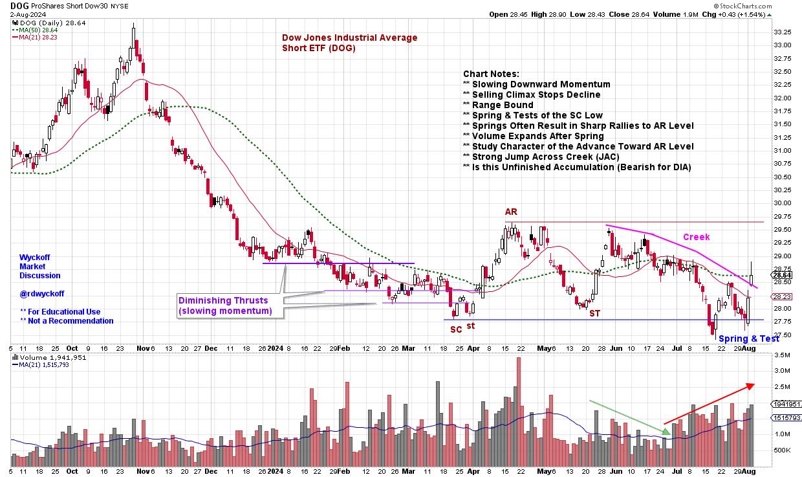
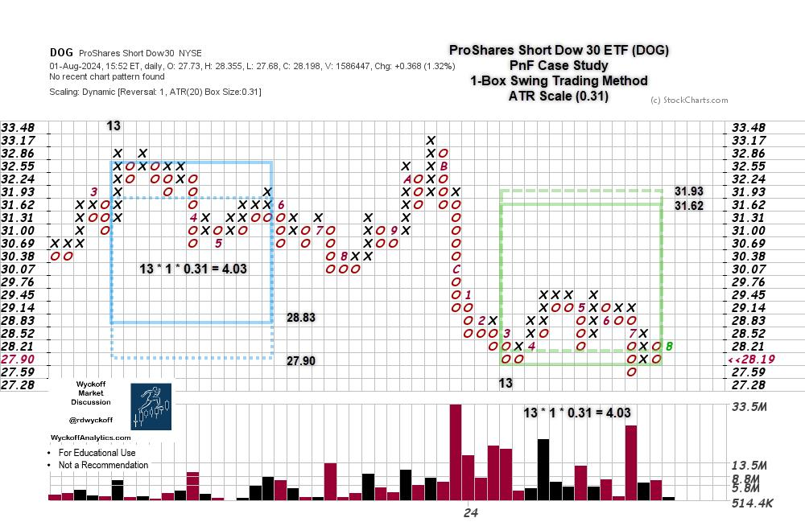

# Who Let the DOG Out?

URL: https://articles.stockcharts.com/article/articles-wyckoff-2024-08-who-let-the-dog-out-970/
Date: August 04, 2024 at 04:55 PM
Author: Bruce Fraser

In the classroom we would have students alter their view of charts they were evaluating to gain fresh perspective and possibly enhance their analysis. Students often had Ah-Ha moments after freshening their interpretation of a chart they had previously laid eyes on many times. Stock chart analysis heavily emphasizes the left hemisphere of the brain which is considered the logical side. The right hemisphere is associated with creativity, art, intuition and imagination. By characterizing charts and data in different modes the right side of the brain can be engaged. By employing a ‘whole brain' study, aspects of the brain are engaged that can enhance perspectives of stock market and trading analysis. Whole brain thinking can also improve problem solving technique when developing and enhancing indicator and methodology development. Traders and analysts will often describe this as bolts of intuition. My teaching partner Dr. Hank Pruden called this process ‘Chart Reading in the R-Mode'. He dedicates a section of his book ‘The Three Skills of Top Trading' to these chart reading methods (pages 202-211). To learn more about Hank's book and to purchase it (click here).

There are many ways to engage the right hemisphere. Here is one that was a favorite of students, and easy to employ.

So, let's get a little playful with the charts while we engage our R-Mode. In the classroom we would take a standard stock chart and flip it over to view the chart through the back of the sheet. This would invert the scale so that a downtrend was upward, and an uptrend was declining. In those days we would place the page on the window so light would illuminate the chart on the reverse side of the page. Then we would do the chart analysis on the back of the sheet. Students often found that when inverting the chart, they would see aspects of the chart structure that were hidden to them with their prior traditional analysis. Thus, the benefits of Reading Charts in the R-Mode.

The good news is that StockCharts.com has made it easy to invert Sharp Charts and conduct the analysis. More on that below.

Here is a case study of chart reading in the R-Mode:

ProShares Short Dow 30 ETF (DOG)

This chart is not actually inverted. It is the unleveraged short ETF of the Dow Jones Industrial Average (DOG). It is not an exact duplicate of the DJIA cash index, so please compare and contrast. Now engage your R-Mode and allow this chart to wash over you. A first step would be to generate a DJIA chart ($INDU or DIA) and refresh yourself on the current chart position of the index, then study the DOG chart above with annotations. How does your perspective of the present position of the DJIA change with the inversion of the chart? Did you see chart attributes that were previously obscured? Did it influence your view of the DJIA?

In my case the Wyckoff structure was immediately evident in the DOG chart. The annotations reflect what stood out.

ProShares Short Dow 30 ETF PnF Case Study

The swing PnF of the structure we just analyzed nearly counts to the overhead resistance. The structure appears to be unfinished. A rally to Sign of Strength (SoS) above 29.45 and then a reaction, called a Last Point of Support (LPS), would complete an Accumulation structure. The unfinished count suggests the potential for a meaningful correction of the DJIA.

Chart Notes:

- PnF count of the prior distribution (in blue) came within one box of fulfilling the down count. As this is an inverted chart, the count objective reached to one box from the ultimate high, so far.
- The current count is unfinished and must be considered a preliminary count. Until the reversal is confirmed we must hold open the idea the current trend is still in force.

Chart Reading in the R-Mode can enhance your analysis, and it is easy to do. In SharpCharts put a Minus Sign in front of a symbol to invert the scale. I do this often and it is very helpful to my chart studies.

All the Best,

Bruce

@rdwyckoff

Disclaimer: This blog is for educational purposes only and should not be construed as financial advice. The ideas and strategies should never be used without first assessing your own personal and financial situation, or without consulting a financial professional.

Wyckoff Resources:

Distribution Definitions (Click Here)

Wyckoff Power Charting. Let's Review (Click Here)

Additional Wyckoff Resources (Click Here)

Wyckoff Market Discussion (Click Here)

For additional resources and to learn more about Dr. Hank Pruden (Click Here)
