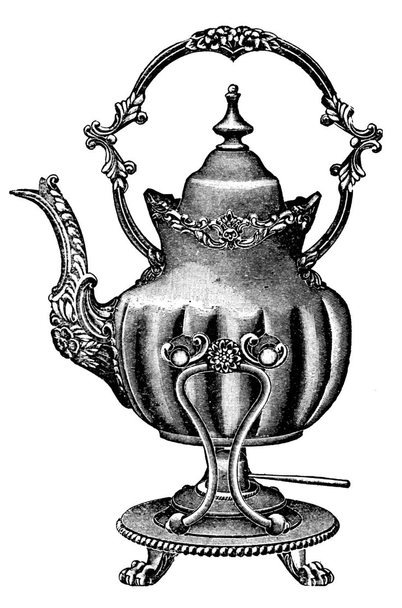
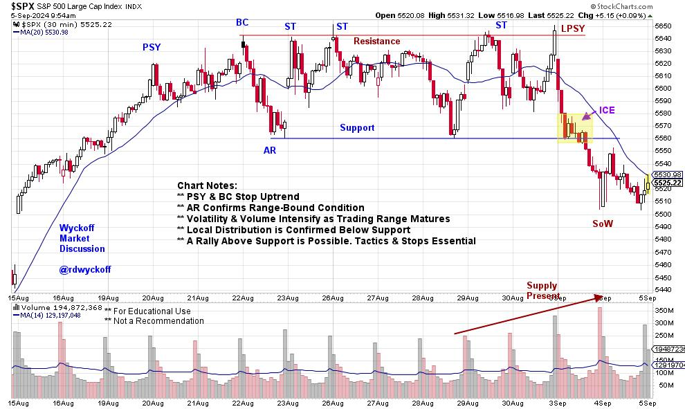
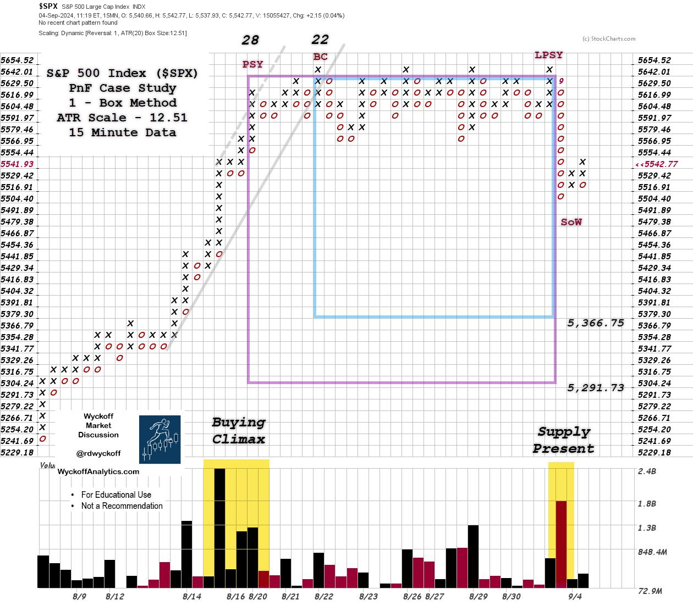

# S&P 500 Tempest in a Teapot

URL: https://articles.stockcharts.com/article/articles-wyckoff-2024-09-sp-500-tempest-in-a-teapot-268/
Date: September 05, 2024 at 10:38 AM
Author: Bruce Fraser

As we have discussed many times, financial markets are fractal. Different timeframes produce similar price structures. This is a very valuable phenomena for the study and practice of trading. When tracking the intraday time frame; Wyckoff structures of Accumulation, Markup, Distribution and Markdown repeat over and over. This creates a laboratory for study and analysis. Below is just such a case study. By paying attention to the intraday charts, the Wyckoffian often identifies setups brewing in the larger timeframes. The market's intention in the larger picture is often first revealed in the intraday.

S&P 500 Index, Intraday 30-Minute Timeframe

#### Chart Notes

1. The upward stride of the $SPX (30-minute timeframe) accelerated into Preliminary Supply (PSY) creating a local climactic event.

2. The continuation of momentum carried the index into a Buying Climax (BC). Note the poor quality of the rally from the PSY to the BC. Supply is present!

3. The Automatic Reaction was sudden and deep with expanding volume. Large sellers were present and motivated to reduce their holdings.

4. The BC is critical Resistance and the AR is Support in the newly formed range-bound structure.

5. A Cause was being built from the PSY to the Last Point of Supply (LPSY) that had the character of Distribution. Volatility on weakness to the Support line tipped off the presence of active selling and supply. Volume expanded during the second half of the Distribution structure. More Supply, Supply, Supply!

6. A Last Point of Supply (LPSY) completed the Distribution which was confirmed by the immediate gap reversal and expanding spread on the return to the Support line. This volatility supported the conclusion that Distribution was complete and Markdown was the next phase. The decline below Support confirmed Markdown in progress.

7. Downtrends, even small versions, are typically volatile with large up and down swings. They are ideal for study purposes, while only the most accomplished traders should consider campaigning them.

S&P 500 Index, 1-Box Method, 15 Minute Data, ATR Scale (12.51 pts)

Distribution is a Cause building process for the next trending move of the index, which is expected to be downward. A 15-minute Point & Figure chart with ATR Scaling is used to estimate the potential for the extent of the subsequent decline. With this 1-Box reversal PnF chart we identifed two count segments. Counting from right to left the count was taken from the Last Point of Supply (LPSY) to the Buying Climax (BC) and to the Preliminary Supply (PSY). Two count estimates were generated: 5,366.75 and 5,291.73.

#### Chart Notes

1. Using the vertical chart of the Distribution and the chart analysis and then identifying those points on the PnF, two counts were taken. The lower objective estimate suggested that the decline could take back the rally from August 14th to the BC high on August 22nd. So, volatility could ensue as there is little natural support to those lower objective levels.

2. Volume was quite high into the PSY and the BC, which indicated active selling on a scale up by the Composite Operator (C.O.) community. Thereafter, C.O. selling was persistent at the 5,642.01 Resistance level. Note that volume expanded throughout the second half of the Distribution. This further confirmed the Distribution hypothesis.

3. Supply engulfed the index as it fell out of the Distribution, and this can be seen in the very high downside volume. A rally into the underside of the prior Support zone is possible. Selling would be expected to continue from under the old Support zone.

4. How, and if, the index approaches the PnF price objectives will tell much about the subsequent intention of the $SPX index. The stock market is always an unfolding picture.

This intraday structure is a Tempest in a Teapot for its small size in time and potential extent of the move. This is valuable training and good practice for a Wyckoffian. Please take the time to zoom out to the larger daily and weekly charts to study the greater picture. As they are fractal, your practice will speed the learning curve. And your path to mastery.

All the Best,

Bruce

@rdwyckoff

Disclaimer: This blog is for educational purposes only and should not be construed as financial advice. The ideas and strategies should never be used without first assessing your own personal and financial situation, or without consulting a financial professional.

Wyckoff Resources:

Distribution Definitions (Click Here)

Wyckoff Power Charting. Let's Review (Click Here)

Additional Wyckoff Resources (Click Here)

Wyckoff Market Discussion (Click Here)

#### Event Announcement:

TSAA-SF Annual Conference (to learn more CLICK HERE)

Old School / New School.

Conference Themes will range from Artificial Intelligence to Reminiscences of a Stock Operator.

In-person in San Francisco and Livestreaming for dues paying members.

Saturday September 14th at Golden Gate University

The TSAA-SF annual conference will be held on Saturday Sept 14th 2024 at Golden Gate University. It is an all day hybrid event, held both in person and via zoom. This year's speakers include:

* John Bollinger, CFA, CMT - Creator of Bollinger Bands, Author, Investor

* Linda Raschke - Author of "Trading Sardines" Trader/Investor

* Damon Pavlatos - CEO of Future Path Trading LLC & PhotonTrader

* Dave Landry - Trader, Author, Speaker, Educator, Founder of DaveLandry.com

* Robert Schott - Expert in Global Investments, Strategy, Risk, Derivatives, & ALM

* Patrick Dunawila, CMT - Technical Analyst, Co-Founder of The Chart Report

* Mike Jones - Data Engineer & Analytics Consultant
