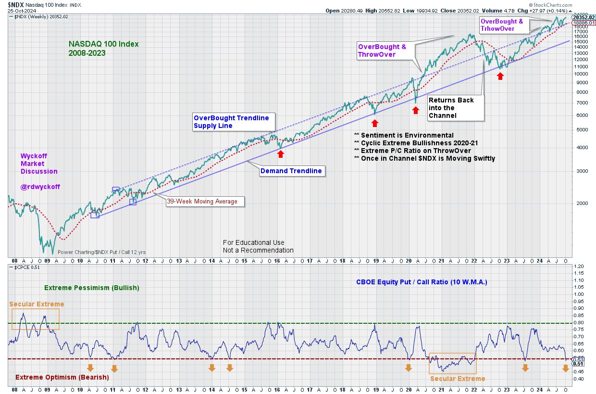

# Secular Shenanigans

URL: https://articles.stockcharts.com/article/articles-wyckoff-2024-10-secular-shenanigans-676/
Date: October 27, 2024 at 05:51 PM
Author: Bruce Fraser

The secular bull market in stocks has been epic both in duration and extent. The NASDAQ 100 Index illustrates this bull run best of all. Using Wyckoff Method classic trendline construction techniques, the chart below illuminates this secular bull phenomena. The stride of the bull market run is set with three points in 2010 and 2011. Drawing a Demand Trendline on the two reaction points and an OverBought (Supply Line) on the intervening high price, the Stride of the advance is defined for the next 14 years (and the bull run is still going strong). The upward trend has ebbed and flowed during the long advance, swinging between the Overbought and OverSold Trendline extremes. And at times throwing over and under these Trendline boundaries. These throwovers typically are long term overbought and oversold conditions. Presently the NASDAQ 100 is above the OverBought threshold of the upward channel, creating the classic Wyckoff throwover. Is this index vulnerable to a reaction back into the channel?

NASDAQ 100 Index 2008-Present

Extremes in sentiment can be characterized by the classic equity put to call volume ratio. In the lower panel the Put/Call Ratio for CBOE equity option volume is plotted. An extremely low reading for this ratio indicates high call option volume in relation to put option activity. High call activity characterizes broad bullishness by option traders. Conversely, a high reading by this oscillator reflects extreme put volume and reflects intense bearishness. What makes this particular view of the Put/Call indicator noteworthy is the 10 Week Moving Average time frame. The long term construction of this indicator moves slowly and deliberately from Bullish to Bearish extreme and back again. This coincides well with the secular view of the upward striding NDX 100. Note the correlation of the OverBought and OverSold extremes around the edges of the trend channel and how well it syncs up with trading sentiment as defined by the 10 WMA Put/Call ratio.

Two notable conditions on the chart have recently occurred. In the third quarter (July) the NDX­-100 jumped above the Supply Trendline and became classically OverBought. Now, as the fourth quarter gets underway a Test of the July high is underway. Second, during the current Test of the July high the 10 WMA of the Put/Call Ratio has suddenly tumbled down into extreme call volume readings signaling that sentiment has become bullish and frothy, on a longer term 10 week basis!

Sentiment indicators are best evaluated as environmental in nature. Thus signaling that the upward trend of the stock market has suddenly become crowded with bullish speculators and investors. Sentiment indicators tell us when the rewards relative to the risks are high or low. The long term Put/Call Ratio now signals that bullish reward potential is diminished, and the risks are high.

Wyckoffians would be watching the relationship between the NDX-100 index and the Overbought trendline. Often a decline back into the trend channel from an OverBought condition leads to volatility and a decline toward the Demand Line and an OverSold condition. Note also the position of the 39-week moving average (red dotted line) which is poised at the same level as the upper trend channel line. A drop of the NDX-100 into the channel would breach both of these noteworthy lines.

All the Best,

Bruce

@rdwyckoff

Disclaimer: This blog is for educational purposes only and should not be construed as financial advice. The ideas and strategies should never be used without first assessing your own personal and financial situation, or without consulting a financial professional.

#### Video Appearance:

I recently joined Dale 'Coach' Pinkert at ForexAnalytix for this discussion of the present position of the stock market and interest rates. To view it (Click here).

#### Workshop Announcement:

Mastering Long Term Campaign Investing. Join Roman Bogomazov and Bruce Fraser for this Wyckoff Method workshop for developing skills and mental discipline to successfully campaign long term stock trends. To Learn More (Click Here)
