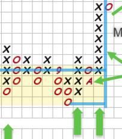
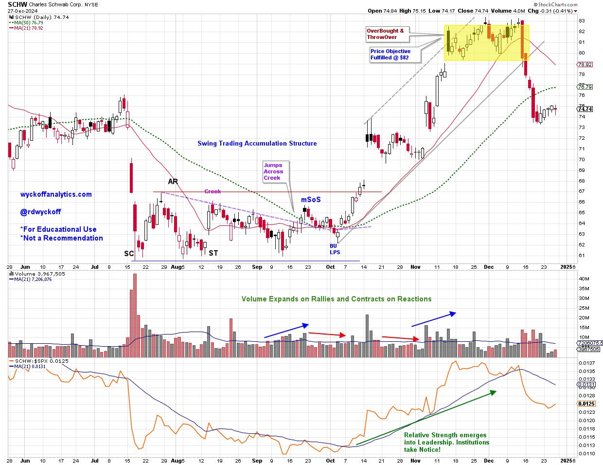
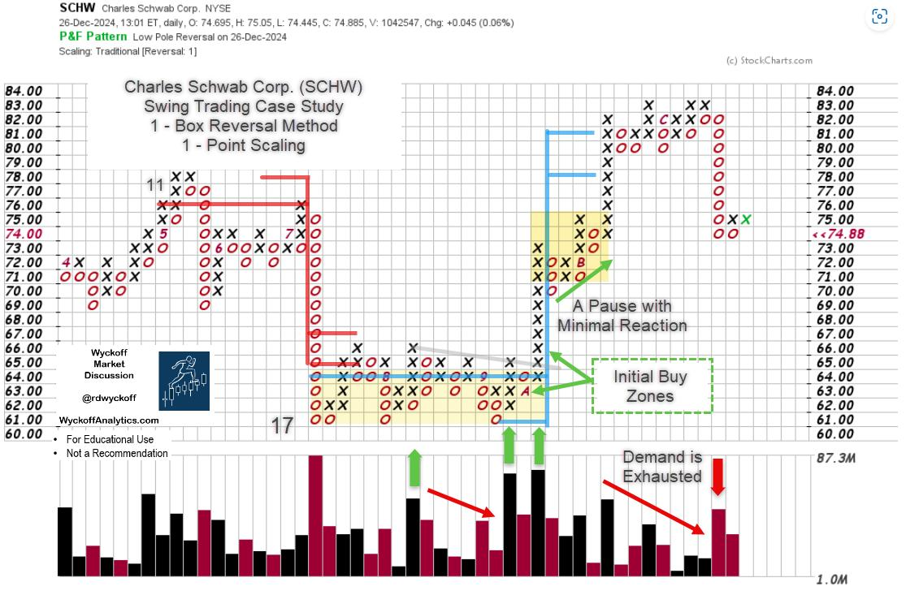
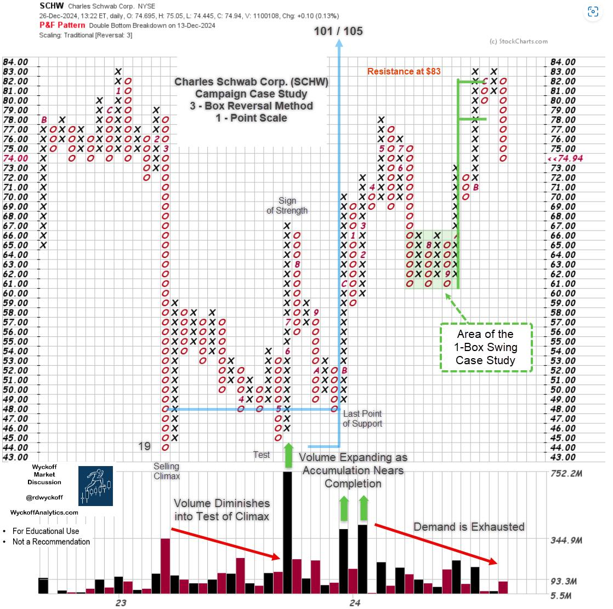

# Swing Trading with Point & Figure

URL: https://articles.stockcharts.com/article/articles-wyckoff-2024-12-swing-trading-with-point-figur-511/
Date: December 29, 2024 at 01:31 PM
Author: Bruce Fraser

There are a number of effective swing trading systems being used today. Let's explore one that is popular among Wyckoffians. It uses two inputs: Point and Figure charts and volume. Let's review this system with a case study of Charles Schwab Corp. (SCHW).

As markets are fractal, Accumulation and Distribution structures form in daily, weekly and monthly timeframes. Swing trading structures typically form on daily charts that can be identified with 1-box Point & Figure charts and daily vertical bar charts.

Charles Schwab Corp. forms a Swing Trading Accumulation structure between July and October. In July climactic selling (SC) volume ends the decline, and an Automatic Rally (AR) sets the support and resistance of a range-bound condition to follow. Subsequent volume on rallies and reactions tells the tale of latent Accumulation. This chart is rich with Wyckoffian principles, and it has been marked up for your study and evaluation. Let's turn our attention to the PnF chart to demonstrate how much useful information is present for Swing Trading.

Charles Schwab Corp. (SCHW) Vertical Chart Study

#### Swing PnF Case Study

Charles Schwab Corp. Swing Trading Case Study. 1-Box PnF

A 1-box PnF chart, properly constructed, will characterize the essential elements of the vertical chart. Note how the PnF strips out much of the noise and highlights the critical chart features. I often hear that traders find volume easier to read and interpret on the PnF chart therefore it is suggested that all PnF charts be plotted with volume. A key feature of PnF charts is the estimation of the price objective determined by the size and structure of the Accumulation. There is no other technique for estimating price objectives as effectively as horizontal PnF counting. PnF is a centuries old, tried and true approach to evaluating and trading financial instruments.

For swing trading purposes, a 1-box reversal PnF is generated using ‘Traditional Scaling'. The up and down swings are clearly revealed with this method. With 1-box PnF the horizontal structure is well defined and the volume patterns are illuminating.

#### Chart Notes:

- Selling Climax (SC) exceeds the Distribution count and finds support at $61. An Automatic Rally (AR) immediately follows and demonstrates emerging demand. A Secondary Test (ST) back to $61, which holds, and confirms this level to be the Composite Operator's ‘Value Zone'. Volume declines on each reaction back to $61 ST level (support).
- Volume expands on each rally (column of X's) as the Accumulation matures to conclusion. Lower volume on declines and higher volume on the rally columns reveal that supply is diminishing and absorption has occurred. Higher volume on the rising columns is evidence of new demand by institutions. Accumulation is nearly complete.
- The pullback to the LPS / BU (see vertical chart) produces a higher low. The turn off that low can be bought with a stop below support. The next entry level is the jump above $65 resistance with a stop below the LPS.
- The price objective generated by the horizontal Accumulation is estimated by the PnF. There are 17 columns of count producing $17 of upside price objective (17 columns x $1-scale x 1-point reversal = $17). The percent potential of this swing trade is $17 from the $64 count line ($17/$64 = 26.6%). The price objective range is estimated by adding $17 to the $61 low of the Accumulation and the $64 count line. Producing a count range of $78 / $81.
- The Buying Climax is reached at $82. Thereafter $83 is resistance and a Swing Distribution forms in this price zone. When the Swing PnF count objective is attained, profits are taken. In this example the local Buying Climax surge produces an ideal selling zone.

#### Campaign PnF Case Study

Charles Schwab Corp. Campaign PnF Case Study. 3-Box Method

Stepping out to the larger timeframe is essential. Please study this 3-box reversal PnF. It reaches back into 2022. A Campaign PnF Count Accumulation has potential objectives of up to $101 / $105. Also, the prior high is $83 which happens to be in the area of the Swing PnF price objective and natural resistance. Be on the alert for the generation of a new Swing PnF count structure in the months ahead. Often these Swing counts will coincide with the higher Campaign PnF counts. We will be watching.

All the Best,

Bruce

@rdwyckoff

A Very Happy and Prosperous 2025 to You and Yours!

Disclaimer: This blog is for educational purposes only and should not be construed as financial advice. The ideas and strategies should never be used without first assessing your own personal and financial situation, or without consulting a financial professional.

#### Announcement

Wyckoff Analytics will launch the Spring Semester of their legendary Wyckoff Trading Courses (WTC). The first session of WTC-1 is Complimentary (Click Here to Register for the Free Session). To learn more about these courses and other offerings Click Here.
