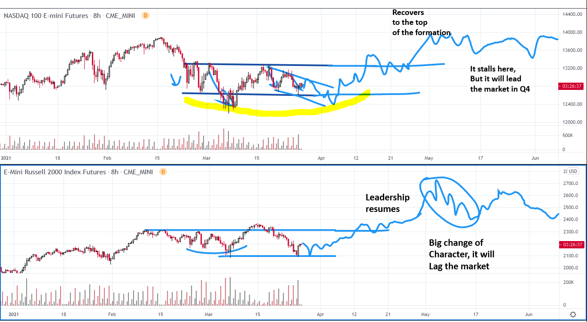

# Wyckoff Crypto Report 59

URL: https://www.wyckoffanalytics.com/wyckoff-crypto-report-59/
Date: 2021-03-26T10:19:18
Author: Alessio Rutigliano

### Wyckoff Crypto Discussion Episode 30
Join us each Thursday for a discussion of the cryptocurrency market from a Wyckoff perspective.
### Just a scenario..
The big picture of the market of the next week will define our strategy to re-enter/add to our positions in the Crypto space.
The recovery that we have seen on Friday is constructive, the current reaction on the Nasdaq has less selling, but I would expect to see at least a retest of the lows. A final low on the Nasdaq would be a signal to enter many crypto assets that are currently in the Spring position (ChainLink, DOT). We will review many assets on Monday-Tuesday in the Wyckoff Crypto Lab.

###
### The Wyckoff Crypto Trading Lab is open. Join us on Discord now!!!

