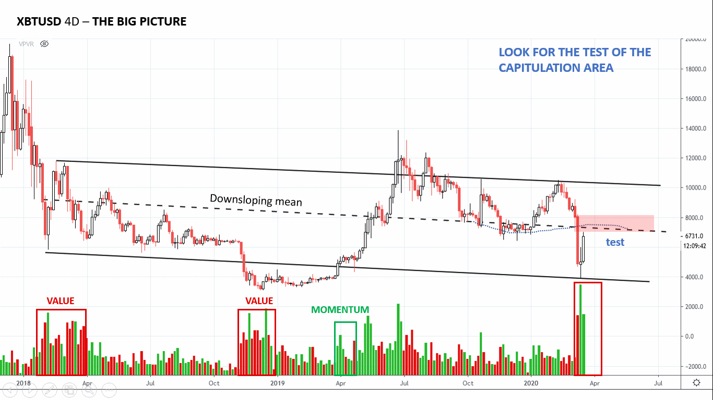
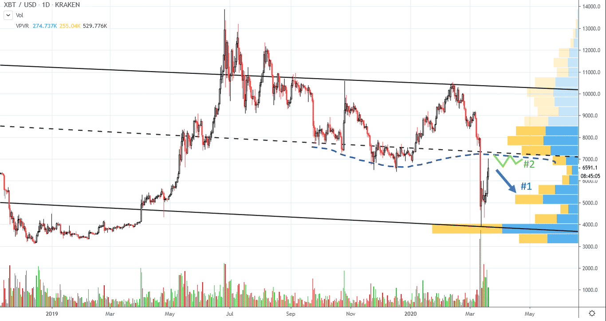
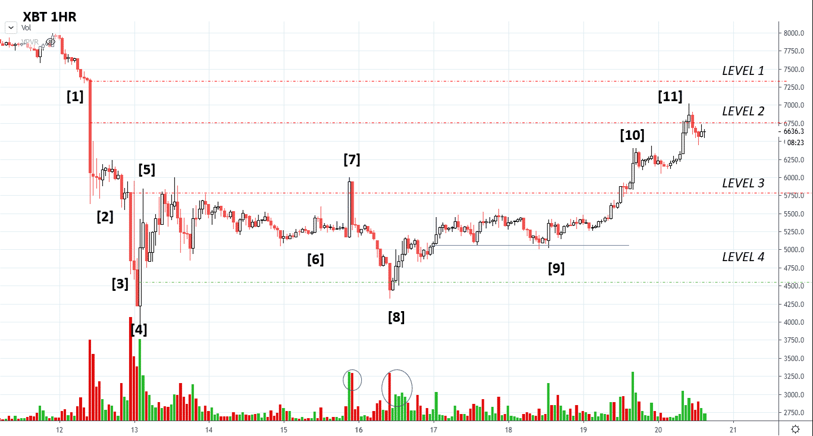
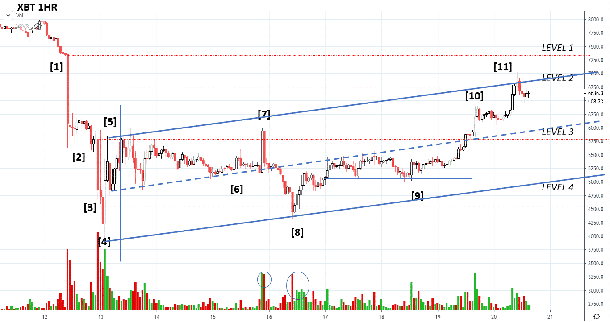
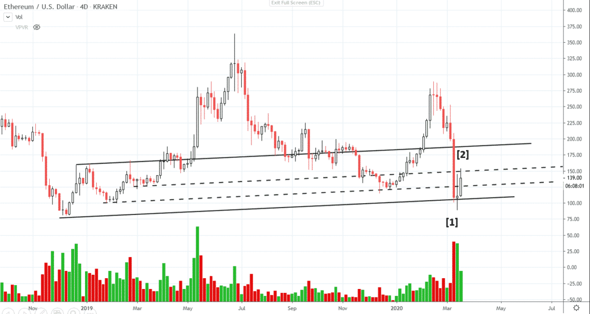

# Wyckoff Crypto Report vol 14

URL: https://www.wyckoffanalytics.com/wyckoff-crypto-report-vol-14/
Date: 2020-03-20T13:50:31
Author: Alessio Rutigliano

The WYCKOFF CRYPTO REPORT provides regular updates on the most popular digital assets based on the Wyckoff Methodology. Our market outlook follows the principles of Supply and Demand and Market Participants Analysis as they are taught and practiced in the WTC/WTPC/WMD classes.
### The big picture. Consolidation in play

After the sharp selloff of one week ago, Bitcoin has quickly recovered part of its losses. Value buyers are still active around the institutional value area $3800-5600. Is the low in? The stopping volume suggests the beginning of a new trading range residing in the lower part of the multi-year formation. The bottoming process could take more time. In the previous Crypto Report we have described how the shortage of cash resources originating from margin calls forced institutions to sell every kind of asset, including Gold, Bonds and Bitcoin. The supply zone highlighted in red is the level where capitulation occurred. We are currently retesting this important area.
### Daily perspective. Trading scenarios.

Let’s look at the daily chart. The supply available on the retest of the ice (blue dashed line) will provide us useful information about the current consolidation.
Scenario #1 (high probability) Price fails to commit above the ice. Our first target for the downmove is the $5300 level. Volume profile shows a local increase of demand around this area. Decreasing spreads and volume on the reaction would suggests an exhaustion of supply, still a bullish sign for the long term picture. If price breaks the $5300 level, a lower low is in the cards.
Scenario #2 (low probabililty) A low volume, shallow reaction around the supply level followed by continuation to the upside would confirm the completion of a big shakeout of the multi-year formation. Very Bullish.
### Intraday. Rewinding the tape
The current consolidation area is marked by high volatility. The wide swings provide us a good opportunity for intraday trading. Let’s analyze the price action on the 1hr chart.

The big bar at point [1] represents the beginning of the capitulation move. Margin calls trigger the drop, Bitcoin is a source of funding. Level #1 is the top of the capitulation bar. The halfpoint of this big capitulation bar defines Level #2 . Supply is dominant on this two levels, and short term traders should look for upthrusts in this supply zone, confirmed by a swing reversal.
Demand comes in again at point [3]. The top of the downbar defines Level #3 . The downmove decelerates at point [4] , indicating that supply is exhausted. The Change of Behavior comes at point [5], confirmed by a higher low on decreasing supply. Stopping action, a consolidation is in play.
Volume decreases in phase B, the upbar at point [7] is a bull trap. Price action shortly upthrusts Level #3 and springs Level #4 (point [8] , the midpoint of the big automatic rally upbar). This price action is very common and is easy to catch. Remember David Weis’s teachings.
When you go fishing in a lake, you don’t just row out to the middle and throw a line in the water. You go where the fish live— around the edges and near the sunken trees. [David Weis, Trades about to Happen]
The price action at point [9] is more tricky. We are in the mercy of the big supply bar at point [7] , but price stays flat, a bullish sign. The support highlighted in blue is the level where demand came in. This level could be considered a low risk point for a short term entry to the long side. The upswing breaks Level #3, but supply is still not dominant. We are currently approaching the last significant supply level. Demand signature since the beginning of the consolidation has decreased, and we look for a failure around this level, followed by a swing reversal to the downside.
Now that we have studied price and volume, we can also try to add our interpretation of the structure on the intraday level:

The upsloping support line suggests$5000 price level, an ideal target for a short term trade to the downside, offering a good confluence with the $5200 target on highlighted on the volume-profile (chart 2).
### Ethereum
A note on rotation
Since the last week, the uncertainty in the markets has favored Bitcoin over the altcoins. Like in the stock world, when the sentiment of the market is bearish, institutions look for major caps, that are usually considered less riskier.
ETHUSD – 4D Perspective

After the brutal shakeout action of the last week, Ethereum is consolidating in the lower part of the two-years formation. The stopping volume at point [1] , followed by the quick recovery, suggests that value buyers came in aggressively. A shakeout is in play? We need more confirmation points. The upbar [2] has less demand and does not commit above the short term resistance. We will likely continue to consolidate around the $150-$100 area in the next week. The price action is encouraging, but the bottoming process could take more time. The extreme level of supply dictates a test on less volume and possibly a higher low. Generally, such a quick shakeout action is followed by a prolonged testing period.
_________________________________________________________________________________________
SEND YOUR QUESTIONS!
What’s the real impact of the halvening on Bitcoin price? Thank you, J.
Dear J.,
Bitcoin is a currency with finite supply. Mining rewards reduce by 50% every four years . The halving does not directly impact the price of Bitcoin itself, but probably suggests the timing for the long term accumulation in Bitcoin. Miners are huge players in the crypto industry. Think of oil producers in the oil sector. Here is an historical chart showing the previous halving events. The halving itself is not an indication of higher prices, but look at the period where accumulation took place. Historically, strong hands have accumulated Bitcoin before the halving event.
Red light: stopping action.
Yellow light: long term accumulation in play.
Green light: price overcomes the previous resistance levels, acceleration to the upside.
Will History Repeat Itself Again?

Stay tuned!
Important Disclaimer – PLEASE READ: The materials presented in the WYCKOFFANALYTICS CRYPTO REPORT are for educational purposes only: nothing contained in any of these materials should be construed as investment advice of any kind. REGARDLESS OF ANY LANGUAGE IN ANY WYCKOFFANALYTICS CRYPT0 REPORT POST, NEITHER THE WYCKOFF AUTHOR(S) NOR WYCKOFF ASSOCIATES, LLC, NOR ANYONE AFFILIATED WITH THE LATTER ORGANIZATION IN ANY WAY IS RECOMMENDING THAT YOU BUY OR SELL ANY SECURITY, OPTION, FUTURE, ETF, OR ANY OTHER MARKETS MENTIONED. There is a very high degree of risk of financial loss involved in trading securities. You understand and acknowledge that you alone are responsible for your trading and investment decisions andresults. Alessio Rutigliano, Wyckoff Associates, LLC, www.wyckoffanalytics.com, Roman Bogomazov, and all officers, staff, employees, and other individuals affiliated with Wyckoff Associates, LLC, and www.wyckoffanalytics.com assume no responsibility or liability of any kind for your trading and investment results. It should not be assumed that investments in or trading of securities, options, futures, ETFs, companies, sectors or any other markets identified and described in these WYCKOFFANALYTICS CRYPTO REPORTs were, are or will be profitable.
