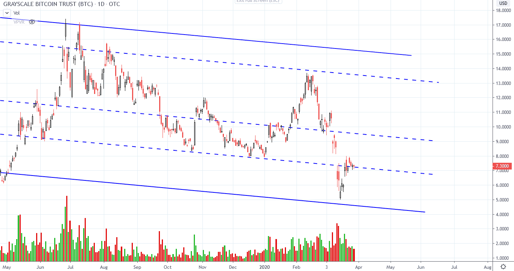

# Wyckoff Crypto Report vol. 15

URL: https://www.wyckoffanalytics.com/wyckoff-crypto-report-vol-15/
Date: 2020-03-27T14:27:48
Author: Alessio Rutigliano

The WYCKOFF CRYPTO REPORT provides regular updates on the most popular digital assets based on the Wyckoff Methodology. Our market outlook follows the principles of Supply and Demand and Market Participants Analysis as they are taught and practiced in the WTC/WTPC/WMD classes.
### The big picture
#### Bitcoin and S&P. Consolidation in play

We are approaching the upper half of the capitulation bar [1] where margin calls forced institutions to sell Bitcoin. The resistance level highlighted in yellow is a key area. This week’s upbar is marked by diminished spread and volume, suggesting that the current upmove is losing momentum . The test of the $7000 area will provide us crucial information about the availability of supply. The price action of Bitcoin is now highly correlated to the S&P. A retest of the lows in the next week could easily bring Bitcoin back to the $5600 area.
### Bitcoin Daily perspective. Bar by bar analysis

- [1] Capitulation, massive selling triggered by margin calls.
- [2] Effort to the downside increases, Result to the downside decreases. Stopping volume, reversal in play. We have called this action live on the forum.
- [3] Retest on lower supply and HL, short term bullish
- [4] Bullish feather (higher prices on decreasing volume)
- [5] Breakout and acceleration
- [6] Effort to the upside increases, Result to the upside decreases. Supply is coming in!
- [7] Retest of the low of bar [6] on less volume, followed by reversal on good volume at bar [8]
- [9] Diminishing spread and volume: momentum is fading out
- [10] Result to the downside is slightly increasing on diminishing supply.
High probability scenario [SHORT] : If price fails to commit above the $7000, we are likely going to revisit the $5300-$5600 area. A short position could be opened on the break of the low of bar [9].
Low probability scenario [LONG] : Bitcoin accepts higher prices (absorption), next target is the $7300 level.
### Intraday trading diary

Last week we have called for a short term swing to the downside [1]. Price quickly revisited the $5600 price area [2], where demand was present. Price retested the support at point [3] on diminished supply signature, a sign of temporary absorption. The upthrust bar at [4] has increased volume, suggesting that it will be retested. Price is currently residing in this zone. Volume and momentum are decreasing. As mentioned before, a break below the low of bar [4] would suggest continuation to the downside. Volume profile offers an alternative look. In the long term, if this big structure hold, the $5200 level would a be a perfect level to watch for a spring, but for now we want to focus only on the current price action.
### Alternative scenario. Low probability continuation
#### A Tape reading exercise

Tape readers do not predict, but follow and interpret price and volume. Here is a price analog that can help us to track the alternative scenario (continuation toward $7600 level). I have included the current price action of the S&P at the top as a further structural analog (blue box). At point [1] , supply is quickly absorbed on the way down. The shallow test on the top confirms that absorption has occurred, suggesting continuation. The uptrend continues, but [3] shows signs of shortening of the upward thrust. Demand is present again on the price level highlighted in green [4] , but the weak rally at [5] warn us that bulls are in jeopardy. Price breaks the green line on low volume and spreads [6]. Low supply? Yes, but demand is poor as well, and the result is to the downside. Price retests the green line [7] , and fails. The break to the downside [8] is the final confirmation.
### Grayscale Bitcoin Trust

The Grayscale Bitcoin Trust confirms the price action of the spot and derivative crypto exchanges. The downsloping lines help us to identify significant price levels. Wait for the retest of the low. A low volume retest followed by a quick recovery would be a constructive price action.
###
### Altcoins
On the intraday, altcoins are not outperforming Bitcoin, confirming that investors are still in “defense mode”.

###
### Ethereum
ETHUSD – 4D Perspective

Ethereum is still consolidating in the lower part of the two-years formation. Price is currently retesting the halfpoint of the big capitulation bar. The dashed grey line is an important level to watch. The extreme volume on the big capitulation bar suggests that supply is present and we will revisit the lows in the next weeks.
_____________________________________________________________________________
### Send us your questions!
Register here for free https://www.wyckoffanalytics.com/forums/topic/crypto-and-wyckoff-analysis/
I will be happy to discuss your questions in the next Crypto Reports!
Stay tuned,
Alessio
Important Disclaimer – PLEASE READ: The materials presented in the WYCKOFFANALYTICS CRYPTO REPORT are for educational purposes only: nothing contained in any of these materials should be construed as investment advice of any kind. REGARDLESS OF ANY LANGUAGE IN ANY WYCKOFFANALYTICS CRYPT0 REPORT POST, NEITHER THE WYCKOFF AUTHOR(S) NOR WYCKOFF ASSOCIATES, LLC, NOR ANYONE AFFILIATED WITH THE LATTER ORGANIZATION IN ANY WAY IS RECOMMENDING THAT YOU BUY OR SELL ANY SECURITY, OPTION, FUTURE, ETF, OR ANY OTHER MARKETS MENTIONED. There is a very high degree of risk of financial loss involved in trading securities. You understand and acknowledge that you alone are responsible for your trading and investment decisions andresults. Alessio Rutigliano, Wyckoff Associates, LLC, www.wyckoffanalytics.com, Roman Bogomazov, and all officers, staff, employees, and other individuals affiliated with Wyckoff Associates, LLC, and www.wyckoffanalytics.com assume no responsibility or liability of any kind for your trading and investment results. It should not be assumed that investments in or trading of securities, options, futures, ETFs, companies, sectors or any other markets identified and described in these WYCKOFFANALYTICS CRYPTO REPORTs were, are or will be profitable.
