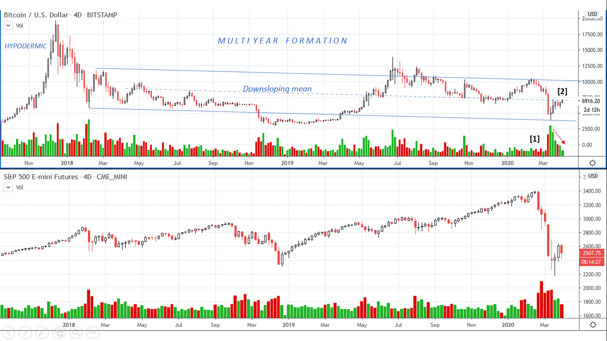
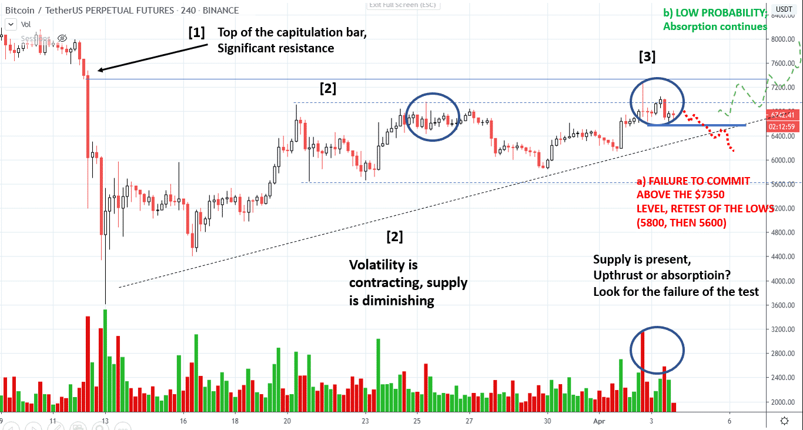
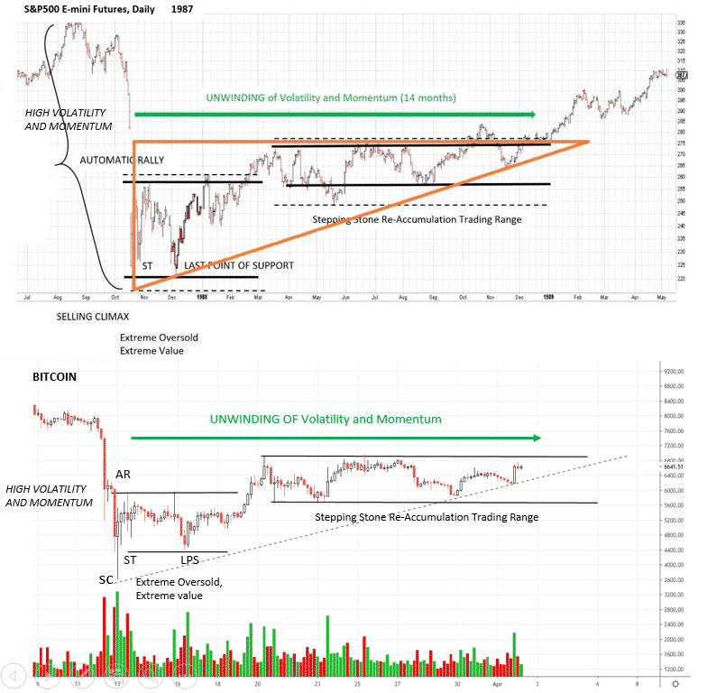
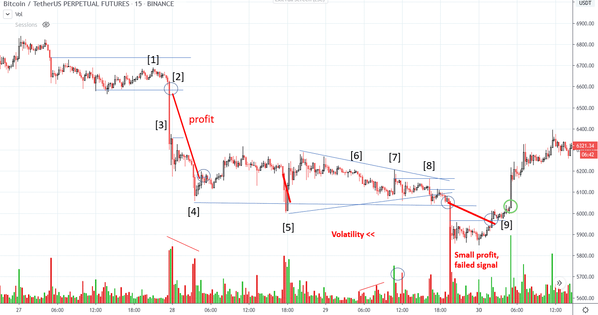
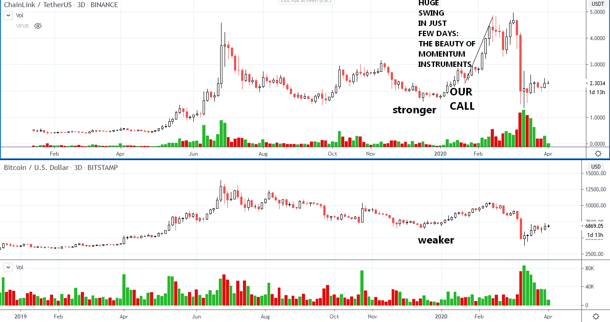

# Wyckoff Crypto Report vol. 16

URL: https://www.wyckoffanalytics.com/wyckoff-crypto-report-vol-16/
Date: 2020-04-03T15:06:15
Author: Alessio Rutigliano

The WYCKOFF CRYPTO REPORT provides regular updates on the most popular digital assets based on the Wyckoff Methodology. Our market outlook follows the principles of Supply and Demand and Market Participants Analysis as they are taught and practiced in the WTC/WTPC/WMD classes.
### The big picture. 4D charts. Bitcoin and S&P
####

Price is recovering on decreased volume and spreads. The moment of truth will come in the next few days, when a break of the $7350 critical level will confirm the absorption scenario, or a failure to commit will suggest a retest of the lows. Volume is reaching the level prior to the big capitulation bar [1] , a sign of temporary absorption , but the confirmation will come only on the breakout. We are open to both scenarios. As always, the price action of the S&P is extremely important. If the market fails to commit above the $2525 resistance , we will see a retest of the lows, and that selling pressure could take down Bitcoin again.
______________________________________________________________________________
### Bitcoin 4hr analysis

Price is gravitating toward the $7350 level, the top of the capitulation bar. Bar [3] has more effort to the upside than its analog [2] , a bearish close, the spread is slightly wider and price touches the $7350 level for the first time. High volume suggests at least a retest of the high. The retest comes as a lower low. IS this a test of the upthrust? A failure below the local support would suggests a short term entry to the downside, target $5600. Risk is very low. If price quickly rebound on the upsloping support, we should reconsider our bearish bias.
_______________________________________________________________________________________
### Derry’s 1987 market analog
What’s the alternative scenario? Our fellow Wyckoffian Derry (derrygold) has submitted to our twitter channel @WyckoffAnalysis a very interesting market analog. In the WMD discussions we have recently studied the 1987 S&P crash. Even though the context of the market is different now, this chart offers an interesting structural analog. After the quick crash, price quickly recovers and then a stepping stone reaccumulation range follow. Volatility and supply slowly unfold.

### A small trick
Whenever the game is in a fifty-fifty situation, my preferred choice is to open a MOVE contract. Daily or weekly MOVE contracts represent the absolute value of the amount a financial instrument moves in a period of time. Short the volatility during the apex formation, long the volatility near the resistance. Here is an introduction to MOVE contracts on FTX https://help.ftx.com/hc/en-us/articles/360033136331-MOVE-contracts
## A question from a reader
> I opened my short position at 6618 and now the price went back to 6600 again and again . All the profit are gone. My target price is 3800. stop is 7100. The ratio of gain/loss is good, but it is a dream I think. It never reach the target and finally maybe hit the stoploss. I had closed my position. What would be a good strategy to close the position that can both protect your profit and never miss the big movement?
Dear G.,
thank your for your message. Let’s analyze the trade environment step by step. When Bitcoin is very volatile, we can operate on a 4hr timeframe. I love this timeframe and it generally works when Bitcoin is moving. When volatility is lower, like in this period, we choose a 5-15 min timeframe to catch smaller swings. As we know, Bitcoin is traded 24/7. However, I always recommend you, when it’s possible, to keep an eye on the US and Asia session (open and close). Traders are very active at these specific spots. Let’s review the trade.

We have identified on the 4 hr timeframe an opportunity to short, and we want to tailor our entry. The price action at point [1] does not reach to the high of the capitulation downbar (blue level at the top). Volume decreases, demand is exhausted, supply is taking over. Price breaks the support [2] , it’s our last opportunity to short the market. We follow the downswing swing using the Significant bar technique, possibly looking at much lower timeframes (5min, 3 min). Volume comes in. We are stopped out at point [4] , with a good profit. Now it’s time to study price and volume. The low at point [4] has slightly decreased volume signature. Supply is decreased, we expect some kind of consolidation, at least a retest of the low. The swing at point [5] is not easy to catch. We are inactive. A short term trade to the downside would probably end in break even. Unnerving, but not bad. What occurs after the spring action at [5] ?
A spring should always produce a higher high. What happens next? Volatility decreases, but price reside in the lower part of the range. A bearish sign. Look at point [7] and [8] : price is rejected each time at a lower level. Since our bias is bearish, we could short again here. We protect our trade using the Significant bar mechanism. We are stopped out again, this time with a very small profit. We were looking for a $5300 target, but price stops here. Point [9] is crucial. A very short term oriented trader could try to short the local upthrust at point [9] . This trade would produce a FAILED SIGNAL . The failed signal is one of the most important signal for a trader. It warns us that our bias at this point is wrong, and we should stop shorting. Demand has come in at a higher level than our original target. Two days: a very profitable trade, a small profitable trade, and a loss/failed signal.

Is intraday trading profitable in these market conditions? Definitely yes. However, I want to stress the idea that the most remarkable profits in crypto comes from swing trading. One of capital sins of crypto traders is to focus on the intraday picture while several swing trades are available in the altcoin world. Relative strength is our “secret” tool. The beauty of high momentum instruments lies in the fact that quick swing trades could be much more profitable than day trading. I have attached here this call from our Crypto Report in late January. Look at the chart: intraday trading on Bitcoin was definitely profitable in late January, but the real deal was the swing trade on ChainLink. In the latest reports, I have focused on Bitcoin, since the general market conditions in the S&P are still uncertain. If the market will continue to show signs of absorption, in the next reports we will include other instruments. Altcoins like REN and XTZ looks promising.
____________________________________________________________________________________
## Send us your question!
Register here for free https://www.wyckoffanalytics.com/forums/topic/crypto-and-wyckoff-analysis/
I will be happy to discuss your questions in the next Crypto Reports!
Important Disclaimer – PLEASE READ: The materials presented in the WYCKOFFANALYTICS CRYPTO REPORT are for educational purposes only: nothing contained in any of these materials should be construed as investment advice of any kind. REGARDLESS OF ANY LANGUAGE IN ANY WYCKOFFANALYTICS CRYPT0 REPORT POST, NEITHER THE WYCKOFF AUTHOR(S) NOR WYCKOFF ASSOCIATES, LLC, NOR ANYONE AFFILIATED WITH THE LATTER ORGANIZATION IN ANY WAY IS RECOMMENDING THAT YOU BUY OR SELL ANY SECURITY, OPTION, FUTURE, ETF, OR ANY OTHER MARKETS MENTIONED. There is a very high degree of risk of financial loss involved in trading securities. You understand and acknowledge that you alone are responsible for your trading and investment decisions andresults. Alessio Rutigliano, Wyckoff Associates, LLC, www.wyckoffanalytics.com, Roman Bogomazov, and all officers, staff, employees, and other individuals affiliated with Wyckoff Associates, LLC, and www.wyckoffanalytics.com assume no responsibility or liability of any kind for your trading and investment results. It should not be assumed that investments in or trading of securities, options, futures, ETFs, companies, sectors or any other markets identified and described in these WYCKOFFANALYTICS CRYPTO REPORTs were, are or will be profitable.
