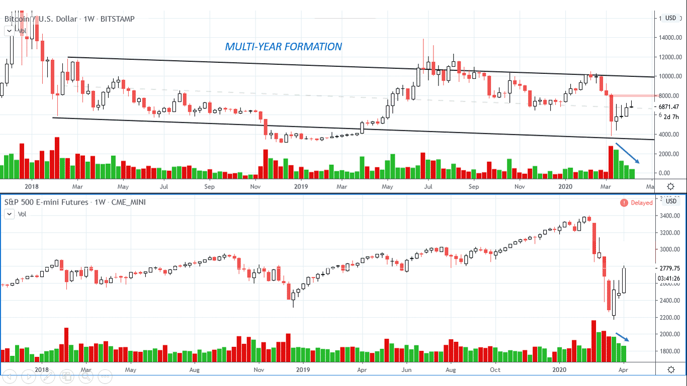
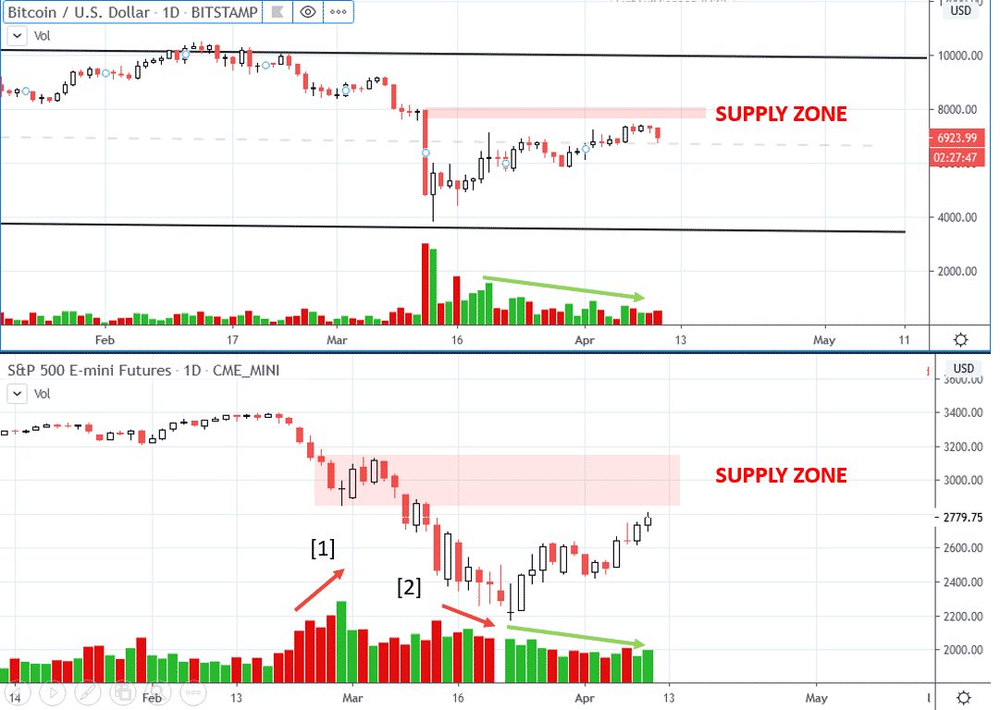
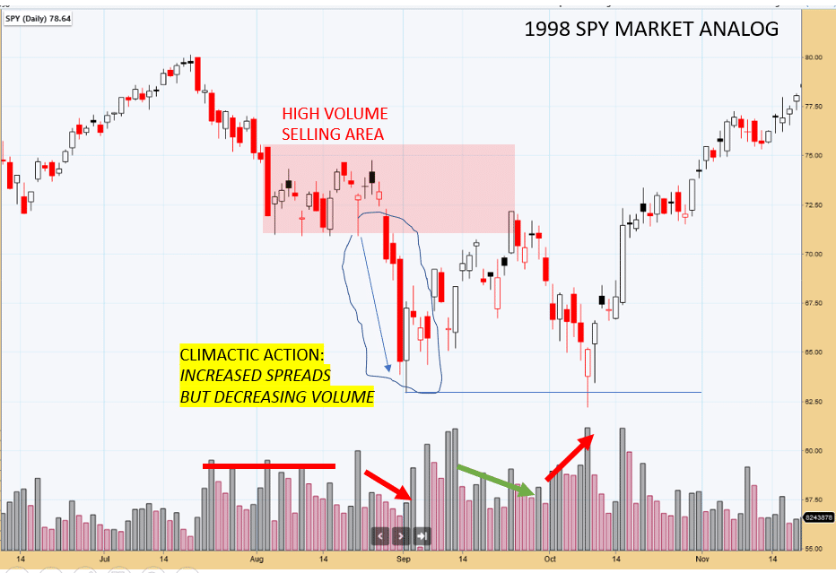
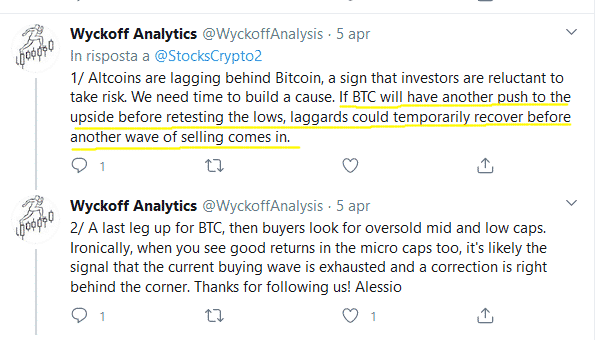
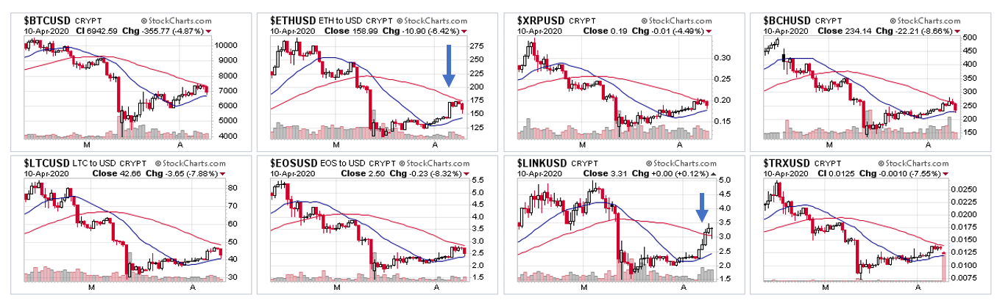
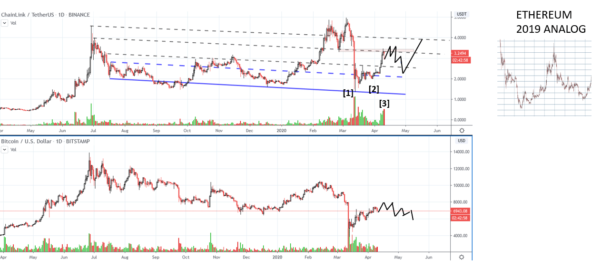
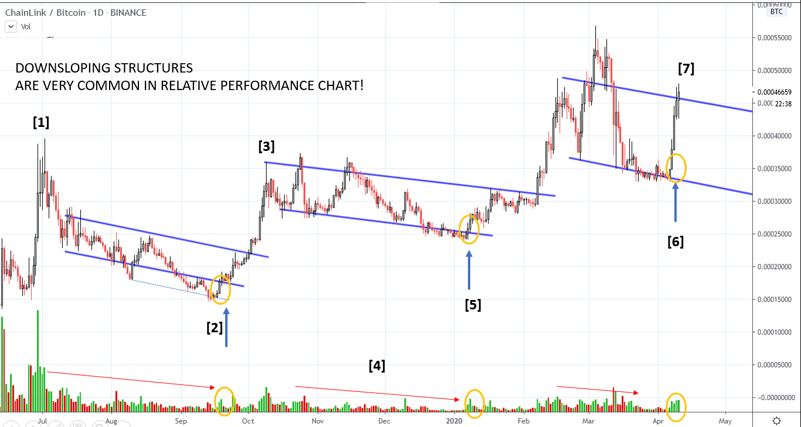

# Wyckoff Crypto Report vol 17

URL: https://www.wyckoffanalytics.com/wyckoff-crypto-report-vol-17/
Date: 2020-04-10T17:32:51
Author: Alessio Rutigliano

The WYCKOFF CRYPTO REPORT provides regular updates on the most popular digital assets based on the Wyckoff Methodology. Our market outlook follows the principles of Supply and Demand and Market Participants Analysis as they are taught and practiced in the WTC/WTPC/WMD classes.
### The big picture. Bitcoin and S&P
####

The last weekly bar shows decreased spread and volume right below the $7485 supply zone highlighted in red. Price has quickly bounced off the oversold territory, and s entiment has swung from extreme fear to greed. As Wyckoffians, we want to judge the market by its own action. Volume on the current rally is suspect and a retest of the lows is still in the cards. We need time to build a cause, and the current rally could be just the Automatic Rally of a more prolonged consolidation .
______________________________________________________________________
### Daily Perspective. Bitcoin and S&P

Let’s look at price action of the S&P. It’s very common to see a climactic action with decreasing volume and increasing spreads [2] followed by big automatic rally that reaches the high volume supply zone [1] . Then, momentum deteriorates and the rally fails. If this is the case, bear in mind that any failure on the S&P would add selling pressure to Bitcoin, at least short term.
Both Bitcoin and the S&P are reaching the supply zone on deteriorating momentum. The last downbar presents some early signs of synchronicity to the downside, but only a swing reversal would act as a confirmation.
### ___________________________________________________
### The 1998 Bottom Analog

Structural analogs from the past are extremely useful. Inspired by Bruce Fraser’s blog “Where Were you in’62” let’s study another bottoming formations of the past. The 1998 S&P climactic action presents some interesting similarities with the current environment. Note the climactic action on decreasing volume, followed by the big automatic rally that upthrusts the top of the capitulation downbar and reaches the supply zone highlighted in red. A double bottom formation develops. We will revisit this structure later, when we will discuss the current price action of ChainLink (LINK).
__________________________________________________________________
### Short term rotation
Few days ago we have warned about the possibility of a short term rotation of capitals Bitcoin-> Altcoins. Here is our Twitter post:

###
###
###
###
###
###
Ethereum (ETH) and ChainLink (LINK) have locally outperformed the market on the intraday. We have seen in the past, especially during corrections, that capitals in the crypto space rotates from the major caps to the low caps until another selling wave occurs. Usually, when micro caps shows good gains, the wave of buying is currently exhausted.

Let’s analyze ChainLink, one of the leader of the previous bull run in the crypto market. The market has produced a Lower high compared to Bitcoin [1]. After the short term testing action on low volume [2], price has quickly recovered almost to the top of the big capitulation bar, and the previous support has turned into reisstance. The huge volume on the capitulation bar, as well as the supply emerged on the downbar at point [3] suggests that we need more and more testing. The scenario indicated with the black line offers a significant structural analog with the price action of Ethereum in 2019. In late 2018- early 2019, price quickly recovered from an extreme oversold condition, overshoot the supply zone, and then fall back into the support on decreased volume and spreads.
___________________________________________________________________________

### Relative strength ratio on steroids. Wyckoff analysis on spread charts.
In the blog Rotation and leadership in the crypto markets we have shown how relative strength ratio could helps us to identify good opportunities int eh Wild West of Cryptocurrencies. Today we will show a slightly different approach. Spread charts are very popular in the crypto arena. Altcoin-Bitcoin pairs are heavily traded. In several instances, we can apply our Wyckoffian knowledge to spread charts too, in order to identify low risk opportunity to catch the resume of the outperformance. We do not trade “directly” on spread charts. For example, there is no reason to increase our exposure in Bitcoin when price is falling. Spread charts give us he alert to look for setups on the USD pair. In this case, we study th LINKBTC chart, and when a relative strength ratio signal is triggered, we switch to the LINKUSD chart and look for the entry. Good volume data is available, adding another layer to our analysis.

Here is the complete Wyckoff Story. After the hypodermic top at point [1], a downsloping reaccumulations structure occurs. Volume and volatility decrease, and the reversal off the spring at point [2] offers a very low risk entry. Price quickly reaches the previous top at point [3], and stays flat. Volume continue to decrease [4], a sign of absorption. The spring at point [5] is the same price action that we have seen in the previous range. Another low risk entry. The upbar at point [6] follows the same logic and was the rationale behind the call. However, remember that a spring should always create a higher high. Currently, we are still below the early March high. If Bitcoin corrects and ChainLink stays above the top of the range, this asset could confirm its long term leadership once again. If the current rally fails, we could retest the lows of the downsloping channel.
____________________________________________________________________________________
## Send us your question!
Register here for free https://www.wyckoffanalytics.com/forums/topic/crypto-and-wyckoff-analysis/
I will be happy to discuss your questions in the next Crypto Reports!
