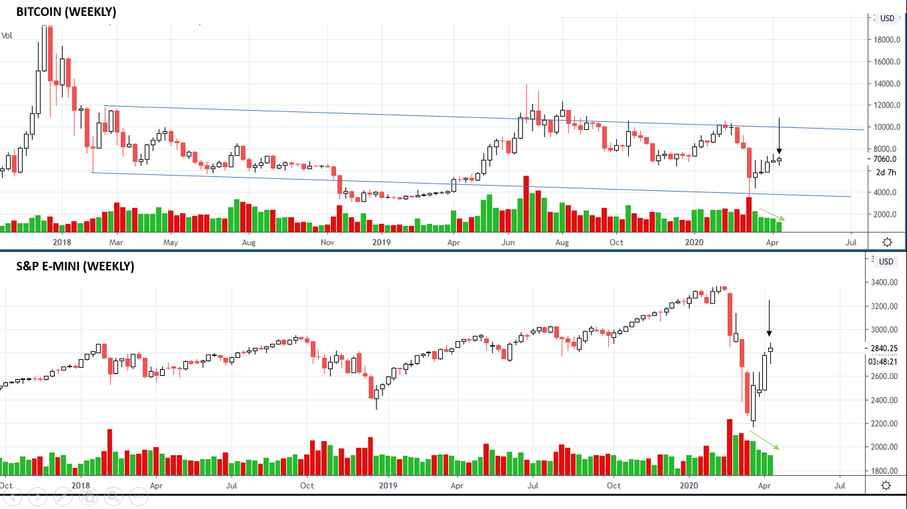
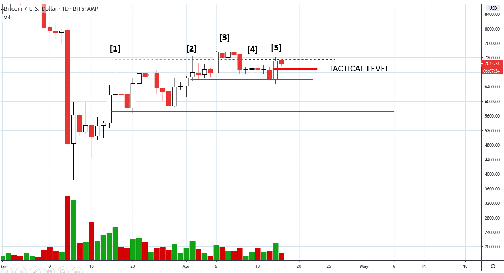
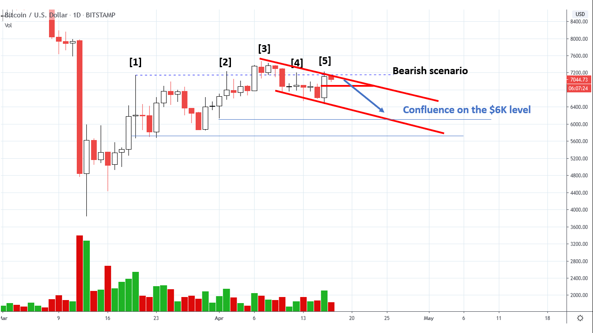
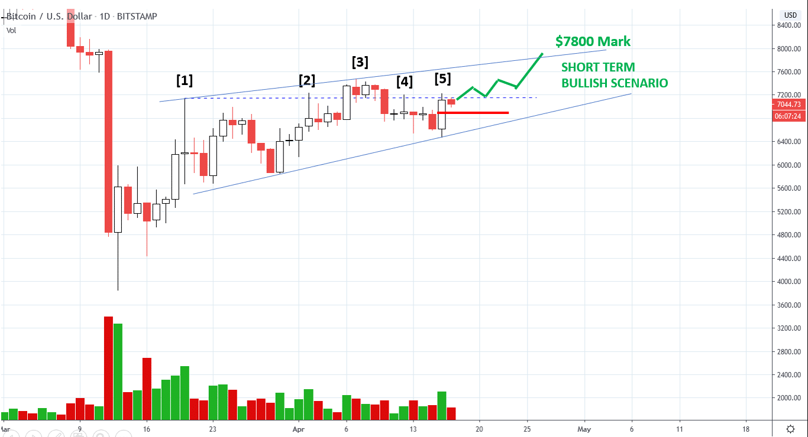
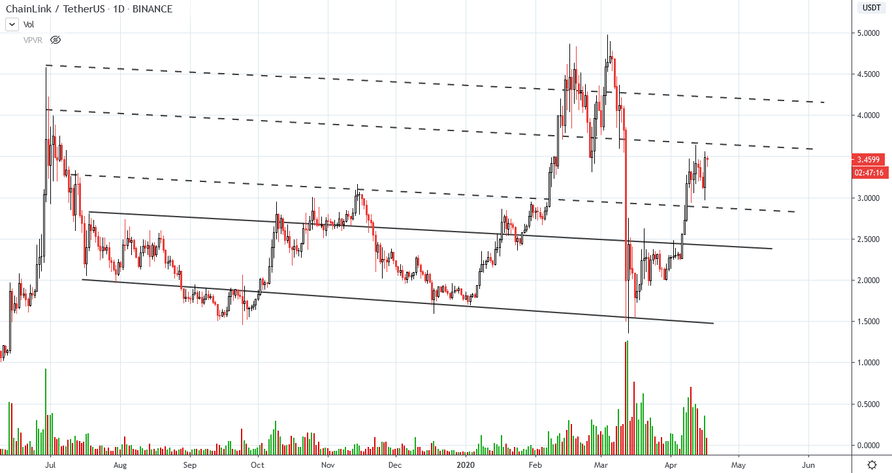
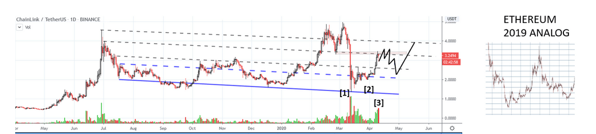
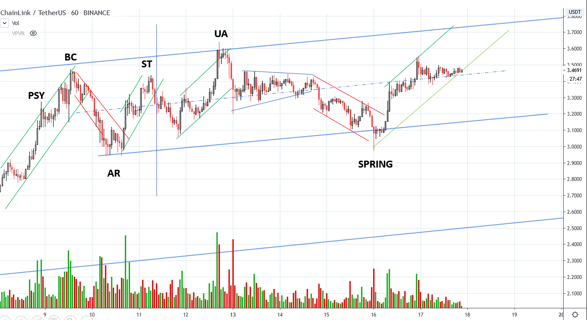

# Wyckoff Crypto Report vol. 18

URL: https://www.wyckoffanalytics.com/wyckoff-crypto-report-vol-18/
Date: 2020-04-17T10:26:43
Author: Alessio Rutigliano

The WYCKOFF CRYPTO REPORT provides regular updates on the most popular digital assets based on the Wyckoff Methodology. Our market outlook follows the principles of Supply and Demand and Market Participants Analysis as they are taught and practiced in the WTC/WTPC/WMD classes.
### The big picture. Bitcoin and S&P, a game of chess
####

Price is still ranging in the $7400-$6400 area. The last weekly bar has slightly penetrated the low of the previous bar on low volume, a first sign of deterioration of the demand, especially when compared to the S&P. The S&P has almost reached its first PnF target. Both instruments have reached a crucial supply zone, and demand is tired. The question for the next week is “ When supply will come in, what kind of reaction will we see? “. Let’s look now at the daily chart to define our tactics .
______________________________________________________________________
### Daily Perspective. Tactics, tactics, tactics.

Supply has emerged at point [1] : the big supply tail and the high volume have stopped the rally. Since then, a long consolidation has started. Price are still residing in the higher part of the range. Supply comes in again on bar [2] , but we do not see any follow through to the downside, suggesting that a push to the upside is still possible. Price temporarily commits above the resistance [3] , but fails. Price reacts on decreasing volume, and springs the local support. As our fellow Wyckoffian Gary Fullet says “ A spring should always produce a higher low “. Bar [5] has good spread and volume, but we still do not see a commitment above the long term resistance. We are currently testing this level. If the test fails, a short term entry to the downside could be triggered. Let’s view the two scenarios.
___________________________________________________________________
### Short term scenario. The bearish camp
If the test of the resistance fails and price breaks with increased velocity the midpoint of the bar [5], price could easily fall again i nthe $6Ks. I have highlighted two levels of confluence that suggest some short term target for a trade to the downside. On the intraday, there is sufficient room for a very short term play.

___________________________________________________________________
### The absorption scenario
If the test holds, there is some limited room to the upside toward the $7800 supply level. If the market will continue to go up and reach the $3K mark, this scenario is possible.

###
### ________________________________________
### ChainLink, the leader. Daily Perspective

Last week we have analyzed ChainLink, the leadership asset in the crypto market. Price is still consolidating in the $3.00-$3.62 area. Volume is still high, and the current consolidation could lead us to lower prices. We repost here our structural analog that we have reviewed in the previous Wyckoff Crypto Report.
The scenario indicated with the black line offers a significant structural analog with the price action of Ethereum in 2019.
In late 2018- early 2019, price quickly recovered from an extreme oversold condition, overshoot the supply zone, and then fall back into the support on decreased volume and spreads.

Let’s view the current price on the intraday level.
__________________________________________________________________
### A closer look to ChainLink. Intraday tactics. A simple trade.

On the 1hr timeframe, it is possible to identify the Wyckoff Structure of the current consolidation. The green/red trendlines can help beginners to identify short term overbought and oversold conditions. In this way, we can identify low risk points for our intraday trading. Price is currently retesting the reverse trendline at the support. ChainLink could potentially reach the $3.7 level. Usually we look only at major swing, but %10 profits on an intraday trade are still very attractive.
____________________________________________________________________________________
## Send us your question!
Register here for free https://www.wyckoffanalytics.com/forums/topic/crypto-and-wyckoff-analysis/
I will be happy to discuss your questions in the next Crypto Reports!
