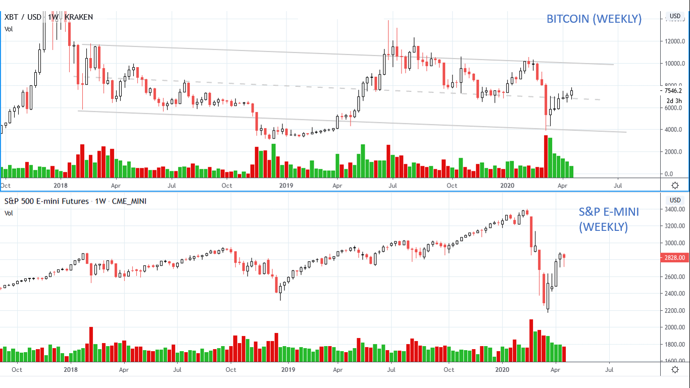
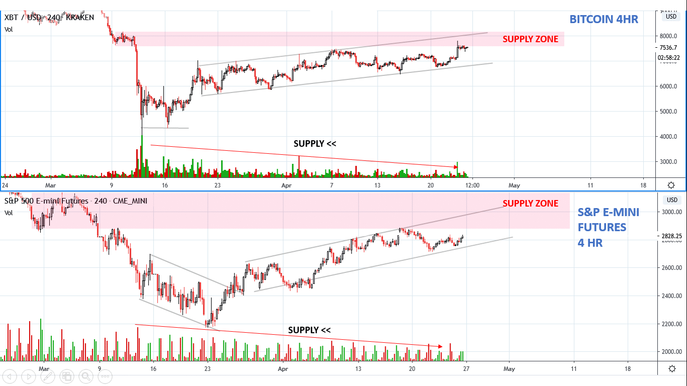
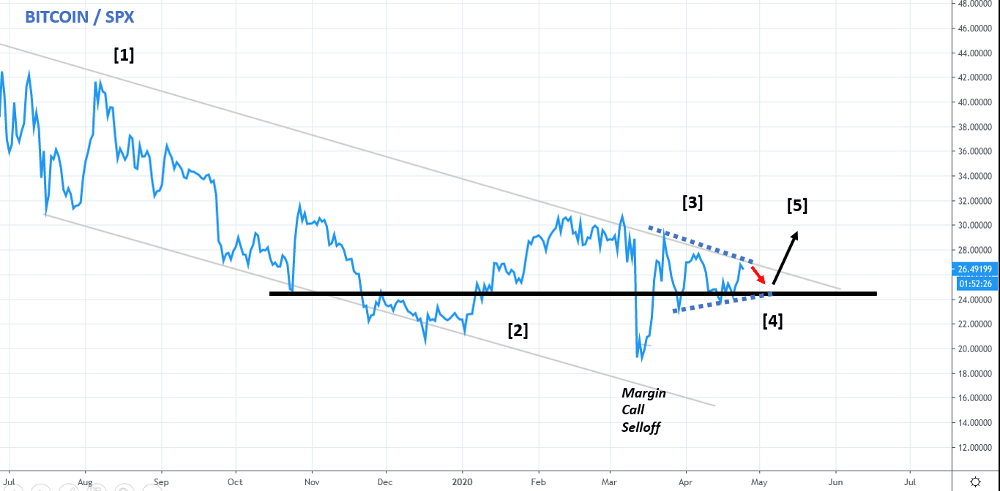
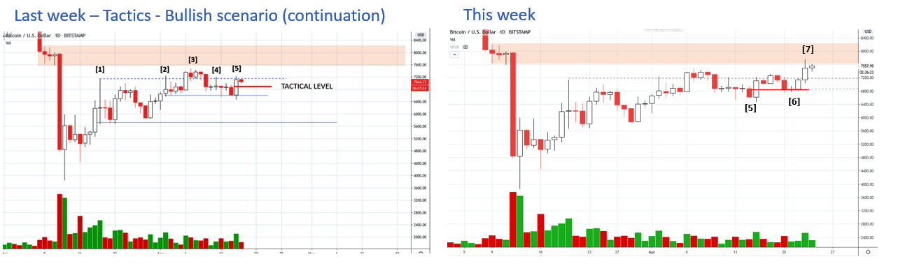
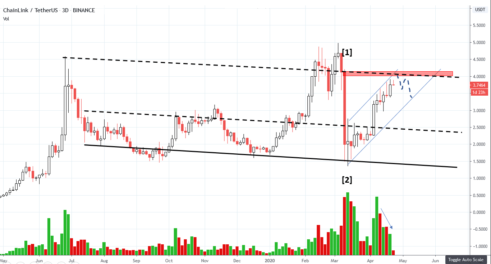
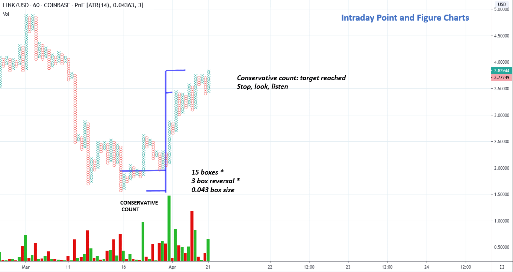
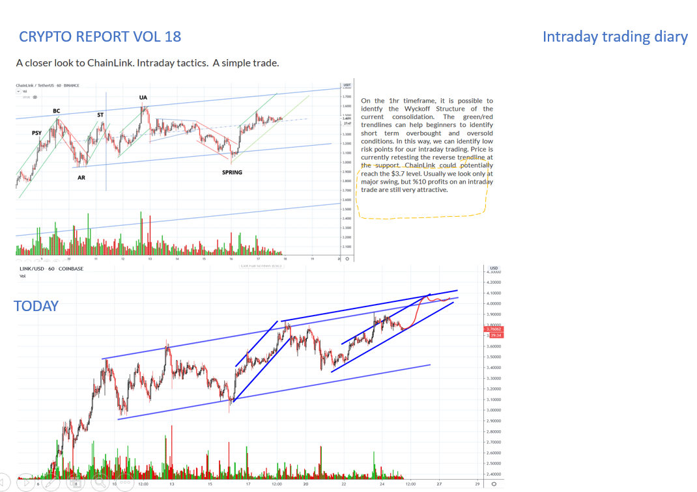
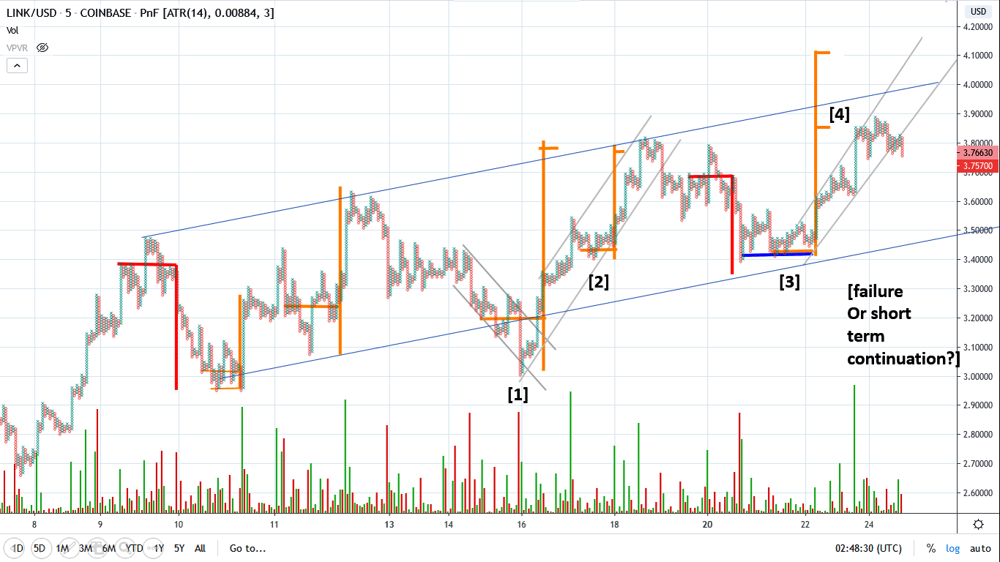

# Wyckoff Crypto Report vol 19

URL: https://www.wyckoffanalytics.com/wyckoff-crypto-report-vol-19/
Date: 2020-04-24T15:19:52
Author: Alessio Rutigliano

The WYCKOFF CRYPTO REPORT provides regular updates on the most popular digital assets based on the Wyckoff Methodology. Our market outlook follows the principles of Supply and Demand and Market Participants Analysis as they are taught and practiced in the WTC/WTPC/WMD classes.
### Weekly Analysis
####

Buyers are accepting higher prices. The last weekly bar has increased spread on low volume and commits above the short term resistance. Price is hovering around the $7700 are, the same price level where the margin calls selloff occurred six weeks ago. In a very limited period of time, sentiment has switched from bearish to bullish, but we do not recommend to open long positions right now. Instead, we think in terms of tactics and strategy. Long term investors should wait for a breakout of the resistance followed by a shallow, flat test, confirmed by continuation. In the meanwhile, we suggest to act on the short term base. The S&P is very close to the supply zone, even though the current rally is still intact. We start to look for weak candidates for short positions, but we pull the trigger only when we see a clear sign of a reversal.
______________________________________________________________________
### A closer look. 4H Timeframe

In the last week we have seen some sign of deterioration of the demand in the S&P. However, the uptrend is still intact and the overall decreasing volume suggests that supply has not come in aggressively yet. Bitcoin performed well, absorbing the supply present at the $7400 level. The overall volatility is continuing to contract.
___________________________________________________________________
### BTC/SPX still in the downtrend, but a base is forming
Relative strength ratio is an important tool for Wyckoffians. Generally, we study the Relative Strength Ratio (Bitcoin:SPX) on weekly charts, however this daily chart tells us a very interesting story. After the downtrend started in July 2019 [1] , The RS line has formed a base in November [2] . RS is now in a hinge [3] . If the market reacts, a long term bullish scenario for Bitcoin would require a HL on the RS line [4] , followed by the break of the trendline [5].

___________________________________________________________________
### Tactics
Last week we have considered several scenarios and identified a “tactical level” [5]. Buyers have step in again at that level: bar [6] has sprung the red level, providing a low risk opportunity for short term traders. The upbar at point [7] has committed above the short term resistance, but the close in the middle indicates that supply needs to be absorbed, and price could continue to reside in the $7300-$7800 range. Let’s study now the altcoins.

###
### ________________________________________
### ChainLink, the leader

ChainLink continues to outperform Bitcoin. Price is hovering around the overbought trendline. We have almost reached the supply zone, but the decreasing volume supply signature suggests that a last push to the upside is still possible. We do not look for long entries at this time. Let’ s look now at the intraday point and figure chart:
______________________________________________________________________
### ChainLink. Intraday PnF

We have reached the maximum target generated by the conservative count. The current consolidation does not present bearish elements, but cwe need a confirmation to extend the count to the left (SC). For now, let’s remember Wyckoff’s satying “Stop, look, listen”.
______________________________________________________________________
### ChainLink. Intraday trading diary

The intraday trade that we have explained last week has worked very well. The selection process was important. Always remember to pick only the “movers” when you day trade. ChainLink (LINK) is a great instrument for intraday trading. How can we improve our performance? Let’s a closer look at our loved PnF charts.
__________________________________________________________________
### ChainLink. Intraday Point & Figure II

As you can see, intraday Point and Figure beautifully work on crypto assets as well. The intraday trade initiated last week at point [2] is simply a SSR. When the horizontal count of the SSR at point [2] indicates the target of the original accumulation [1], the uptrend restarts. A similar intraday trade could be initiated at point [4]. Wait for a reversal of the last downbar (a potential spring). If price fails, the uptrend could be in jeopardy.
____________________________________________________________________________________
## Send us your question!
Register here for free https://www.wyckoffanalytics.com/forums/topic/crypto-and-wyckoff-analysis/
I will be happy to discuss your questions in the next Crypto Reports!
