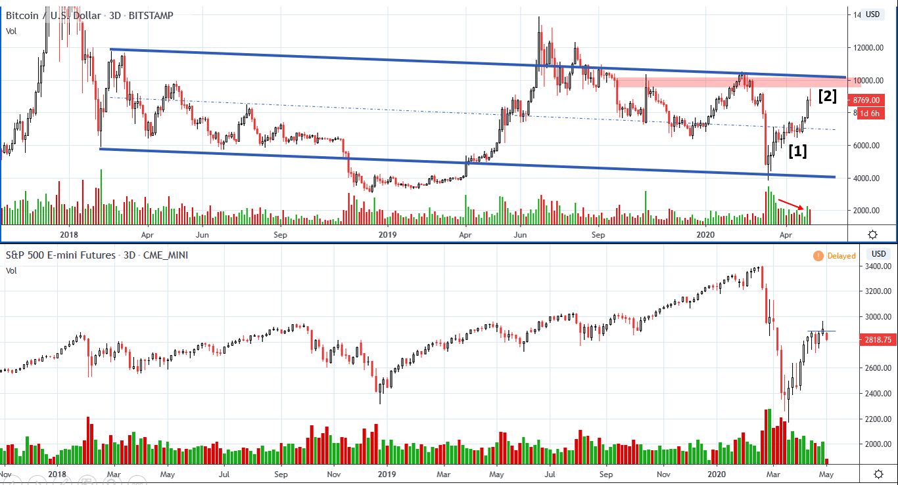
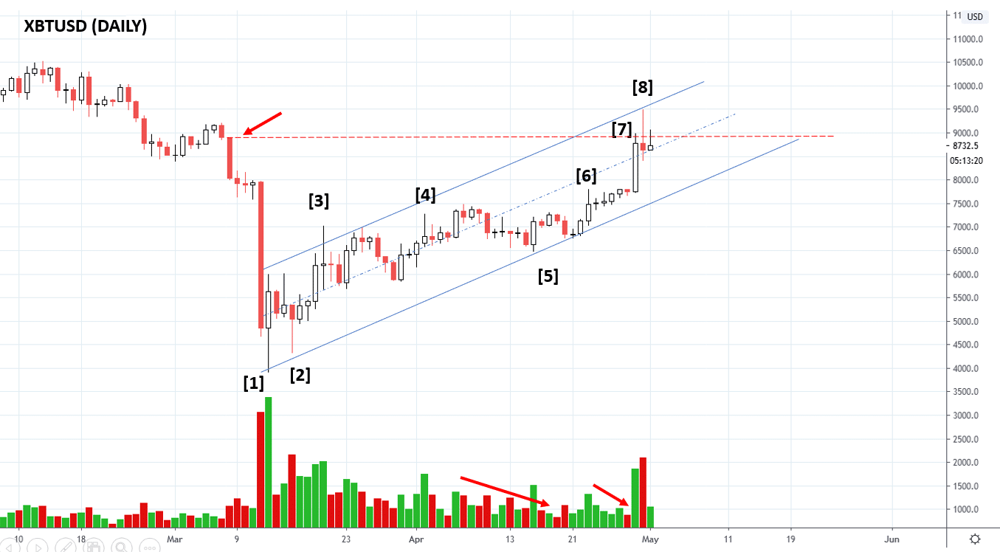
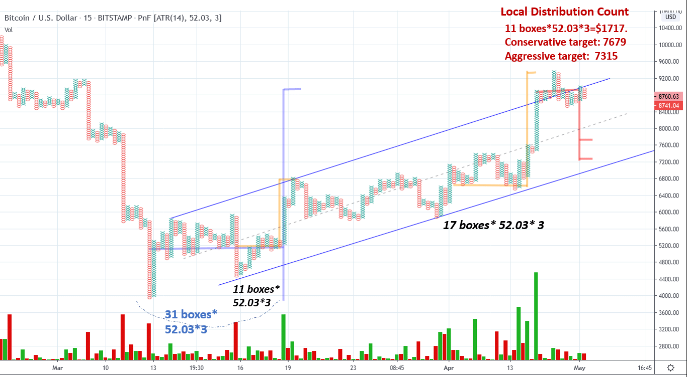
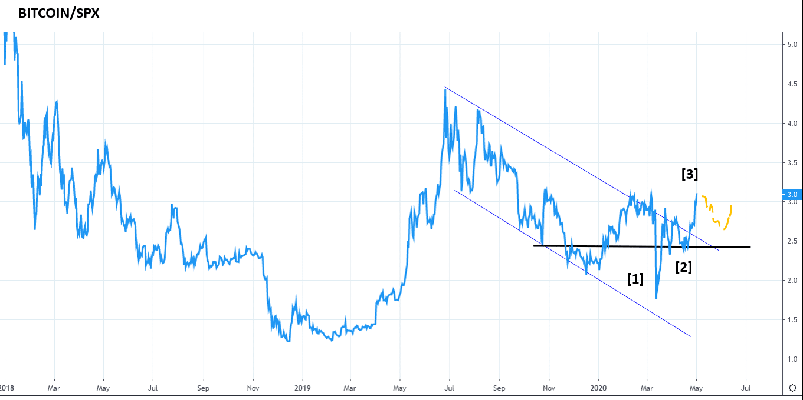
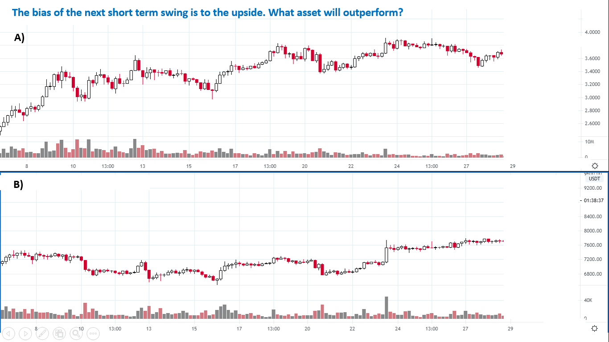
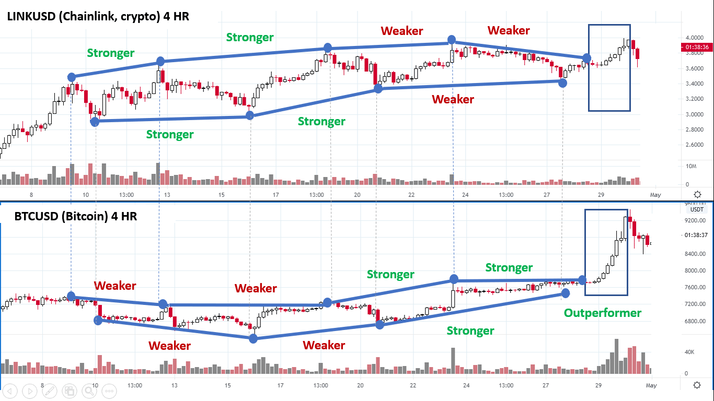
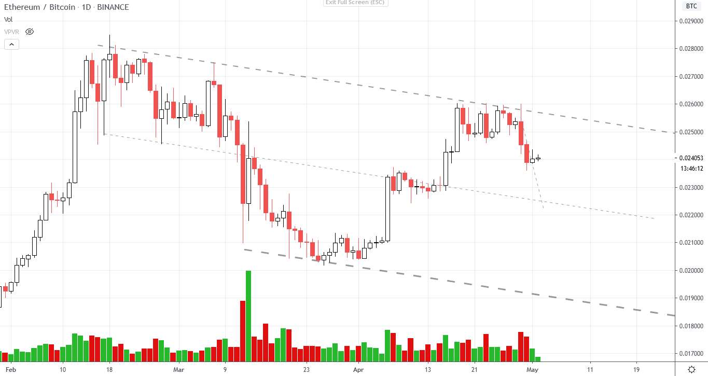

# Wyckoff Crypto Report vol. 20

URL: https://www.wyckoffanalytics.com/wyckoff-crypto-report-vol-20/
Date: 2020-05-01T12:36:13
Author: Alessio Rutigliano

The WYCKOFF CRYPTO REPORT provides regular updates on the most popular digital assets based on the Wyckoff Methodology. Our market outlook follows the principles of Supply and Demand and Market Participants Analysis as they are taught and practiced in the WTC/WTPC/WMD classes.
### 3D Analysis
####

After a shakeout action, we usually want to see a quick recovery followed by a flat reaction. The quick recovery of the last weeks is an encouraging sign for Bitcoin in the long term. Higher lows on decreasing volume at point [1] indicate absorption. Then, price accelerates and touches the $9500 level (red area) where we have previously encountered supply in the last months. The high volume on the last downbar [2] warn us that supply has come in. We analyze the short term consolidation on lower timeframes. In the meanwhile, selling pressure is entering in the market after a prolonged rally and can potentially affect cryptocurrencies too. However, Bitcoin has outperformed the market in the last few month, and assets like ChainLink have almost fully recovered their losses since March. If you operate in the stock market tool, there are much better candidate for short selling. If you focus on cryptocurrencies only, here are several short term strategies.
______________________________________________________________________
### Daily view. Bar by bar analysis

[1] Extreme oversold value. Buyers come in.
[2] Test as higher low and decreasing supply. Bullish
[3] Supply comes in
[4] Supply comes in again on the same level, but decreased volume. Both supply and demand have diminished.
[5] Flat reaction on decreasing volume
[6] Supply comes in again on the same level, but the result is slightly better. A bullish feather confirms the absorption is in play.
[7] After the bullish feather, price accelerates and commits above the top of the big capitulation bar. Volume comes in, but the high closes at the top.
[8] Volume increases but the bar fails to commit above the previous bar’s high (high effort, low result, bearish). The short term uptrend is still intact but the $9000 price level is still a significant level where effort and result to the downside have increased in March. We are currently testing this area. We want to judge the nature of the test. A break below the low of bar [8] would confirm some short term weakness. If price shows inability to react, we will revisit our upside targets.
___________________________________________________________________
### Profit taking scenario. Local distribution count
We have reached the target of the first conservative count. The confirming reaccumulation count marked in yellow We have a significant the confluence between the PnF target and the overbought line of the up channel. A distributional count of the local tepee formation would suggest two targets to the downside, at $7679 and $7313, both very close to the oversold trendline. It would be wise to wait for a proper confirmation, in this case, the break of the local support.
The $7679 is also the bottom of the breakout upbar, that could offer also a low risk point of entry for late bulls.

###
###
###
###
###
### BTC/SPX breaks the downtrend
Last week we have highlighted the possible break of the downtrend of the reatova strength ratio Bitcoin / S&P. In tha last days Bitcoin has finally broken the downtrend channel. A retest as a HL would be constructive.

___________________________________________________________________
### Post analysis. Comparative analysis
I propose a relative strength exercise this week:

###
###
The chart at the top is ChainLink (LINK). It is very common to see a quick rotation of the leadership between Bitcoin and the major crypto assets. Day traders should not underestimate the importance of relative strength! As usual, we compare significant lows and significant highs. In this case, we start from ChainLink, the market mover, and project the significant highs and lows to Bitcoin. ChainLink is stronger than Bitcoin in the first half of the chart, but Bitcoin is “silently” under absorption. In the second half of the chrta Bitcoin shows a better rally, followed by a shallow reaction. A sign of leadership. The next rally outperforms ChainLink. The rally has climactic characteristics, the ideal exit for short term traders is on the break of the last significant bar to the uspide.

____________________________________________________________________________________
### Ethereum vs Bitcoin
The spread chart Ethereum / Bitcoin is a good indicator of the “speculative” sentiment of the market. When a distributional pattern is spot on the ETHBTC chart, institutions have locked in their profits, anticipating some short term weakness.

## Send us your question!
Register here for free https://www.wyckoffanalytics.com/forums/topic/crypto-and-wyckoff-analysis/
I will be happy to discuss your questions in the next Crypto Reports!
