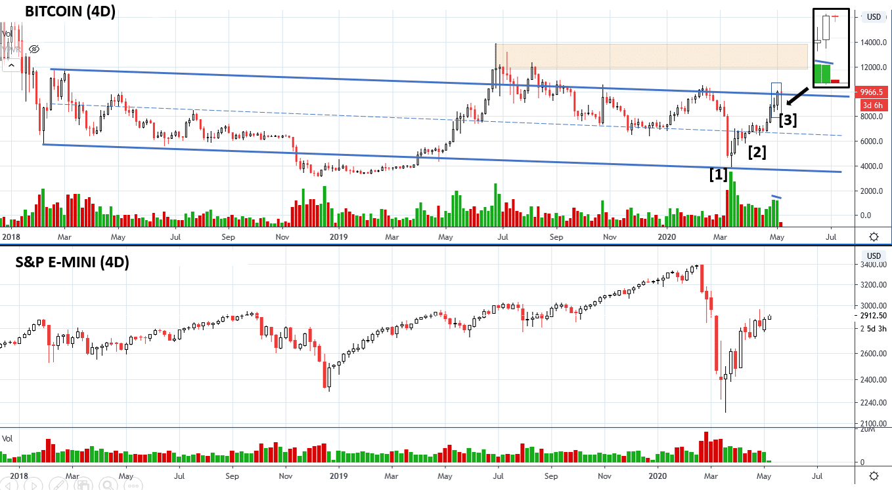
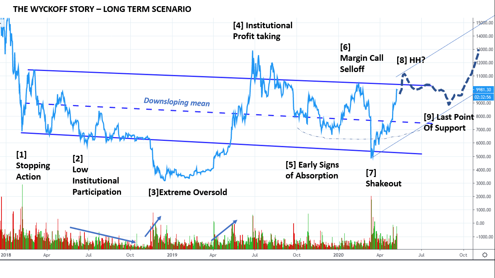
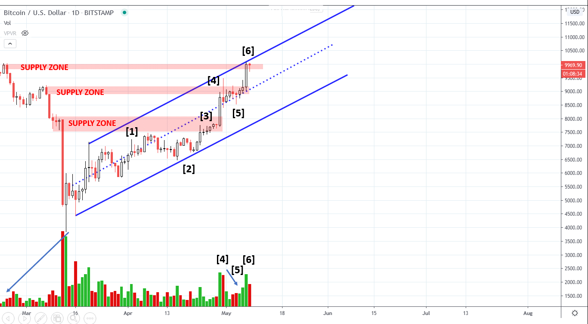
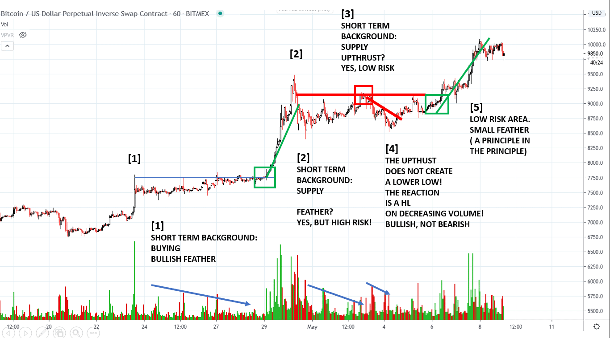
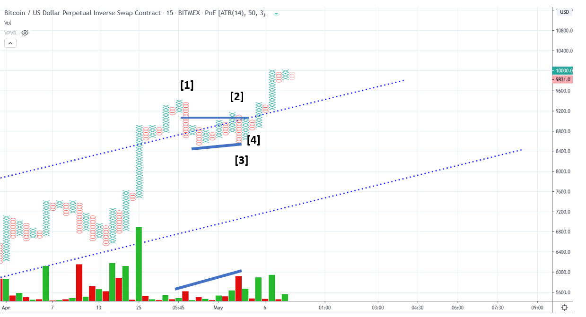
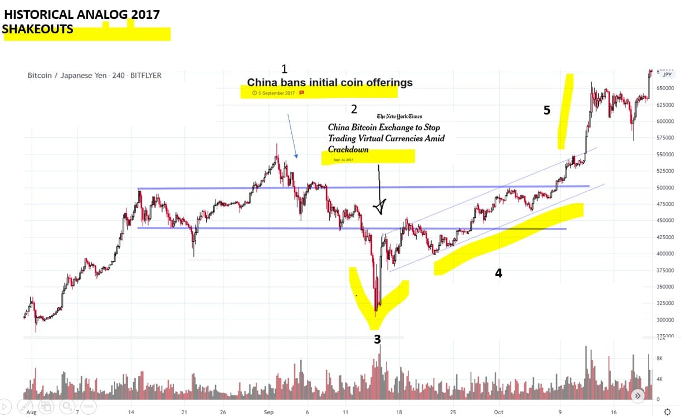

# Wyckoff Crypto Report vol 21

URL: https://www.wyckoffanalytics.com/wyckoff-crypto-report-vol-21/
Date: 2020-05-08T14:56:34
Author: Alessio Rutigliano

The WYCKOFF CRYPTO REPORT provides regular updates on the most popular digital assets based on the Wyckoff Methodology. Our market outlook follows the principles of Supply and Demand and Market Participants Analysis as they are taught and practiced in the WTC/WTPC/WMD classes.
### Bitcoin. S&P. 4D Analysis

After the period of absorption of the last weeks, momentum has kicked off. The chart illustrates the three stages of the uptrend: VALUE BUYING [1] ABSORPTION [2] MOMENTUM [3] . The halving event is acting as a catalyst. The last two 4D bars still do not show any sign of weakness for now. The last upbar has increased result to the upside on slightlyless volume (Ease of Movement). Swing traders can maintain their long position and raise the stop loss to $9000. Bitcoin has outperformed the S&P since the March selloff. The majority of market participants is surprised by the extension of the current rally of the S&P, but Point and Figure charts suggests that there is still some room to the upside. Another small push to the upside would force short sellers to capitulate, and big operators could take advantage of the increase of liquidity to lock in their gains.
________________________________________________
### Long term accumulation
We have discussed the long term bullish scenario for Bitcoin in late November. The global selloff triggered by margin calls has impacted the cryptocurrency world as well, but the price action of the last seven weeks confirms once again that institutional interest for Bitcoin is high. Let’s recap the Wyckoff Story of the last two years and trace a possible path for the long term accumulation.

[1] Stopping Action. Value buyers step in after the late 2017 distribution.
[2] Low institutional participation: Instititutional Trend Followers still do not participate.
[3] Extreme Oversold Area: Value buyers step in again. We see the classic price cycle sequence: Value – Absorption – Momentum – Speculation.
[4] Profit taking: Instititutions take profits after the x4 quick run.
[5] Early Signs of Absorption: Volatility contracts and price shows inability to react to the downside. Bullish
[6] Margin Call Selloff: Demand is consistent on the rally, but the Margin Calls trigger a big selloff. Back to the support.
[7] Shakeout: Value buyers step in again.
[8] HH? The long term investor should consider this rally as a potential SOS in Phase D (the emergence of the uptrend). A Higher High would be very constructive.
[9] Last Point of Support: The reaction after the SOS represents an ideal Point of Entry for the campaigner, and would mark the conclusion of the multi-year accumulation.
______________________________________________________________________
### Daily view. S upply-absorption-feather-acceleration
We are still in the uptrend. Each time price shows elements of supply [1], a HL on decreased volume suggests that absorption is occurring [2] . Look at the five upbars with narrow spreads and higher closes at point [3] : it’s a textbook feather , a Wyckoffian pattern followed by acceleration. Price quickly jumps to the next supply zone. The same sequence supply-absorption-feather-acceleration repeats at point [4]-[5]-[6]. Supply is present at point [6] and we are close to the overbought line of the uptrend, but the upper supply zones marked in red have less and less volume (look at the arrow in the left corner of the chart). If demand is still present, price can accelerate and break the trendline. From the trading perspective, we can raise our Stop Loss to the low of the last Significant bar and follow the trend until it’s over. Short term traders looking for an entry should consider very small timeframes (60 min).

___________________________________________________________________
### Opportunistic tactics. Trading diary.
Last week we have published a possible local distributional count for intraday traders. An overbought condition, however, does not automatically materialize in a short term trade to the downside, especially when momentum to the upside is high. The trade setup was not triggered, since price never broke the local low. A failed signal, however, is not necessarily a for a nuisance for a trader, especially when you operate on the intraday . On small timeframes, you always want to adopt an opportunistic style and “react” as soon you see a Change of Behaviour. Even when your short term bias is initially wrong, if you follow the rules and pick low risk areas,you can quickly turn a small loss / break even trade into a winner. Here is a beautiful nuance for short term traders. A failed upthrust that does not generate a new low is telling a bullish story.

The bullish feather at point [1] occurs on a bullish background, a very aggressive trader could buy the breakout right away. The feather at point [2] , instead, has a short term bearish background. We see that absorption is taking place (higher highs on decreasing volume), but this is a HIGH RISK point. We avoid this entry. Do not look for feathers when you have Instead, we decide to short the upthrust [3] at the level where supply emerged. A failure at this level would confirm that weak hands are pushing the price toward the original supply zone, but their buying does not have the “quality” to overcome the crucial point. Think of an amateur athlete who run like crazy in the first minutes of a marathon. During the first half of the competition, he looks very strong. But the truth is that he just spent all his energy in the first minutes. In the meantime, more skilled and powerful runners have “distributed” their efforts during the whole marathon. The amateur athlete, exhausted, falls to the ground before the end of the path. High effort, low result. The amateur athlete represents the weak hands. The end of the path is the resistance area where we want to see a commitment . A failure to commit above this resistance triggers our short term trade to the downside. However, something goes wrong: the reaction does produce a higher low on lower volume. Bullish, not bearish [4] . At this point, the second trade is closed at a break even point. However, the HL suggests that buyers are still supporting the uptrend. That upthrust was a failed signal. We want to be opportunistic and switch to the bullish camp. What’s the next low risk area? A small feather in the green box at point [5] provides a low risk entry.

###
Sometimes the price action is even clearer on a Point and Figure chart. After the selling at point [1] , the local Upthrust at point [2] fails to commit above the middle point of the big selling bar. Price reacts, but look what happens at at point [3] . Price stops at a higher level relative to the previous low, and volume increases. Buyers stepped in and prevent price to fall. Should we buy Bitcoin at this point? Not yet. Every time we see high volume, we want to see a test as a higher low and reduced supply. The test comes at point [4].
### _________________________________________
### Historical analogs. 2017. Bitcoin and the”e xogenous” shock
Few weeks ago, after the massive COVID-19 selloff that affected Gold, stocks, and Bitcoin, Dragon0flai – an attentive reader of the Wyckoff Crypto Report and active member of the WyckoffAnalytics.com forum, has suggested to look for historical price analogs of the big March shakeout. Here is my price analog from mid-2017. As you can see, the reaccumulation starts in August. The Change of Character does not show signs of distribution. The reaction is small and has very low volume. All troubles starts when the rumors of a possible China ban for Bitcoin are in the headlines [1] . Selling becomes more and more aggressive, and the final announce of the closure of a big Chinese exchange triggers a very deep shakeout [2]

Many Wyckoffians would be tempted to comment this weird formation as a manouevre by the “Composite Man” to shake out weak hands and accumulate more positions. But this is a too simplistic idea. What really happens here is that a big exogenous shock (the China ban) comes out of nowhere, and many market participants are forced to sell at least a part of their big crypto reserve. Big players in Asia were forced to shut down, a hit for the ecosystem. Miners and crypto companies have to quickly decide to relocate their activity to new places with a favourable regulatory environment. In the short term, Bitcoin becomes a source of funding. Value buyers step in at point [3] . A period of «restructuring» follows. V olatility contracts . Look at the very slow absorption on a rising scale. [4] . The stride of the trend is established immediately after the shakout. It’s late October. Behind the scene, US institutions are working for the introduction of Bitcoin Futures. The China ban was a hit, but the “fundamentals” have not changed. The introduction of the futures is an important catalyst. We find again the same sequence: shakeout, value buying, absorption on a rising scale, acceleration. The market particupants behaviour behind the exogenous nature of shock of the “China ban” is very similar to the shakeout formation that we have seen in March in Bitcoin. An “exogenous” shock, followed by absorption, in anticipation of a catalyst even (the halving).
## Send us your question!
Register here for free https://www.wyckoffanalytics.com/forums/topic/crypto-and-wyckoff-analysis/
I will be happy to discuss your questions in the next Crypto Reports!
