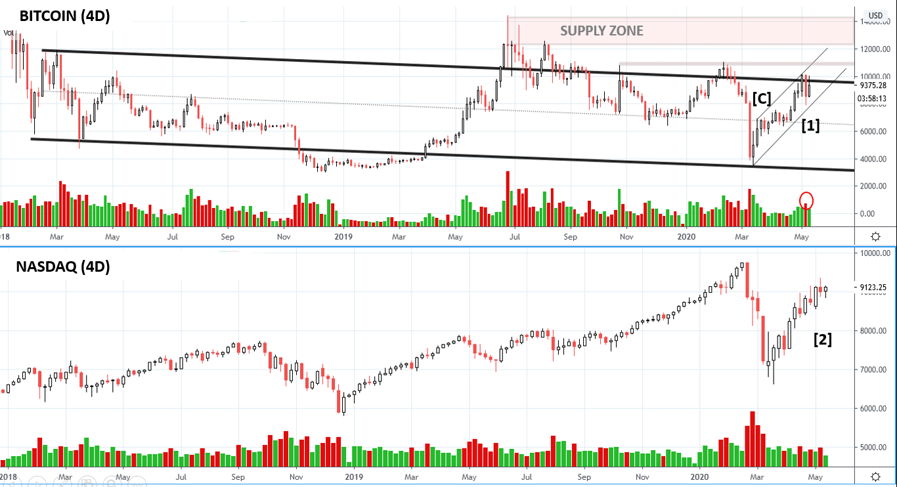
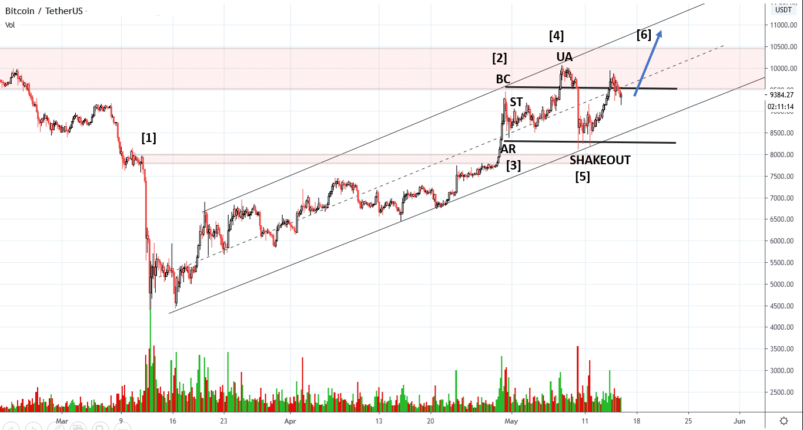
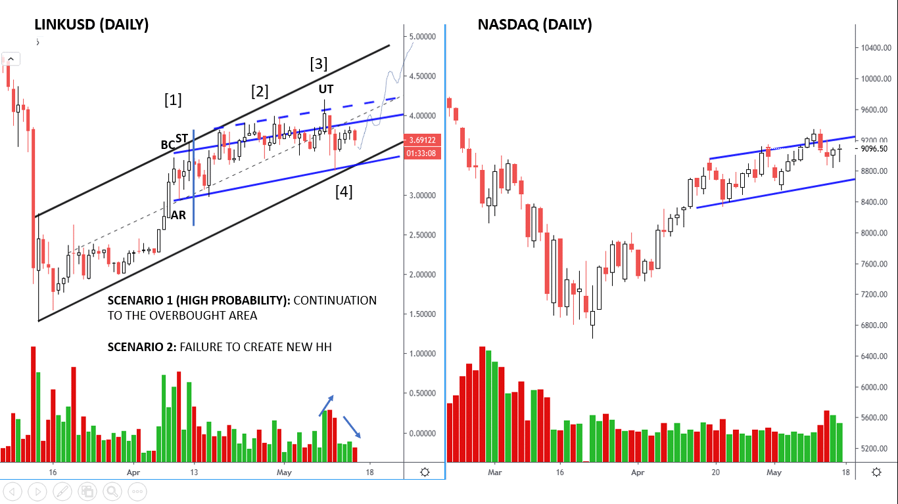
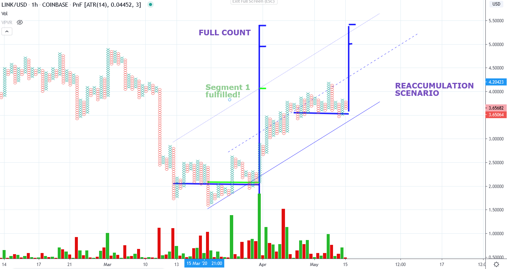
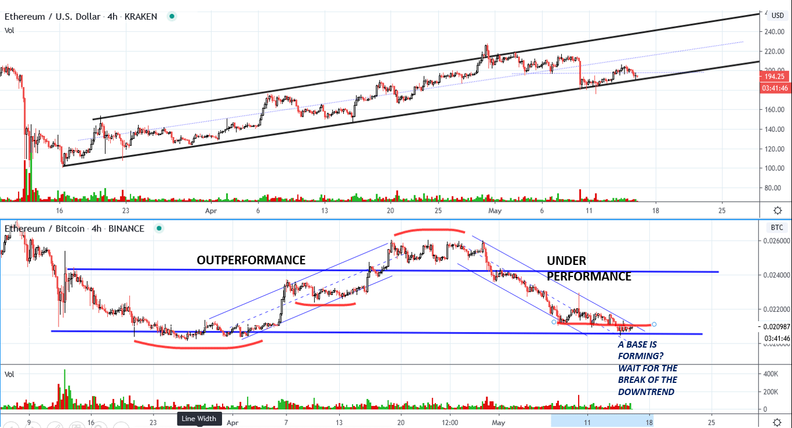
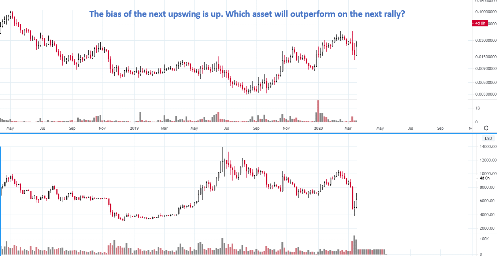
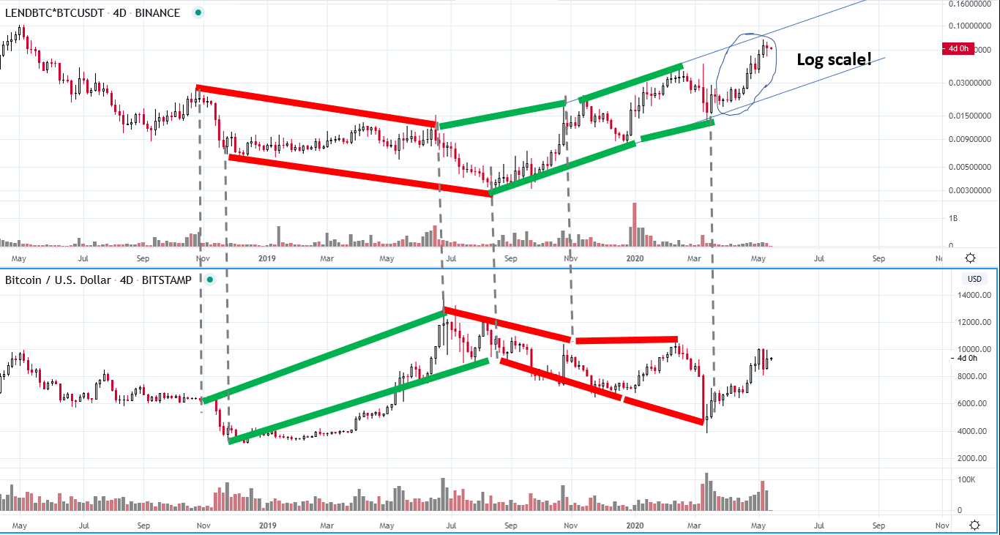
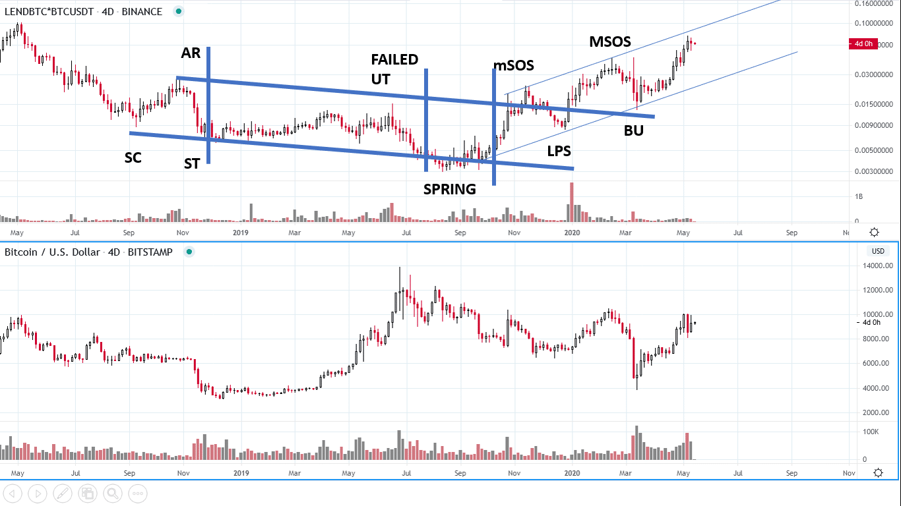

# Wyckoff Crypto Report vol 22

URL: https://www.wyckoffanalytics.com/wyckoff-crypto-report-vol-22/
Date: 2020-05-15T18:21:24
Author: Alessio Rutigliano

The WYCKOFF CRYPTO REPORT provides regular updates on the most popular digital assets based on the Wyckoff Methodology. Our market outlook follows the principles of Supply and Demand and Market Participants Analysis as they are taught and practiced in the WTC/WTPC/WMD classes.
### Bitcoin. Nasdaq. 4D Analysis

Supply has entered the crypto market in the last week, but buyers have accepted higher prices. The downbar at point [1] has increased spread and volume, but it does not break the support line of the uptrend. The selling has stopped near the top of the big capitulation bar [C] : resistance has become support. The Nasdaq has been the leading index of the past couple of months. The current consolidation [2] could potentially resolve in a local higher high and trap early short sellers.
____________________________________________________________________________________________
### Bitcoin. Intraday 4HR

After a prolonged period of absorption, price has quickly accelerated to the overbought trendline up the uptrend [2]. A new trading range above the top of the previous selling area has started. The small Automatic Reaction at point [3] suggests a Higher High. The Higher High at point [4] reaches the overbought trend line again -Upthrust Action in Phase B. A Shakeout leads price to the oversold trendline [5]. If the market continues to show signs of absorption, price can reach the $11000 target [6]
______________________________________________________________________
### ChainLink (LINK) vs Nasdaq. Tactics

The upsloping consolidation in ChainLink resembles the current structure of the Nasdaq. After the stopping action [1] , price resides in the upper half of the range [2] , a bullish sign. The Upthrust at point [3] generates a HL [4] on the oversold line of the uptrend. We are still in the uptrend and we have not seen significant selling, so our first scenario is a continuation to the overbought line. If the spring fails and price breaks the oversold line, we will be ready to change our bias.
________________________________________________
### ChainLink (LINK) Bullish scenario. Confirming count

ChainLink has already fulfilled the first segment. IF (AND ONLY IF) the current consolidation resolves on the upside, a confirming count would validate the bigger count to $5.5. If the current low breaks to the downside, we will revisit our analysis and study the downside target on the PnF chart.
___________________________________________________________________
### Ethereum (ETHUSD) 4h. Spread charts

Spread charts help us to identify the early signs of rotation from Bitcoin to Altcoin. Last week we have seen a Change Of Behaviour in the ETHBTC chart. A base is now forming at the level of the support. If ETHBTC successes to break to downtrend, the next upswing in the crypto market will be likely dominated by altcoins.
________________________________________________
### Comparative analysis Exercise
In the previous blog we have seen an example of comparative analysis on the 4h timeframe. Comparative analysis is extremely important on bigger timeframes as well. Here is an exercise. Choose the best performer.

###
Solution:
The chart at the top is LEND, a micro cap crypto. We have used a logarithmic scale to highlight the price swings. We synchronize the significant lows and highs and then we compare the slopes. As you can see, LEND underperforms Bitcoin until July 2019. The green lines shows the segments where outperformance turns in favor of LEND.

Here is the complete labeling for LEND. The micro cap coin has good relative strength and momentum, but we are currently in the overbought condition of the logarithmic upchannel.

## Send us your question!
Register here for free https://www.wyckoffanalytics.com/forums/topic/crypto-and-wyckoff-analysis/
I will be happy to discuss your questions in the next Crypto Reports!
