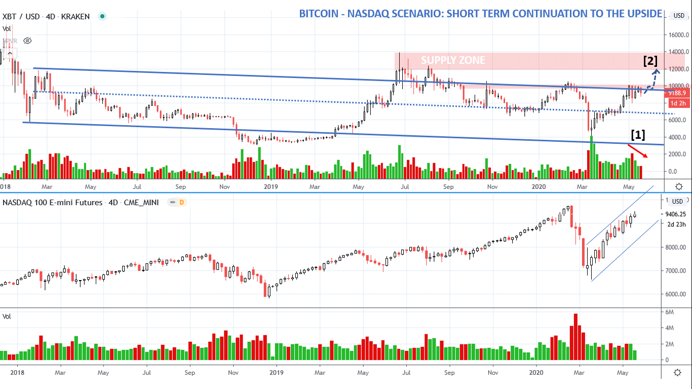
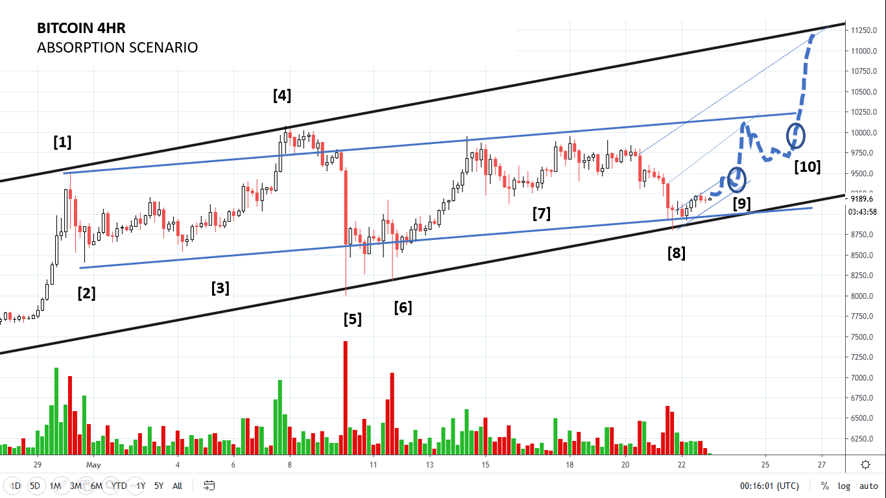
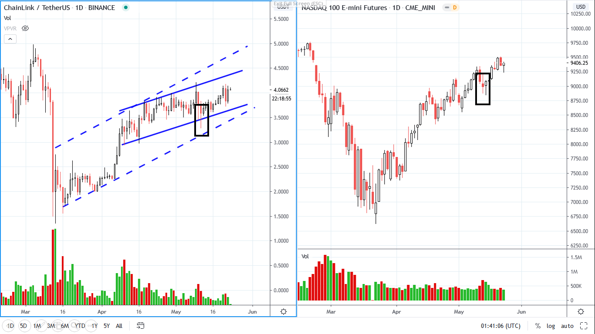
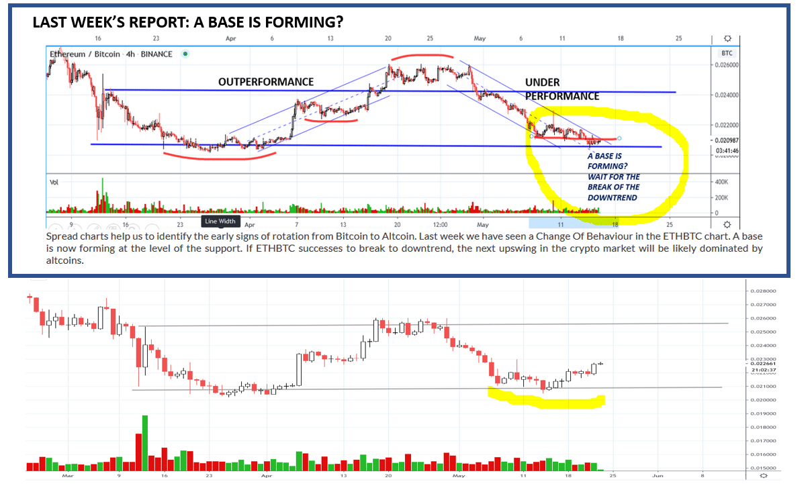
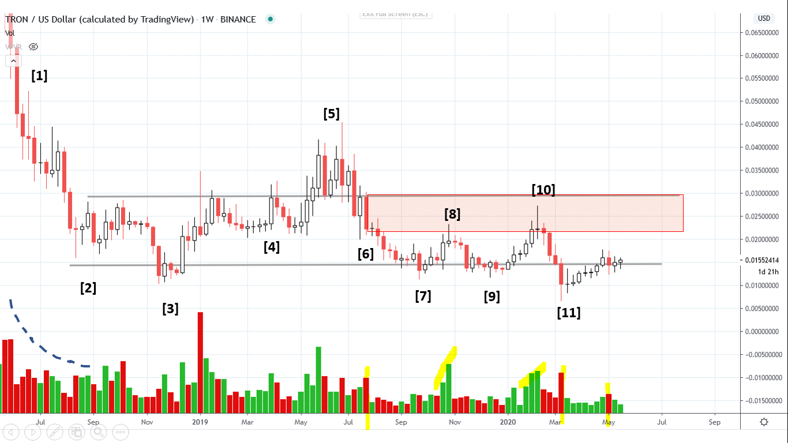
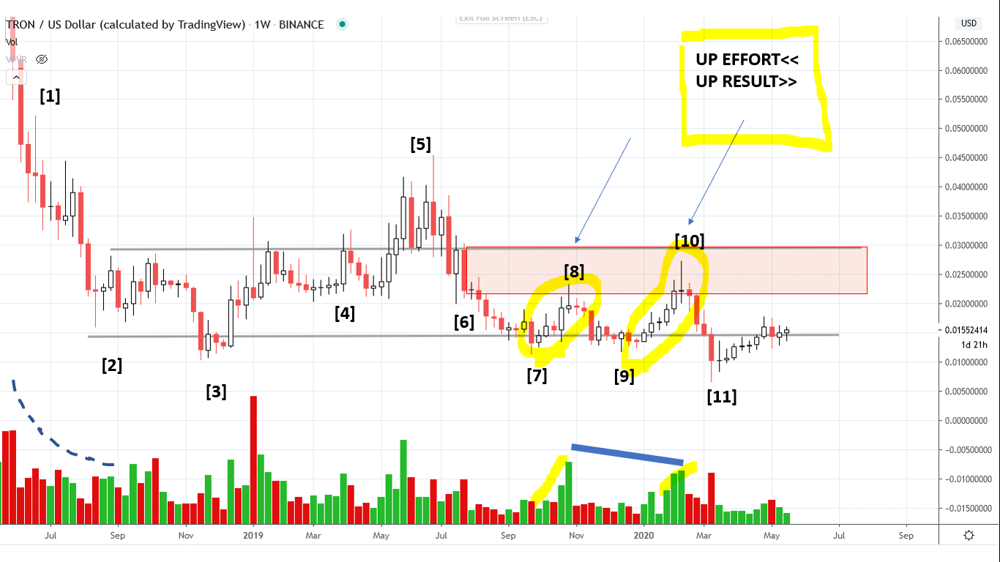
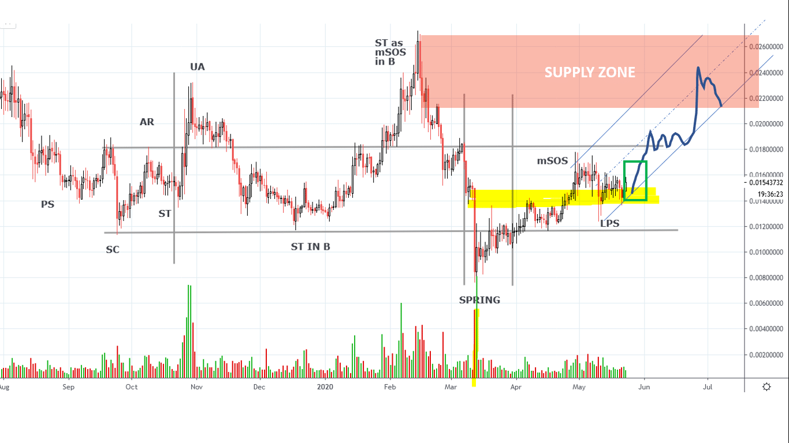

# Wyckoff Crypto Report vol 23

URL: https://www.wyckoffanalytics.com/wyckoff-crypto-report-vol-23/
Date: 2020-05-22T18:24:49
Author: Alessio Rutigliano

The WYCKOFF CRYPTO REPORT provides regular updates on the most popular digital assets based on the Wyckoff Methodology. Our market outlook follows the principles of Supply and Demand and Market Participants Analysis as they are taught and practiced in the WTC/WTPC/WMD classes.
### Bitcoin. Nasdaq. 4D Analysis
###

The market continues to show see signs of absorption. A classic feather pattern is forming on Bitcoin: at point [1] higher lows hugging the resistance and decreasing volume indicate that buyers are accepting higher prices. A bullish feather usually resolves with an acceleration to the upside. Price can potentally break the short term $10K resistance and climax around the $11500-120000 supply level [2]. Nasdaq, the leading index, is suggesting that we have still room to the upside. We still stay in our long position until a significant Change of Behavior occurs.
________________________________________________________________________________________
### Bitcoin. Intraday 4HR

WYCKOFF STORY
[1] Price accelerates into the overbought trendline. Climactic action
[2] The reaction is small, stops into the upper half of the previous rally. Bullish clue.
[3] Higher lows on decreasing volume: absorption. We expect at least a retest of the high.
[4] Supply comes in again on the overbought line. This is an Upthrust action in Phase B.
[5] After the inability to break the overbought line , trend followers capitulate. Aquick shakeout leads prices back to the support of the range. The demand tail suggests that buyers have entered the market. Remember: Action, Test, Confirmation. We want to see a test of the high supply as a higher low on decreasing volume.
[6] A test as a higher low on lower volume indicates that supply has been absorbed.
At point [7], price initially show signs of absorption, and we consider a short term entry to the long side. Unfortunately, the timing is too early. Once opened a long entry, price should accelerate to the upside. Here instead, momentum is fading, price falls back into the support. Break even point trade.
[8] Demand comes in again into the support of the trendline. If confirmed, the low at point [8] is a HL relative to [5] , a potential LPS (Phase C). Still bullish.
TRADING TACTICS: High probability bullish scenario, a rally could lead us to the overbought line of the trend ($11K). The first resistance to overcome is the top of the local capitulation bar at [8]. Point [9] and [10] represent our ideal Point of Entry. Stop loss below the low of bar 8.
If price breaks the uptrend, we revisit our strategy.
______________________________________________________________________
### ChainLink (LINK) vs Nasdaq. Update

Last week we have talked about a potential spring on ChainLink, and we have showed the resemblance of this leading asset to the Nasdaq. We are in the trade to catch the terminal upmove toward $5
The PnF count suggests that there is still potential to the upside ($5). LINKBTC is currently outperforming.
__________________________________________________________________
### Rotation
The altcoins are now outperforming Bitcoin. The outperformance will likely continue throughout the last push to the upside. Once a trend is established in a sector, institutions look for the “cheaper” peers. This buying wave is usually the terminal part of the rally before a correction. The Ethereum / Bitcoin chart shared last week is leading the way.

LAST WEEK’S CRYPTO REPORT
Spread charts help us to identify the early signs of rotation from Bitcoin to Altcoin. Last week we have seen a Change Of Behaviour in the ETHBTC chart. A base is now forming at the level of the support. If ETHBTC successes to break to downtrend, the next upswing in the crypto market will be likely dominated by altcoins.
TODAY : ETHBTC has broken the trendline. Altcoins are outperforming Bitcoin.
Let’s review some mid and small cap.
________________________________________________
### TRON (TRX)
Our follower Alex has requested us to analyze Tron. Let’s study the “Wyckoff Story”.

[1] Selling comes into the market. Price falls on decreasing volume and spreads [2] . The selling climax in this case has decreased spreads and volume. Less and less traders sell the asset, and volatility contract. A trading range starts. At point [3] , price springs the support and quickly recovers. The local absorption at point [4] suggests continuation to the upside. Price commits above the resistance of the range, but after few weeks (July 2019) the whole crypto market is under pressure. Selling enters the market, and price comes back to the support. Now we are analyzing the area that Alex has posted on Twitter. As you can see, it’s a small range within the bigger formation. Hank Pruden used to say “A principle within the principle”.
Please compare the price action from [1] to [2] with the reaction [6]-[7] . In both cases, the stopping action has decreasing volume and spreads. Bar [6] defines our supply zone (red area in the chart). The selling orders are “hidden” in this zone. Price needs to absorb the supply present in the red zone in order to go up. Buyers come in at bar [8], selling repeats and price comes back to the support [9]. Buyers comes in again, and the price action repeats.
Let’s compare now the two rallies highlighted in the chart Bar [10] is a higher high compared to [8] butd the volume (effort to the upside) is decreased. Less effort produces a better result to the upside. A bullish clue. Think of that red zone as a wall . Each time buyers come in, they break a part of it.

Here is the labeling of the local accumulation area (September 2019- today). Remember, labeling should always be the last step in your analysis. The starting point is always the price/volume analysis. Please notice that the ST as mSOS in B is not the final Sign of Strength. We use this terminology to stress the bullish character of this rally. Such a dynamic ST as mSOS in B is a bullish element of the “Wyckoff Story”. The rally fails, buyers come in on the spring and absorb the final supply. The recent price action is very constructive. Price has jumped the top of the capitulation bar (yellow level) and is currently forming a LPS. At this point, any upbar with good spread and volume is a very good Entry Point (stop loss under the low of the LPS).

## Send us your question!
Register here for free https://www.wyckoffanalytics.com/forums/topic/crypto-and-wyckoff-analysis/
I will be happy to discuss your questions in the next Crypto Reports!
