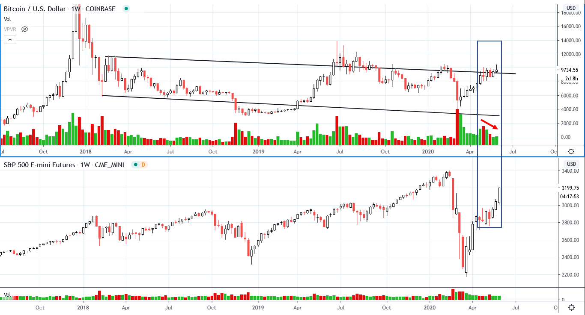
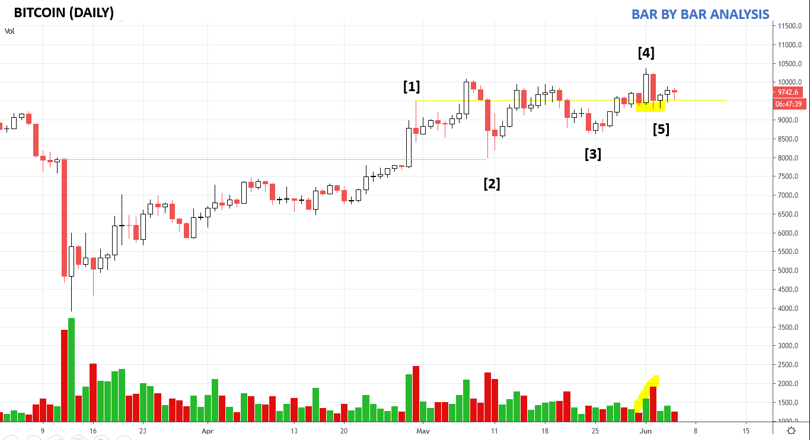
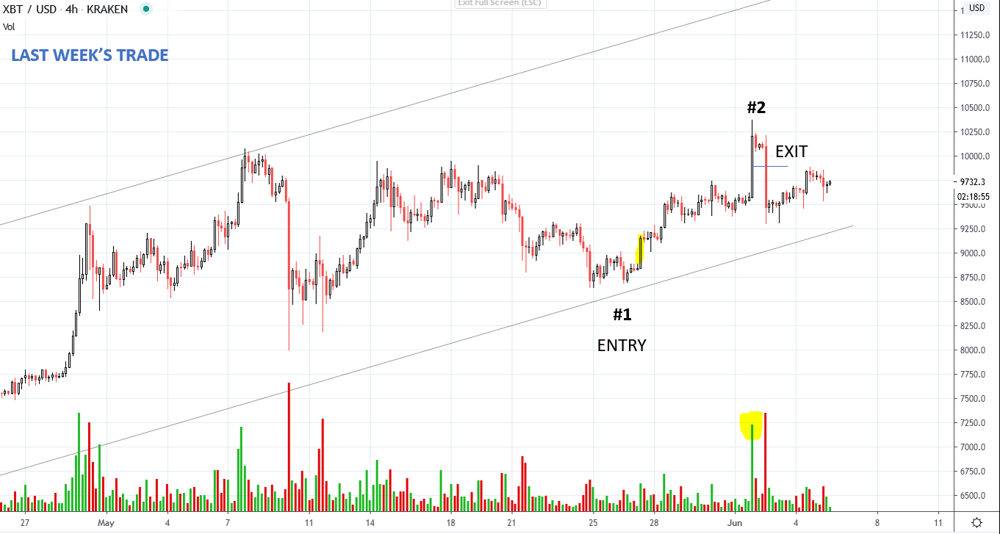
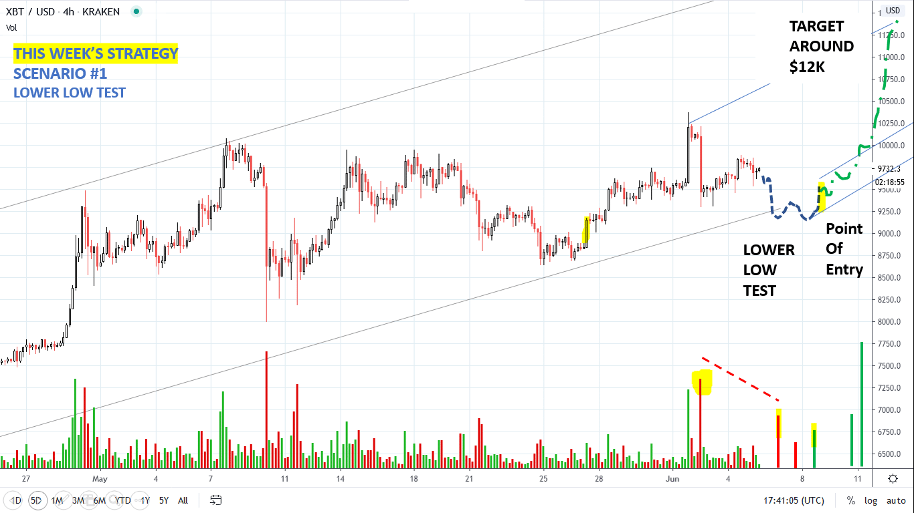
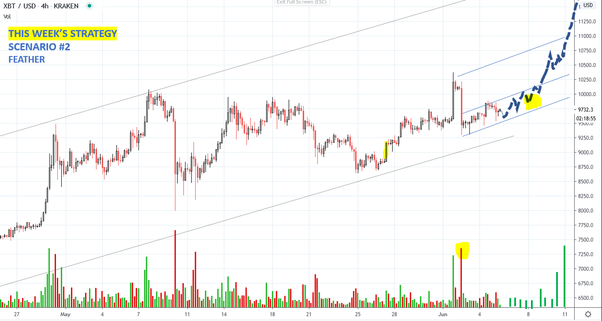
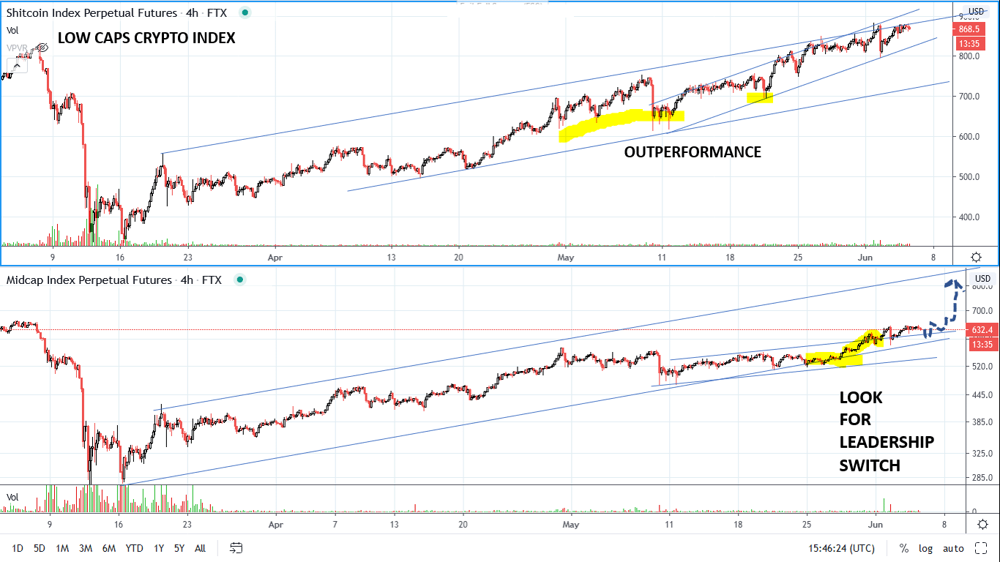
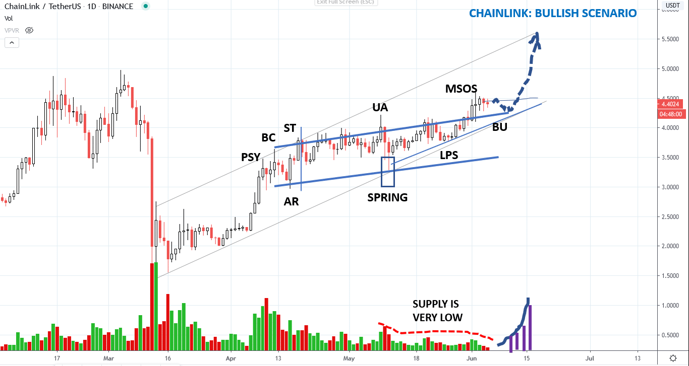
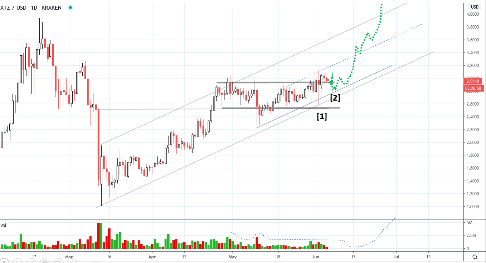

# Wyckoff Crypto Report vol 24

URL: https://www.wyckoffanalytics.com/wyckoff-crypto-report-vol-24/
Date: 2020-06-05T13:13:28
Author: Alessio Rutigliano

The WYCKOFF CRYPTO REPORT provides regular updates on the most popular digital assets based on the Wyckoff Methodology. Our market outlook follows the principles of Supply and Demand and Market Participants Analysis as they are taught and practiced in the WTC/WTPC/WMD classes.
### Bitcoin. S&P. Weekly Chart

Supply has been absorbed on the S&P on a rising scale, and price is now finally accelerating to the upside. In the last weeks we have seen a rotation of capitals from Stay at Home stocks to Reopening stocks. Bitcoin has not benefited from this rotation and is currently lagging behind the major indexes. However, the consolidation in the blue box continues to show decreasing supply signature and higher lows, a sign of absorption. The close of the last bar suggests that some selling is present, but it is not threatening for now.
________________________________________________________________________________________
### Bitcoin. Daily

WYCKOFF STORY
[1] Supply comes in but it is quickly absorbed.Price consolidates and upthrusts the high.
[2] We see the larger reaction since the beginning of the uptrend, but demand is top of the capitulation bar (yellow level). Still bullish.
[3] Bullish retest: lower volume, higher low.
[4] Price temporarily commits above the previous high, but supply comes in again.
[5] High effort to the downside, low result : the downbar does not close below the low of the previous bar. This price action suggests that buyers are still active. The Big downbar looks like an Upthust, but it actually show absorption on the level where supply has come in (the high of bar 1, yellow level).
TRADING TACTICS: Until the trend is broken, We still stay in the bullish camp. The supply at bar [5] must be retested. The retest can be a slightly lower low on lower volume or a higher low (feather). Let’s look the structure on the intraday timeframe.
______________________________________________________________________
### Bitcoin 4hr. Trading diary & Strategy

In the last weeks we have stalked Bitcoin for a long entry on the intraday. The upbar at point #1 was a very good opportunity and provided a low risk entry point. A SL on the half of the big down bar has automatically close our short term swing trade, but now we are looking for a new point of entry to the long side. PnF counts suggests that there is still room to $12K area. Let’s look our scenarios and tactics.

The test of the supply could be a potential lower low. In this scenario we can play again the same entry. Low risk, high target ($12K area).

We could have a test as a series of higher highs on decreasing volume (feather). A bullish feaher is followed by acceleration to the upside.
__________________________________________________________________
### Rotation

Low caps have outperfermed large caps in May. Now, the Low Cap Index on the top of the chart is hitting the overbought trendline, a natural point for profit taking. In the meanwhile, the Mid Cap index on FTX has shown initial signs of outperformance, and has currently cleared the long term resistance. The Mid Cap Index (MID-PERP on FTX.com) include assets like LINK( ChainLink) and XTZ (Tezos).
_____________________________________________________________
### CHAINLINK (LINK) DAILY ANALYSIS

ChainLink presents a very interesting structure. The upsloping range shows that supply has been absorbed. We are currently forming a potential Backing Up action, that we anticipate to be shallow since the level of supply are already very low. The next upmove could lead ChainLink to the overbought line of the uptrend (target $5.50) that coincides with the our PnF target area.

__________________________________________________________________________________________________
### TEZOS (XTZ) DAILY ANALYSIS

Tezos’s charts is very similar to ChainLink. We have hust experienced a spring at point [1]. We are currently retesting the spring [2] and the oversold trendline. A test on low volume followed by a swing reversal could provide a low risk point of entry to the long side. The break of the trendline would invalidate the setup.
##
##
##
##
__________________________________________________________________________________________________
## Send us your question!
Register here for free https://www.wyckoffanalytics.com/forums/topic/crypto-and-wyckoff-analysis/ or comment the report on our Twitter channel @WykoffAnalysis.
I will be happy to discuss your questions in the next Crypto Reports!
