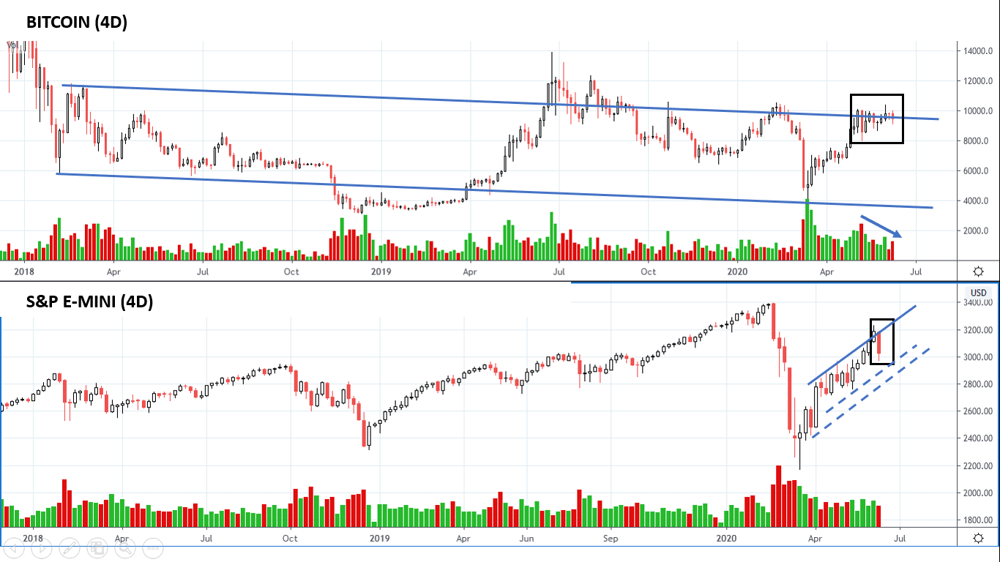
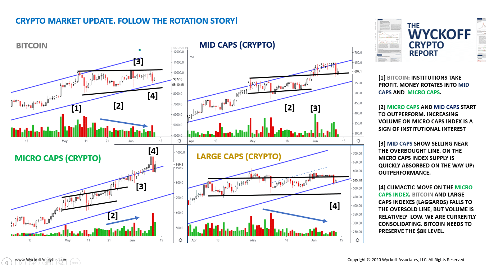
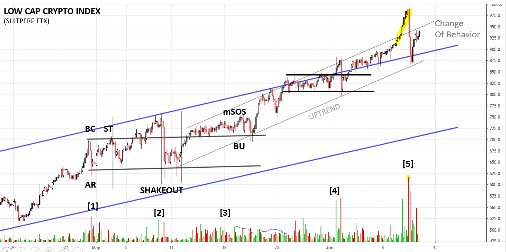
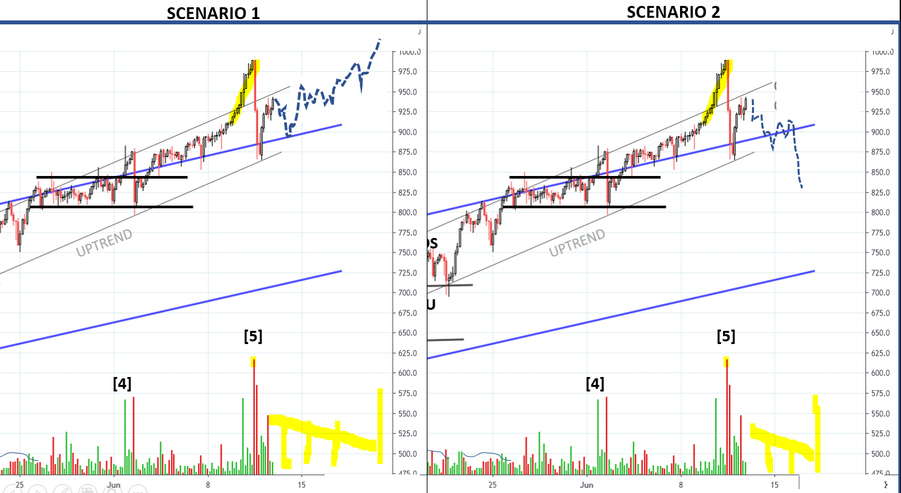
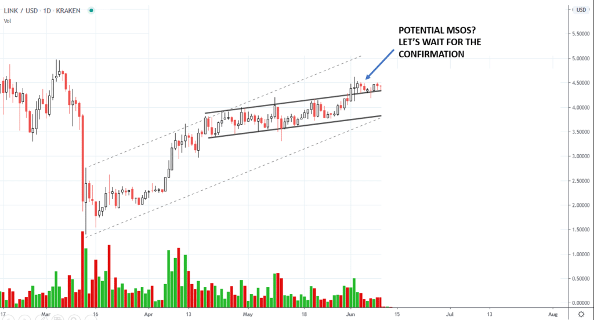
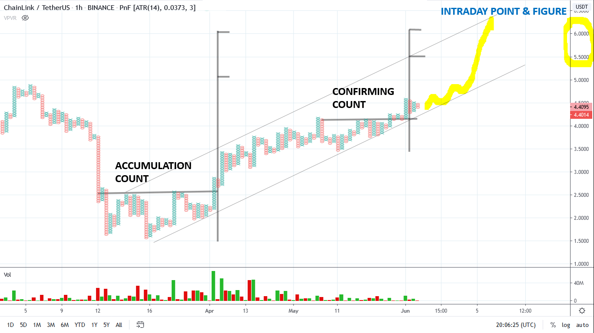
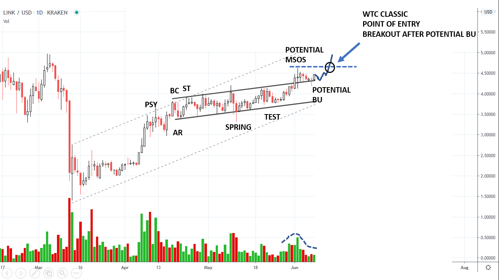
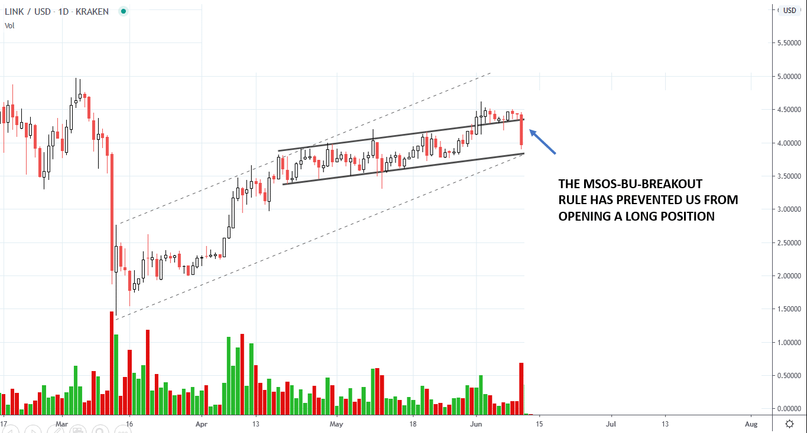
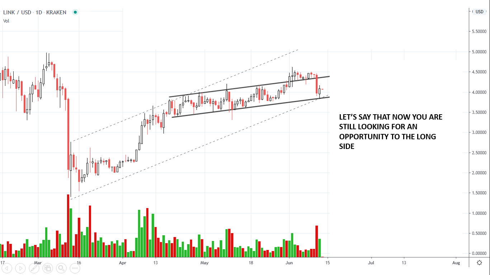
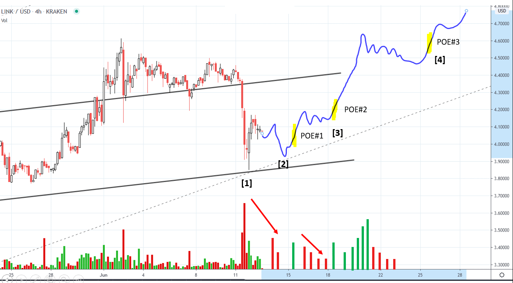

# Wyckoff Crypto Report vol 25

URL: https://www.wyckoffanalytics.com/wyckoff-crypto-report-vol-25/
Date: 2020-06-12T15:25:10
Author: Alessio Rutigliano

The WYCKOFF CRYPTO REPORT provides regular updates on the most popular digital assets based on the Wyckoff Methodology. Our market outlook follows the principles of Supply and Demand and Market Participants Analysis as they are taught and practiced in the WTC/WTPC/WMD classes.
### Bitcoin. S&P. 4D chart.

The last downbar on the S&P has the largest spread since the beginning of the uptrend and suggests a Change of Behavior. In the last two weeks Bitcoin has lagged behind the major indexes, however the recent selling has not deeply affected the major cryptocurrency for now. Bitcoin is still consolidating near the multi-year downsloping resistance highlighted in blue.
Crypto traders need to pay attention to the price action of the S&P and Nasdaq in the next week. Further selling could potentially trigger more downside in the crypto ecosystem too. Instead, if the recent supply emerged in the market is quickly absorbed, we can potentially see a further leg up on Bitcoin. Let’ s explore the crypto sectors on the daily timeframe.
________________________________________________________________________________________
### Crypto Sector Analysis. Daily chart
In the stock market, the rotation of capital mirrors the business cycle, as managers favor specific sectors according to the economic conditions. For this reason, when we analyze the stock market we compare the main indexes (S&P, Nasdaq, Dow, Russell). Capitals rotates in the crypto ecosystem too. It’s possible to analyze the crypto market using the same techniques that have been successfully applied on the stock markets for decades. Here we see four charts: Bitcoin (the largest capitalization asset), Large Cap Index, Mid Cap Crypto Index, Micro Caps. Let’s follow the Wyckoff Story.

###
###
###
###
###
###
###
###
###
In early May [1] , institutions take profit on Bitcoin and reinvest their profits on micro caps. Bitcoin enters a consolidation on decreasing supply signature and higher lows, while micro caps show signs of outperfomance [2] . At point [3], supply is quickly absorbed on the way up on the Micro Cap Index, price accelerates to the upside and breaks the overbought trendline. Now look at the big downbar on high volume at point [4] on the Micro Cap Index: it’s a Change of Behavior. Selling has occurred on Bitcoin too but we have not broken the oversold line of the trend for now and the supply signature does not look distributional for now. In order to see a continuation of the major uptrend, Bitcoin must not break the support area. Let’s analyze now the leader index (Micro Caps).
### Micro Caps. 4 hr time frame.

WYCKOFF STORY
[1] Supply comes in but it is quickly absorbed. A trading range starts.
[2] Shakeout and successful test. Phase C is completed.
[3] Supply is still present on the top half of the range, but it’s quickly absorbed. The uptrend starts.
At point [4] , supply comes in on the overbought line of the uptrend channel, a danger point. However, price holds and a test as a higher high on low volume indicate that buyers are accepting higher prices.
[5] Price accelerate to the upside, climactic move. Change of Behavior.
TACTICS: The highest supply signature since the beginning of the uptrend suggests that we will likely revisit the $875 level. A test as a higher low on decreased volume would be encouraging. Here we see two possible scenarios:

T
SCENARIO #1: Price retests the low on decreasing supply signature. A series of higher lows confirms that buyers are accepting higher prices.
SCENARIO #2: Price retest the previous low, but after the initial momentum demand is exhausted and we see no lift. Tepee formation. A break of the support would act as a confirmation.
Please notice that both scenarios have the same identical “supply signature”!
______________________________________________________________________
### CHAINLINK (LINK) TRADING DIARY
Last week J., an attentive reader of the Wyckoff Crypto Report, has asked a great question about Point of Entries.
Could you share how you design your exit strategy (profit target and stop loss points)? I am trailing my stop about a few points (based on the recent average 4hour ATR) below the last significant daily bar (June 02 doji) and setting my profit target close to the previous all time high. I understand you also use significant bars as reference for setting stops. Do you use a different exit strategy for swing trades vs shorter term day trades? The LINKUSD rising channel indicates potential for it to reach a new all time high. Do you always use the PnF count to set the target or do you scale out (e.g. close out a partial position at the previous high and trail the rest expecting price to reach the top of the slope resistance)? [..] I am interested in learning the Wyckoffian guidelines for setting targets and stops.
Great question! Let’s start with the basics. Wyckoffians use specific guidelines for Points Of Entry and stop losses. Let’s say that we are looking for a long trade on LINK. We identify a potential MSOS followed by a Backing Up action. You can define the target using PnF chart (best option) or just use a basic trandline analysis (in this case your first target is the overbought line of the uptrend, dotted line).

Here is the PnF chart:

At WyckoffAnalytics, we always look for potential Major Sign of Strength, followed by a Backing Up action, confirmed by a breakout. Action, test, confirmation. This technique help us to avoid a premature entry.
###

Here is what happens: the setup fails, but we are not in the trade yet.

Let’s say now that we are still long and we are looking for an entry near the oversold line of the uptrend. The current action could be both a spring or the beginning of a Sign of Weakness. ChainLink has hold quite well compared to the S&P, but supply on the last downbar is very high and we want to see a retest.

Here are your ideal Points Of Entry. You wait for the test of the big downbar. Higher low on lower volume [2]: bullish. You open the position to the long side on yellow mark. An upbar with good spread and volume in the yellow zone confirms that demans is in control. Stop loss below the low of point [1]. As the rally unfold, you can add to the position at PoE#2 and #3. Remember the sequence: Action, Test, Confirmation.

This is a classic swing trade. Day trading requires a slightly different approach, indeed. We will cover several swing and intraday techniques in our incoming WyckoffAnalytics special, “ Trading the Crypto Market with the Wyckoff Method “, a three session course totally devoted to Cryptocurrency and the Wyckoff Method. I hope to see you in our classes soon!
## Trading the Crypto Market with the Wyckoff Method
3 Session Course. $199. You can join us live for the webinars or listen to recordings of all the sessions.
https://www.wyckoffanalytics.com/event/trading-the-crypto-market-with-the-wyckoff-method/

__________________________________________________________________________________________________
## Send us your question!
Register here for free https://www.wyckoffanalytics.com/forums/topic/crypto-and-wyckoff-analysis/ or comment the report on our Twitter channel @WykoffAnalysis.
I will be happy to discuss your questions in the next Crypto Reports!
