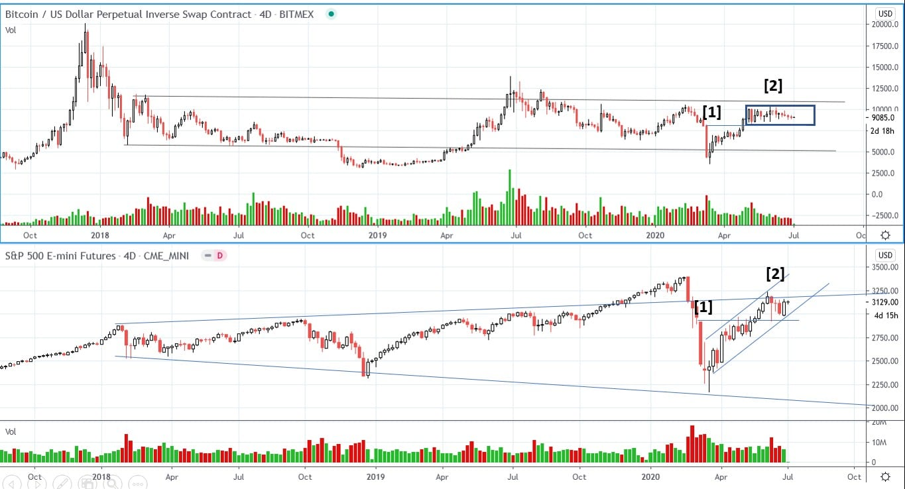
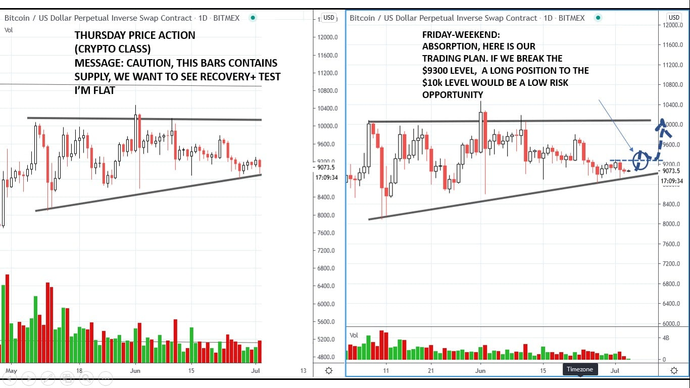
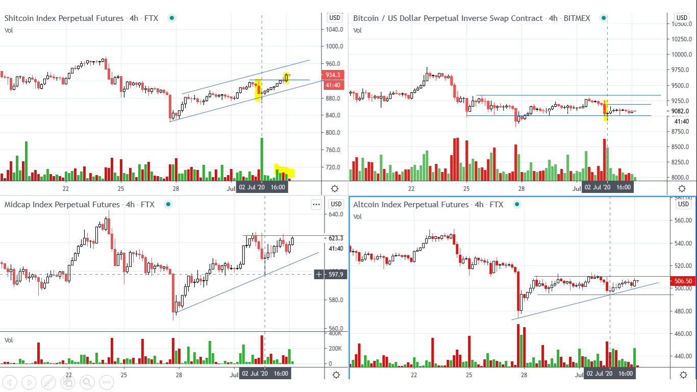
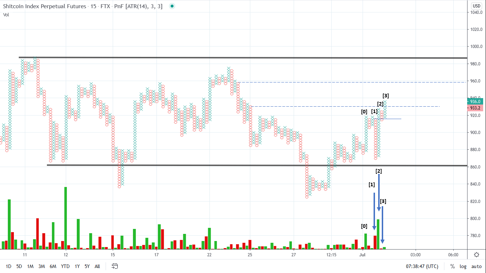
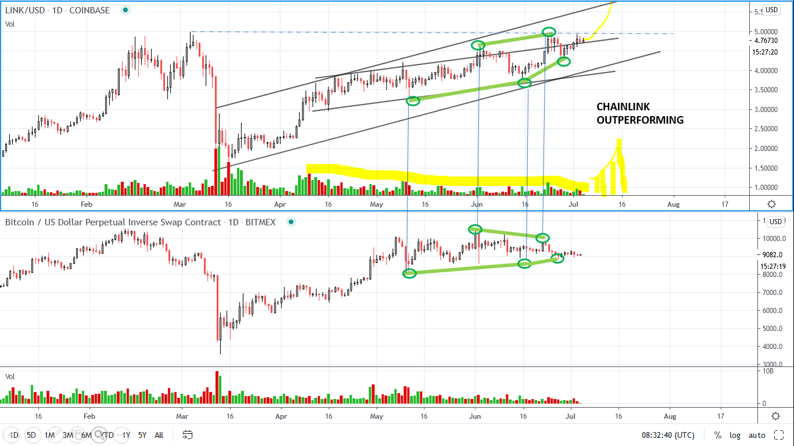

# Wyckoff Crypto Report vol 27 – Flash Update

URL: https://www.wyckoffanalytics.com/wyckoff-crypto-report-vol-27-flash-update/
Date: 2020-07-04T01:44:32
Author: Alessio Rutigliano

The WYCKOFF CRYPTO REPORT provides regular updates on the most popular digital assets based on the Wyckoff Methodology. Our market outlook follows the principles of Supply and Demand and Market Participants Analysis as they are taught and practiced in the WTC/WTPC/WMD classes.
### Bitcoin. S&P. 4D chart.

Bitcoin is still consolidating in the 8-10K range. Both Bitcoin currently shows signs of absorption and the overall bias is still bullish. Look at this simple analog on both charts: at point [1] buyers silently step in on the big capitulation bar. Ahuge rally reaches the previous significant supply zone, and the price starts to consolidate [2] on the top of the capitulation bar.
________________________________________________________________________________________
### Bitcoin Daily chart. Trading plan for the next week. Spring setup
During Thrursday’s class, we have quickly analyzed Bitcoin and the major crypto indexes. On that day, the Crypto Market has underperformed the S&P. When Crypto underperform the S&P, we want to be cautios: it could be a sign that institutions are in risk-off mode. But at the of Thursday’s session, the crypto markets have recovered. Bitcoin is still lagging behind the Small Caps, but In our analysis, we have cautiosly decided to stay flat in the weekend. What we do now? We identify the significant price levels on the chart and plan our trading strategy. We always want to find the best LOW RISK opportunities.
Consolidation
BIAS: still Bullish
TRADING PLAN: the $9300 is the level where we saw some supply coming in. The break of this level would act as a CONFIRMATION of a potential spring setup A spring would offer a very low risk opportunity on the intraday. Since the overall supply signature during the consolidation is still decreasing, we expect a quick acceleration to the upside after the $9300 level.
First target: top of the range: $10000-$10400
If price breaks the top of the consolidation, higher targets are possible.

_____________________________
### Crypto Indexes (via FTX). 4h charts
The crypto indexes are even more bullish than Bitcoin. As usual, small cap cryptos are leading the market . The shitcoin index has already broke out the previous supply level, and the midcap is currently in an apex.

### Intraday PnF Effort- Result Analysis – Small caps Index
On the intraday PnF chart, we see this interesting sequence:
[0] SUPPLY comes in
[1] shakeout on HIGH VOLUME, WE TEMPORARILY break the low of upbar [0]. A quick recovery on good demand reverses the downbar
[2] Low supply on the top of the capitulation bar.
[3] Breakout on low volume. The 930$ price (top of big downbar, dotted line) is a very important supply level.
If supply will come in, we want to see a high volume downbar on the top of bar [1] ( high effort-low result to the downside) . further continuation would suggest acceleration.

### ___________
### ChainLink Update
ChainLink still showing relative strength. Absorption Scenario still in play.

I hope to see you in our classes soon!
## Trading the Crypto Market with the Wyckoff Method
3 Session Course. $199. You can join us live for the webinars or listen to recordings of all the sessions.
https://www.wyckoffanalytics.com/event/trading-the-crypto-market-with-the-wyckoff-method/

__________________________________________________________________________________________________
## Send us your question!
Register here for free or comment the report on our Twitter channel @WykoffAnalysis.
I will be happy to discuss your questions in the next Crypto Reports!
