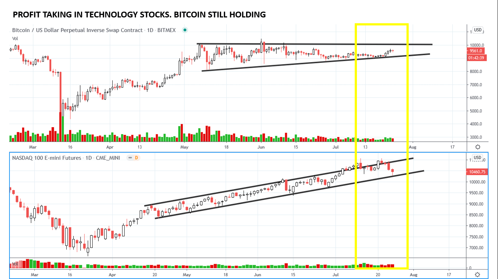
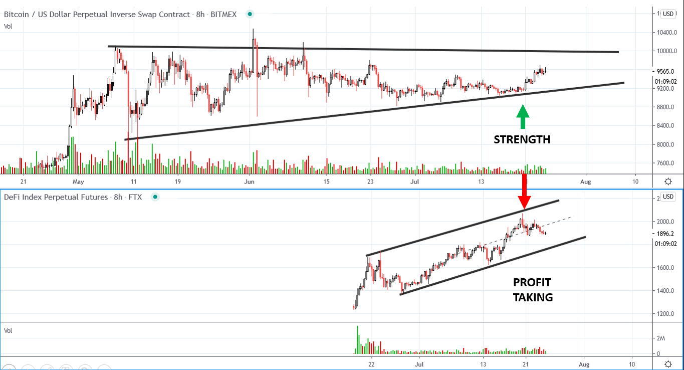
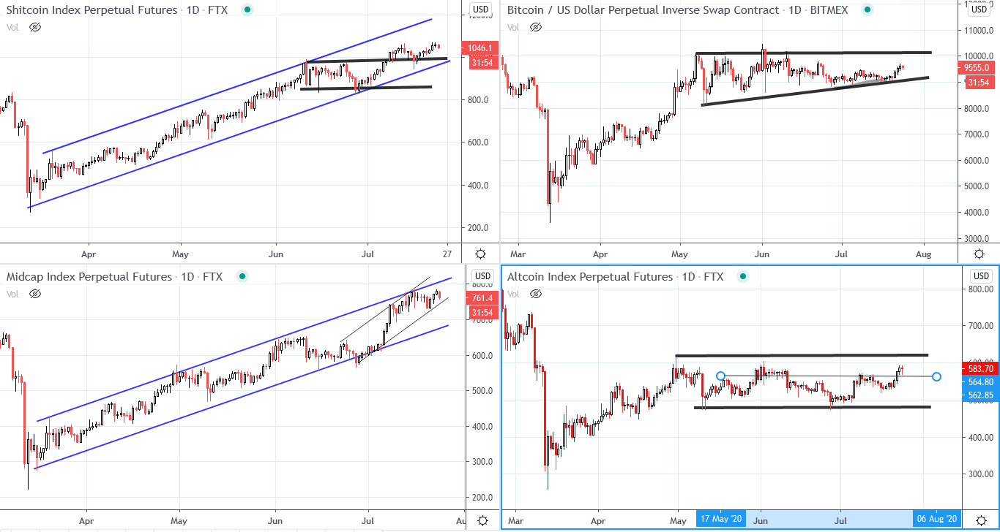
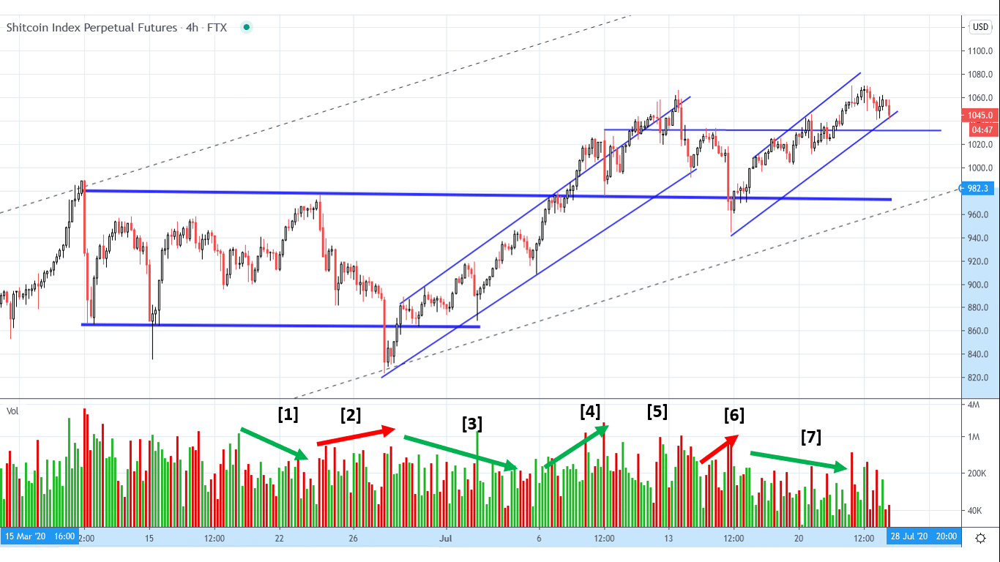

# Wyckoff Crypto Report vol 28

URL: https://www.wyckoffanalytics.com/wyckoff-crypto-report-vol-28/
Date: 2020-07-24T14:35:26
Author: Alessio Rutigliano

The WYCKOFF CRYPTO REPORT provides regular updates on the most popular digital assets based on the Wyckoff Methodology. Our market outlook follows the principles of Supply and Demand and Market Participants Analysis as they are taught and practiced in the WTC/WTPC/WMD classes.
### Bitcoin. Nasdaq. 1D chart

The Nasdaq 100 had a Throwover on July 13rd and is currently consolidating near the support of the uptrend channel. The selling pressure that has affected the stock market has not impacted Bitcoin, that has recently shown signs of local outperformance (yellow box). Volatility is contracting, volume is very low. Buyers are accepting higher prices for Bitcoin.
________________________________________________________________________________________
### Rotation in play. Bitcoin. DeFi Index

Shayan, one of the students of the Crypto class, has asked us to analyze the DeFi Index. DEFIPERP is a new index offered by FTX. De centralized Fi nance is a new, popular theme in the crypto space. This index aggregates many new small caps marked by aggressive growth and momentum (KNC, LEND, MKR, KAVA, ZRX, LRC, REN, REP, SNX, COMP). The red arrow indicate profit taking near the overbought line of the trend channel. The selling activitywas in sync with the red days in the Nasdaq. Bitcoin, instead, is showing strength (green arrow). Capital are rotating from the most speculative assets to large cap cryptos.
________________________________________________________________________________________
### Crypto Indexes. Low caps. Mid caps. Large Caps. Bitcoin

The same principle is visible on the Altcoin Index. The Altcoin Index has been lagging throughout the last three months, but in the last week is showing short term signs of outperformance. Uptrends sustain themselves through rotation. As usual, our goal is to identify where the capitals are flowing, and then catch the best reaccumulation.
_____________________________
### XTZ bullish scenario and Points of entry

One of the most interesting charts among mid and large caps is Tezos (XTZ). We have been stalking this formation in the last weeks. The Sign of Strength rally must be confirmed by a backing up action. We are currently testing the supply available on the resistance. The high volume on the level of resistance (Jul 13) is concerning, however, the extremely low volume in Phase B suggests that market participants can potentially absorb the supply on the way up. The supply signature is decreasing, a bullish sign.
BNB shows a similar formation.
SETUP
Action-Test-Confirmation.
Action: Backing Up action
Test of the Backing Up action. HL on lower volume
Confirmation: Breakout of the last swing high (July 23rd)
FAILURE: price falls below the previous low on increased volume and spreads
_______________________________________________________________
### Small cap Index (via FTX). 4h chart.

Small caps were leading the rally in the last 2 months. In the last week, small caps are lagging. On the four hour chart, we see the same pattern repeating over and over.
[1] Demand deteriorates
[2] Effort versus Result: Strong hands absorb the supply on the way down
[3] Rally on low volume (supply has been already absorbed)
[4] More and more market participants jump on the bandwagon. Up effort >> Up result <<Supply is present
[5] High supply signature suggests a deep reaction
[6] Price quickly fall back to the resistance of the previous range, buyers absorb the supply on the way down. Price behaviour similar to point [2]
High effort to the downside, low result.
[7] A rally with low demand signature temporraily commits above the resistance. Price behavior similar to point [3]
Buyers must preserve the $1020 price level.
## Trading the Crypto Market with the Wyckoff Method
3 Session Course. $199. You can still listen to the recordings of all the sessions.
https://www.wyckoffanalytics.com/event/trading-the-crypto-market-with-the-wyckoff-method/

__________________________________________________________________________________________________
## Send us your question!
Register here for free or comment the report on our Twitter channel @WykoffAnalysis.
I will be happy to discuss your questions in the next Crypto Reports!
